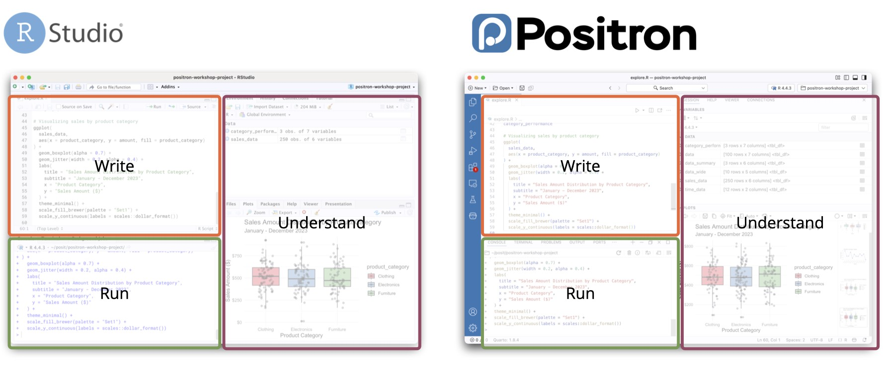
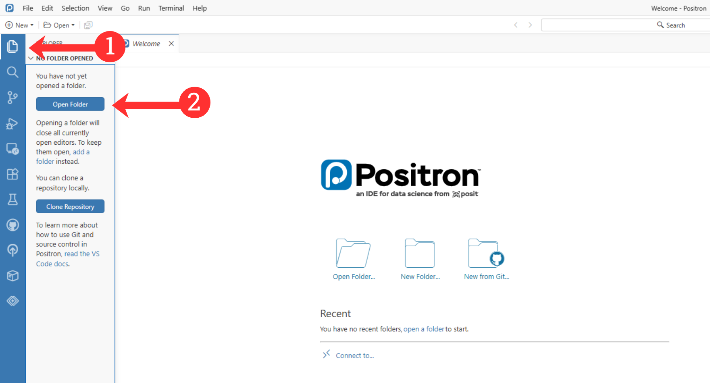
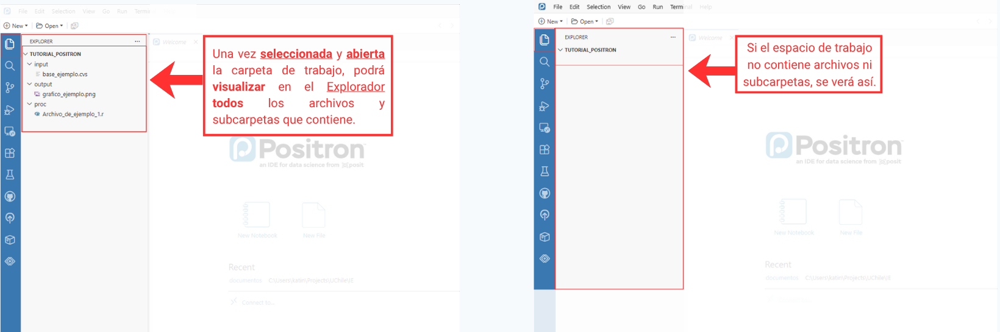
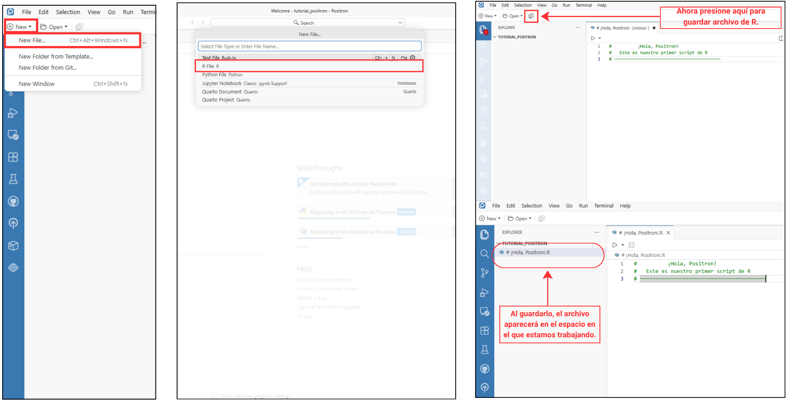
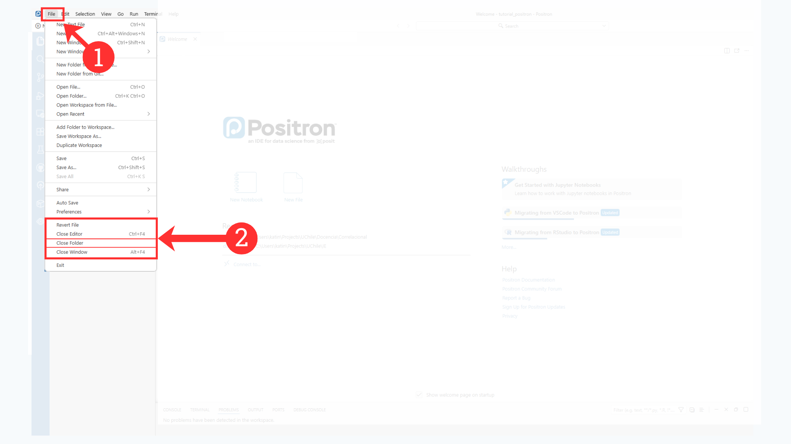

<style>
/* Ajustes locales: se aplican únicamente a esta página. */
#quarto-content main.content img {
  display: block;
  width: 100%;
  max-width: 100%;
  height: auto;
}

#quarto-content main.content .quarto-figure,
#quarto-content main.content figure {
  width: 100%;
  max-width: 100%;
}

main.content p,
.callout-body p {
  text-align: justify;
  text-justify: inter-word;
  hyphens: auto;
}
</style>

::: {style="text-align: right; margin-top: -10px; margin-bottom: 20px;"}
[Descargar Positron](https://positron.posit.co/download.html){.btn .btn-outline-danger .btn-sm target="_blank" role="button"}

<small style="color: #666; display: block; margin-top: 4px; font-size: 0.8em;">* Recuerde tener R instalado.</small>
:::

::: {style="text-align: right; margin-top: -10px; margin-bottom: 20px;"}

[Última versión de R](https://cran.r-project.org/bin/windows/base/){.btn .btn-outline-primary .btn-sm target="_blank" role="button"}
[Visual C++ Redistributable](https://learn.microsoft.com/en-us/cpp/windows/latest-supported-vc-redist?view=msvc-170#latest-supported-redistributable-version){.btn .btn-outline-secondary .btn-sm target="_blank" role="button"}

:::

# De RStudio a Positron

Positron cambia parcialmente la organización visual, pero conserva la lógica central de trabajo. En ambos entornos puede escribir scripts, ejecutar comandos en una consola de R, utilizar paquetes, revisar objetos, visualizar gráficos y organizar los archivos de un análisis. A raíz de esto, el propósito de esta sesión es que pueda familiarizarse con el entorno y con las acciones necesarias para comenzar a trabajar. Positron es solo una herramienta: el foco del curso seguirá estando en comprender los análisis, interpretar sus resultados y escribir código reproducible.

::: callout-note
## Lenguaje y entorno de trabajo

- **R** es el lenguaje que contiene las instrucciones, funciones y paquetes utilizados en el análisis. 
- **RStudio** y **Positron** son entornos de desarrollo o IDE: programas que reúnen herramientas para escribir, ejecutar y revisar código. 
- La **sintaxis** corresponde a las instrucciones escritas, mientras que un **script** es el archivo `.R` donde se guardan y organizan. (Cambiar de RStudio a Positron no significa cambiar de lenguaje.)
:::


### ¿Por qué utilizaremos Positron?

Positron permite aprovechar lo que  ya aprendimos en RStudio dentro de un entorno más integrado y flexible. **R sigue siendo el mismo lenguaje:** los comandos, paquetes y scripts continúan funcionando de igual forma que con RStudio. Durante el curso utilizaremos Positron porque reúne distintas herramientas en un solo espacio de trabajo. Positron permite:

1. **R, Python y distintos archivos**  
   Trabajar con scripts y diferentes tipos de documentos dentro de un mismo entorno.

2. **Extensiones y personalización**  
   El entorno puede ampliarse gradualmente según las tareas y necesidades de cada proyecto. Además, es posible instalar múltiples herramientas y complementos desarrollados por la comunidad.

3. **Exploración visual de datos**  
   Facilita la revisión de objetos, bases de datos y gráficos durante el análisis.

4. **Asistencia opcional con inteligencia artificial**  
   Puede apoyar la comprensión de errores y fragmentos de código, pero su uso es opcional y sus respuestas siempre deben revisarse.

5. **Escritura reproducible**  
   Mantener relacionados el texto, el código y los resultados para reconstruir el procedimiento de análisis.

6. **Versionamiento y proyectos futuros**  
   Git y el registro de cambios ofrecen posibilidades para colaborar y desarrollar investigaciones, tesis u otros proyectos posteriores.





::: {.callout-note appearance="simple"}
## Positron no reemplaza lo aprendido en RStudio

Durante el curso utilizaremos Positron principalmente de una manera similar a RStudio: R, los comandos y los scripts siguen siendo los mismos. Si usted ya ha trabajado con RStudio, no está comenzando desde cero: solo deberá reconocer una nueva forma de organizar herramientas que ya conoce.

No será necesario dominar desde el comienzo todas las funciones del entorno. Basta con reconocer que existen herramientas adicionales para el análisis de datos, la escritura y el versionamiento, en las que podrá profundizar durante el curso o en proyectos futuros. El foco continuará estando en comprender los análisis e interpretar sus resultados.
:::

# ¡Positron!

Ahora que sabemos qué se mantiene y qué cambia, revisaremos cómo se organiza la interfaz de Positron.


En la imagen puede reconocer cinco áreas principales:

::: {style="margin: auto; width: fit-content;"}
| En Positron | Función |
|---|---|
| **Barra de actividades** |  Permite abrir el Explorador de archivos, las extensiones, Git y otras herramientas. Se encuentra en el borde izquierdo de la pantalla. |
| **Barra lateral principal** |Muestra los archivos y carpetas del proyecto. Se despliega al seleccionar una opción en la barra de actividades.|
| **Editor** | Permite escribir y guardar código en scripts y otros documentos.|
| **Panel inferior** | Muestra la consola de R, los resultados, los mensajes y los errores.|
| **Barra lateral secundaria** | Muestra objetos, gráficos, ayuda y otras herramientas.|
:::

La **terminal**, ubicada junto a la consola, no es lo mismo que la consola de R. Sirve para ejecutar comandos del sistema y no será necesaria en este práctico.

::: {.callout-tip appearance="simple"}
## El origen
Visual Studio Code (Microsoft) es un editor de código flexible para distintos lenguajes y tareas, y **Code OSS** es su base abierta. Positron está construido sobre esa misma base e incorpora herramientas especializadas para trabajar con datos mediante R y Python
:::

# De R Project a workspace

En Positron, seguimos organizando el trabajo dentro de una carpeta que reúne los scripts, datos y resultados del análisis, tal como lo hacíamos en RStudio. La diferencia es que en Positron no es necesario crear un proyecto `.Rproj` para comenzar. Al abrir una carpeta, esta funciona como el workspace o espacio de trabajo.




# Reconocer el espacio de trabajo

Antes de ejecutar código, observe dos elementos de la interfaz:

1. el nombre de la carpeta abierta en Positron;
2. los archivos que aparecen en el Explorador.

Desde el **Explorador**, podrá navegar por las carpetas, los scripts, los datos, los resultados y las imágenes del proyecto.




# Script

En Positron, el script funciona de manera similar a RStudio. Un script es un archivo `.R` que conserva la sintaxis del análisis. Allí puede guardar, corregir y volver a ejecutar sus instrucciones cuando sea necesario.  El script mantiene un registro organizado del trabajo realizado, mientras que la **Consola** ejecuta el código.

## Abrir un script en Positron




::: callout-note
## El recorrido del trabajo y del código

Antes de comenzar el análisis, debe abrir la carpeta que contiene los archivos del proyecto y seleccionar el script en el que trabajará. El recorrido básico es el siguiente:

1. Seleccione y abra la **carpeta de trabajo**, donde se encuentran los scripts, datos y resultados.
2. Abra o cree un **script de R** con la extensión `.R`.
3. Escriba y guarde el código en el **Editor**.
4. Ejecute las instrucciones para que R las procese en la **Consola**.
5. Los objetos creados, como bases de datos y variables, aparecerán en **Variables**.
6. Los gráficos generados aparecerán en **Gráficos**.

De esta manera, la carpeta organiza el proyecto, el script conserva el código, la Consola lo ejecuta y los demás paneles muestran los resultados.
:::

# Para cerrar la carpeta de trabajo…




# Cápsula: Introducción a Positron

Como complemento a este práctico, revise la siguiente cápsula, donde se presenta paso a paso el entorno de trabajo de Positron y su uso con R.



## Código utilizado en la cápsula

::: {.callout-tip collapse="true" title="Ver código completo de la cápsula"}

```r
# Cargar los datos
datos <- read.csv(
  "Input/WID_Data_09082026-200910.csv",
  sep = ";",
  skip = 1
)

# Limpiar nombres de países
datos$Country <- trimws(datos$Country)

# Seleccionar algunos países
comparacion <- subset(
  datos,
  Country %in% c("Chile", "Brazil", "USA", "Sweden")
)

comparacion

# Convertir a porcentaje
comparacion$Porcentaje <- comparacion$Value * 100

comparacion

# Crear una tabla simple
tabla <- comparacion[, c("Country", "Porcentaje")]

# Ver tabla
tabla

# Crear gráfico
barplot(
  comparacion$Porcentaje,
  names.arg = comparacion$Country,
  ylab = "Porcentaje del ingreso",
  main = "Ingreso 10%"
)
```

:::