```{r set-dependencies, include=FALSE}
# Site-wide targets dependencies
# withr::with_dir(here::here(), {
#  targets::tar_load(project_zips)
#  targets::tar_load(xaringan_slides)
#  targets::tar_load(xaringan_pdfs)
# })
```


::: {.home}

::: {.grid .course-details}


::: {.g-col-12 .g-col-sm-6 .g-col-md-4}
### Profesor

<div class="image-cropper">
  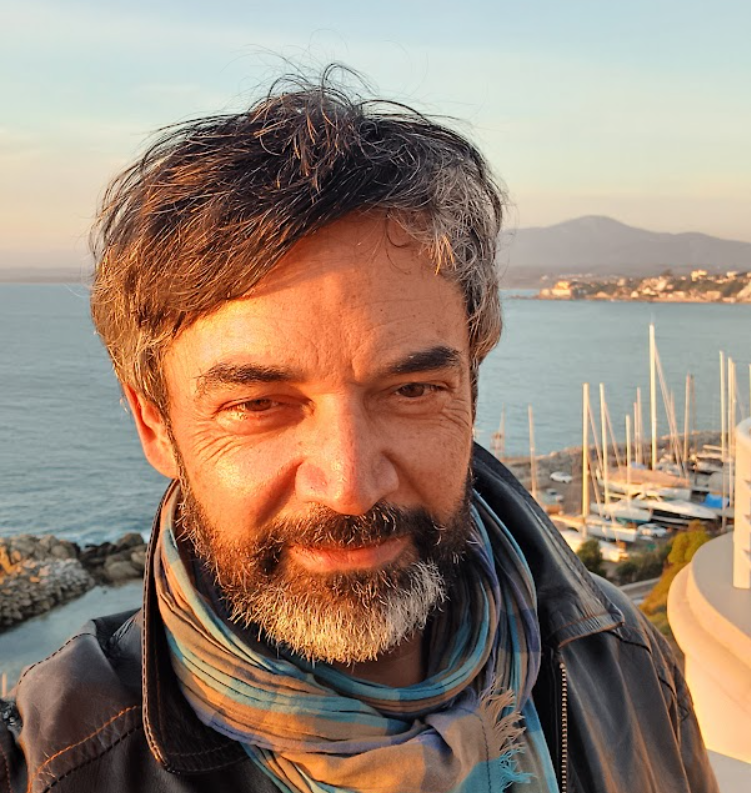
</div>

-  &nbsp; []()
-  &nbsp; 
-  &nbsp; <a href="mailto:juancastillov@uchile.cl">juancastillov@uchile.cl</a>
-  &nbsp; <a href="https://github.com/juancarloscastillo">juancarloscastillo</a>
-  &nbsp; <a href="https://jc-castillo.com/">jc-castillo.com</a>
-  &nbsp; [Agendar reunión]()

:::

::: {.g-col-12 .g-col-sm-6 .g-col-md-8}
### Profesores colaboradores

::: {.grid}

::: {.g-col-12 .g-col-md-6}

<div class="image-cropper">
  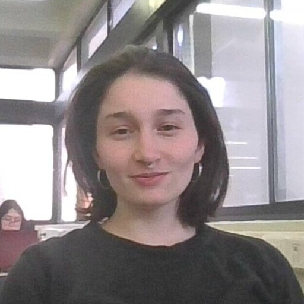
</div>

-  &nbsp; Katherine Aravena
-  &nbsp; 328 Sociología FACSO, Universidad de Chile
-  &nbsp; <a href="mailto:katherine.aravena@ug.uchile.cl ">katherine.aravena@ug.uchile.cl </a>
-  &nbsp; <a href="https://github.com/KAravena">KAravena</a>
-  &nbsp; <a href="https://cl.linkedin.com/in/katherine-aravena-herrera-791a2933b">linkedin</a>


:::

::: {.g-col-12 .g-col-md-6}

<div class="image-cropper">
  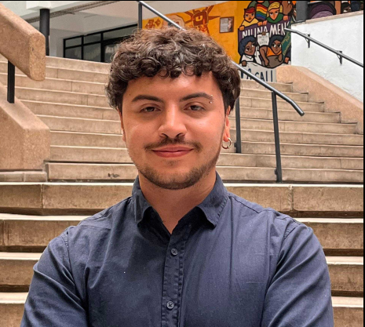
</div>

-  &nbsp; Tomás Urzúa
-  &nbsp; 328 Sociología FACSO, Universidad de Chile
-  &nbsp; <a href="mailto:tomas.urzua@ug.uchile.cl ">tomas.urzua@ug.uchile.cl </a>
-  &nbsp; <a href="https://github.com/tomasurzuam">tomasurzuam</a>
-  &nbsp; <a href="https://www.linkedin.com/in/tom%C3%A1s-urz%C3%BAa-moreno-b65755375/">linkedin</a>
-  &nbsp; <a href="https://calendar.app.google/BoyLBTKhuGqiPiLK8">Agendar reunión</a>

:::

::: {.g-col-12 .g-col-md-8}

<div class="image-cropper">
  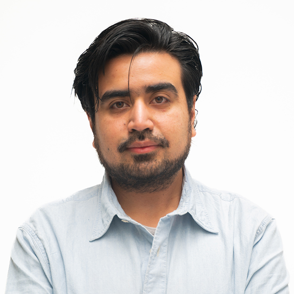
</div>

-  &nbsp; Gabriel Cortés
-  &nbsp; Decanatura FACSO, Universidad de Chile
-  &nbsp; <a href="mailto:gabriel.cortes@uchile.cl ">gabriel.cortes@uchile.cl </a>
-  &nbsp; <a href="https://github.com/gabcortes97">gabcortes97</a>

:::


:::

:::


::: {.g-col-12 .g-col-md-4 .contact-policy}


### Actividades

-  &nbsp; **Lunes 8:30 a 10:00**
-  &nbsp; Sala 6 Aulario C


-  &nbsp; **Miércoles 8:30 a 10:00**
-  &nbsp;  Aulario B sala B1 
-  &nbsp;  FACSO sala 45 
-  &nbsp;  FACSO sala 345

:::
:::
:::

## Ayudantes

::: {.home}

::: {.grid .ayudantes-grid}

::: {.g-col-6 .g-col-md-3}
::: {.ayudante-card}
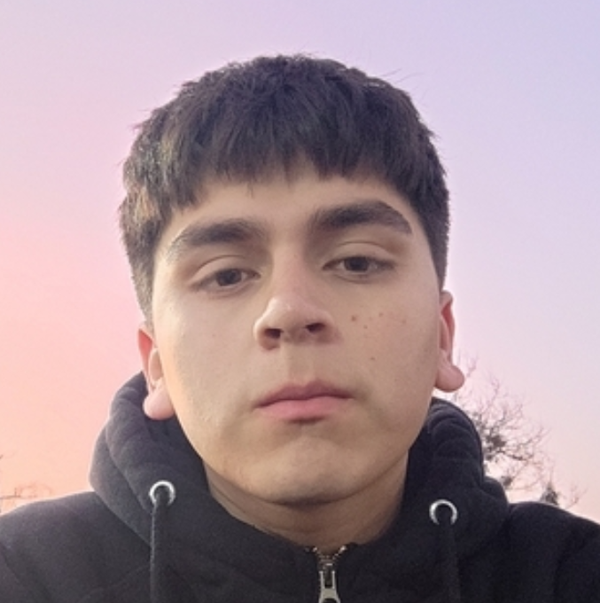{.ayudante-foto}

**Bastián Martin**
:::
:::

::: {.g-col-6 .g-col-md-3}
::: {.ayudante-card}
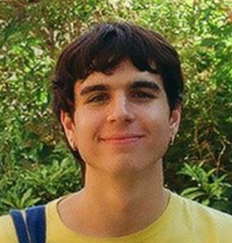{.ayudante-foto}

**Felipe Vega**
:::
:::

::: {.g-col-6 .g-col-md-3}
::: {.ayudante-card}
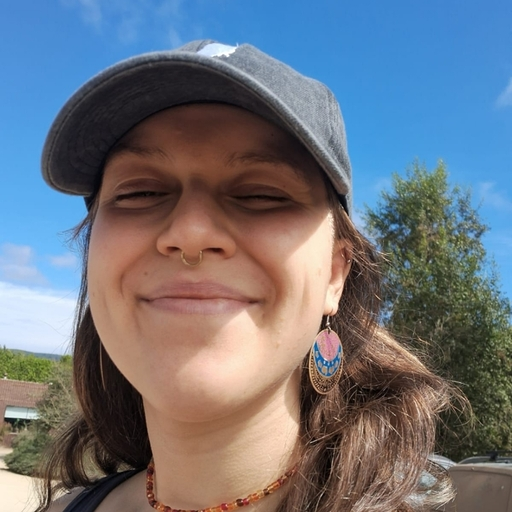{.ayudante-foto}

**Manuela Chateau**
:::
:::

::: {.g-col-6 .g-col-md-3}
::: {.ayudante-card}
{.ayudante-foto}

**Joaquín Núñez**
:::
:::

::: {.g-col-6 .g-col-md-3}
::: {.ayudante-card}
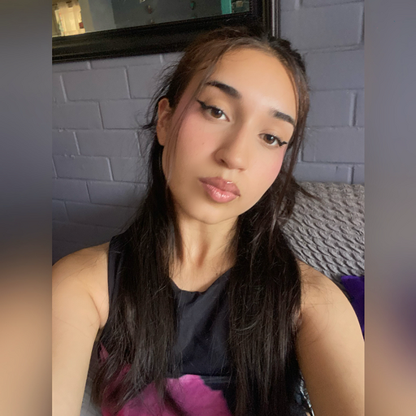{.ayudante-foto}

**Amaranta González**
:::
:::

::: {.g-col-6 .g-col-md-3}
::: {.ayudante-card}
{.ayudante-foto}

**Amanda Rojo**
:::
:::

::: {.g-col-6 .g-col-md-3}
::: {.ayudante-card}
{.ayudante-foto}

**Cassidy Mansilla**
:::
:::

::: {.g-col-6 .g-col-md-3}
::: {.ayudante-card}
{.ayudante-foto}

**Nicolás Outerbridge**
:::
:::

::: {.g-col-6 .g-col-md-3}
::: {.ayudante-card}
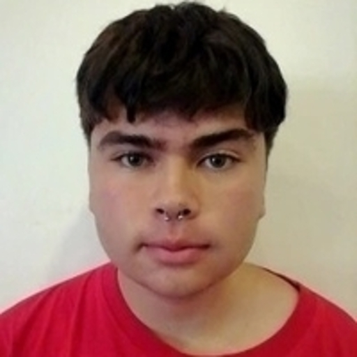{.ayudante-foto}

**Cristóbal Ramírez**
:::
:::

::: {.g-col-6 .g-col-md-3}
::: {.ayudante-card}
{.ayudante-foto}

**Tomás González**
:::
:::

::: {.g-col-6 .g-col-md-3}
::: {.ayudante-card}
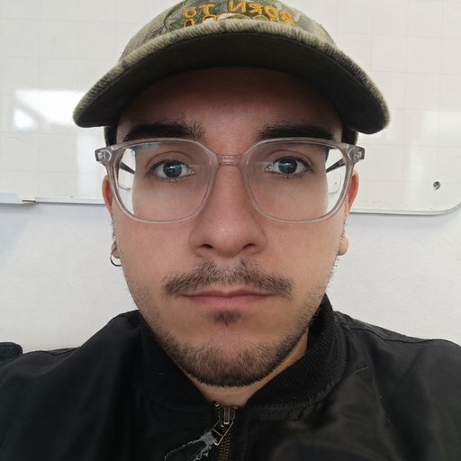{.ayudante-foto}

**Renato De Luca**
:::
:::

::: {.g-col-6 .g-col-md-3}
::: {.ayudante-card}
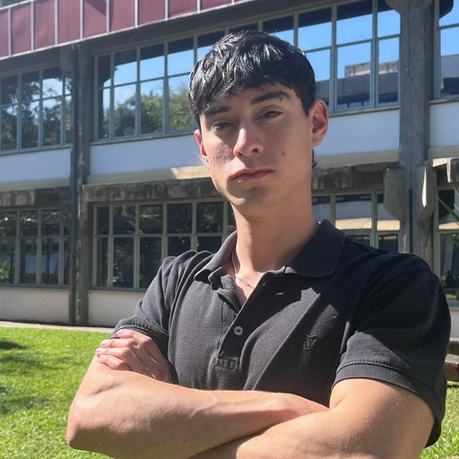{.ayudante-foto}

**Vicente Rojas**
:::
:::

::: {.g-col-6 .g-col-md-3}
::: {.ayudante-card}
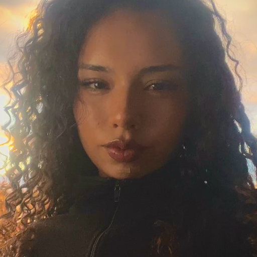{.ayudante-foto}

**Amaya Barbet**
:::
:::

:::

:::

## Últimas informaciones

::: {#informaciones}
:::

## Versiones anteriores del curso

- [2025](https://correlacional.netlify.app/)

- [2024](https://2024--correlacional.netlify.app/)

- [2023](https://2023--correlacional.netlify.app/)
