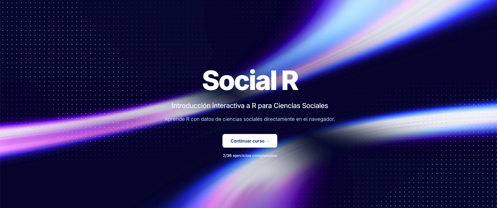

{.news-main-image}

Ya se encuentra disponible **Social R**, una plataforma interactiva para practicar R con datos de ciencias sociales directamente desde el navegador.

La plataforma está pensada especialmente para apoyar la **preparación de la segunda evaluación**, que incluirá trabajo en R.

Los ejercicios están organizados de manera progresiva para que puedan avanzar **a su propio ritmo**, practicar los comandos trabajados en el curso y desarrollar gradualmente las habilidades necesarias para trabajar con datos en R.

No es necesario instalar nada: pueden escribir código, ejecutarlo y resolver los ejercicios directamente en la plataforma.

  <a href="https://karavena.github.io/social-r/"
     class="course-resource-button"
     target="_blank"
     rel="noopener noreferrer"
     aria-label="Acceder a Social R en una nueva pestaña">
    Practicar en Social R →
  </a>

La recomendación es **ir avanzando durante estas semanas**, en lugar de realizar todos los ejercicios justo antes de la evaluación.

Su progreso se guarda en el navegador, por lo que pueden continuar desde donde quedaron cada vez que vuelvan a ingresar. 