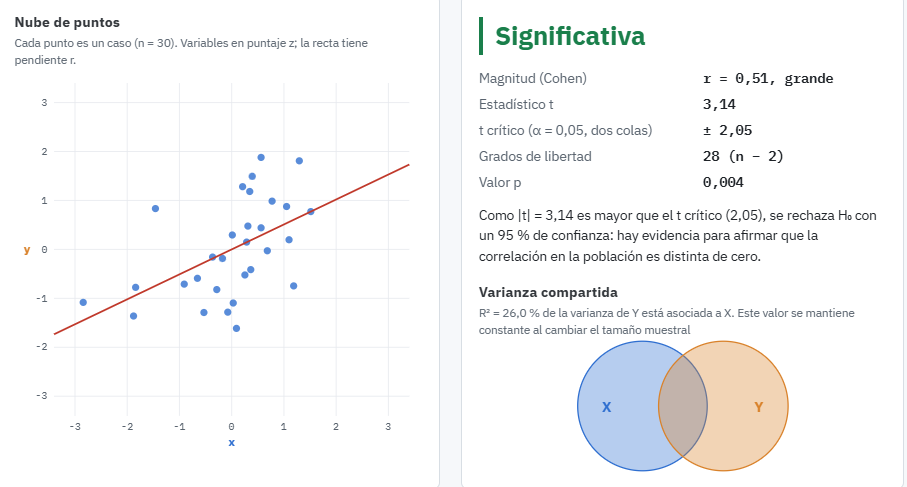

{.news-main-image}

En este post podrán encontrar la visualización interactiva *Interpretando Correlaciones*, presentada en la clase lectiva del 28 de septiembre. A través del visualizador pueden explorar de forma gráfica cómo interactúan el coeficiente de correlación de Pearson, el tamaño muestral y el nivel de confianza, y cómo esto afecta la interpretación del coeficiente.

En el primer panel podrán observar la nube de puntos generada a partir del tamaño muestral y el *r* de Pearson seleccionados. En el segundo panel, en tanto, podrán revisar información sobre la magnitud del coeficiente, el estadístico *t* y el valor *p*. Asimismo, se muestra una representación gráfica de la varianza compartida entre *x* e *y*, que corresponde al $r^2$.

<iframe src="https://gabcortes97.github.io/correlacion/significancia-correlacion.html"
        width="100%" height="900" style="border: none;"
        title="Visualizador: significancia de la correlación"
        loading="lazy"></iframe>

  <a href="https://gabcortes97.github.io/correlacion/significancia-correlacion.html"
     class="course-resource-button"
     target="_blank"
     rel="noopener noreferrer"
     aria-label="Abrir el visualizador en una nueva pestaña">
    Abrir visualizador en pantalla completa →
  </a>

