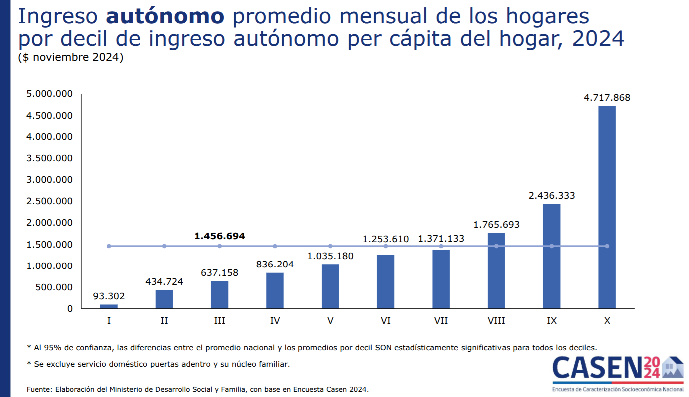
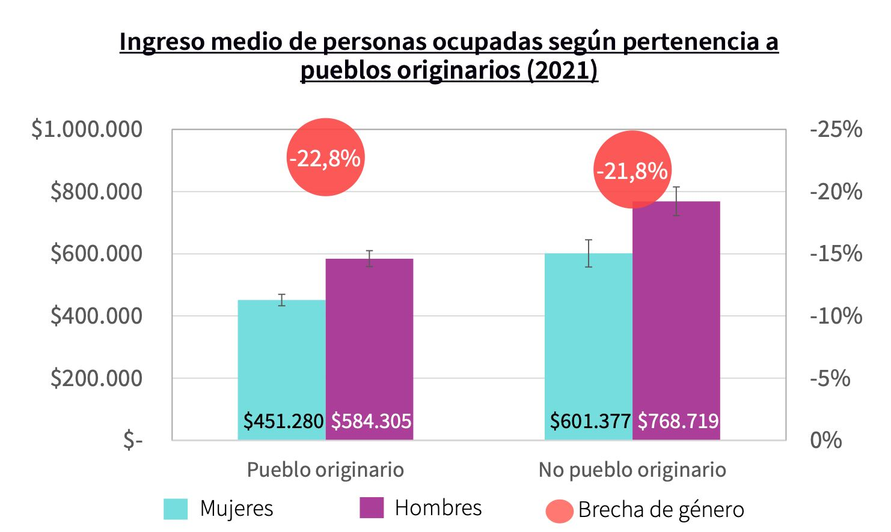
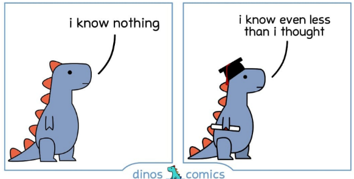
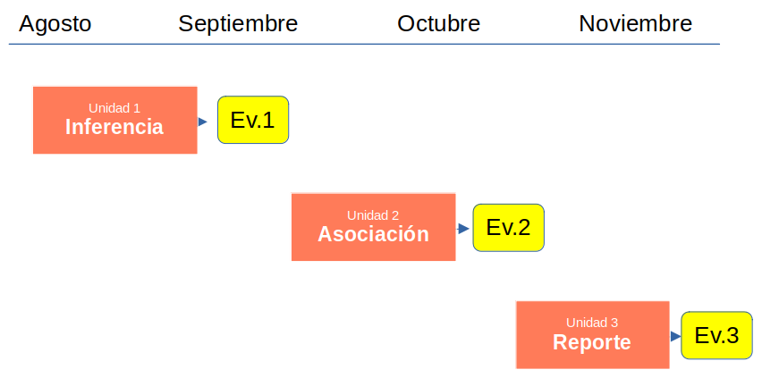

# {.hide-logo data-background-color="#0C3547"}

 

::::: columns
::: {.column width="30%"}

 

{width="100%" fig-align="right"}
:::

:::{.column width="2%"}

:::

::: {.column style="width: 65%; font-size: 25px; text-align: right; margin: 0 auto;"}

 

### [Estadística Correlacional]{style="font-size: 2em; color: white;"}

::: {style="border-top: 1px solid white; margin: 0.3em 0;"}
:::

[Inferencia, asociación, y reporte]{style="font-size: 1.5em; color: #dfc117;"}

[Juan Carlos Castillo]{style="font-size: 1em; color: white;"}\
[Sociología FACSO - UChile]{style="font-size: 1em; color: white;"}\
[2do Sem 2026]{style="font-size: 1em; color: white;"}

[correlacional.metodos-facso.org](https://correlacional.metodos-facso.org)

:::
:::::

#

### ¿Es posible que la mayoría de las personas ganen menos que el promedio de ingresos de la población? 

{width="50%" fig-align="right"}

# 

{width="70%" fig-align="center"}

## ¿Existen diferencias [significativas]{style="color: #9e0000;"} de ingreso entre grupos de la población?

{width="50%" fig-align="right"}

## 

{width="70%" fig-align="center"}

## ESTE CURSO

### a- Lo SIGNIFICATIVO (y el error) 

  - inferencia estadística

### b- Diferencias y asociaciones entre grupos 

  - correlación

# [Objetivo de la sesión:]{style="color: white;"} {data-background-color="#0C3547"}

::: {style="color: white;"}
- marco general del curso

- motivación

- contenidos y funcionamiento
:::

# {data-background-color="#212525" .vcenter style="text-align: center;"}

[*¿Qué saben de este curso?*]{style="color: white; font-size: 1.7em;"}\
 
[*¿Cuáles son sus expectativas?*]{style="color: white; font-size: 1.7em;"}

# Algunos mitos

:::: {.columns}
::: {.column width="50%"}

:::

::: {.column width="50%" .fragment}

- positivismo

- predominante

- foco en los números

- cuadrado

- masculino

- verdad absoluta

:::
::::

# [¿Por qué estudiar estadística en sociología?]{style="color: #dfc117;"} {data-background-color="#212525" .vcenter style="text-align: center;"}

## {.vcenter}

:::: {.columns}
::: {.column width="50%"}

::: {.content-box-red style="text-align: center;"}
### Imaginación sociológica

Relación del individuo con la sociedad y con la historia

Individuos en contexto social

(C.Wright Mills)
:::

:::

::: {.column width="50%" .fragment}

::: {.content-box-green style="text-align: center;"}
### Imaginación estadística

Una apreciación de que tan usual o inusual es un evento, circunstancia o comportamiento, en relación con un conjunto mayor de eventos similares

(Ritchey, 2008)
:::
:::

::::

# [Adquirir la imaginación estadística]{style="color: #dfc117;"} {data-background-color="#212525" .vcenter style="text-align: center;"}

es abrir los ojos a una representación más amplia de la realidad y superar malentendidos, prejuicios y estrechez de pensamiento

[(Ritchey, 2008, p.3)]{style="color: white; font-size: 0.5em;"}

## {.vcenter}

:::: {.columns}
::: {.column width="50%"}

### Estadística:

"Rama de la matemática que utiliza grandes conjuntos de datos numéricos para obtener **inferencias** basadas en el cálculo de probabilidades". (RAE)

:::

::: {.column width="50%" .fragment}

### Dos características:

- **humildad**: la inferencia siempre posee una probabilidad de **error**

- **pretensión**: podemos medir y establecer qué grado de error estamos cometiendo

:::
::::

# {data-background-color="#212525" .vcenter style="text-align: center;"}

 *"El problema con el mundo es que las personas inteligentes están llenas de dudas, mientras que las estúpidas están llenas de certezas"* (Bukowski)

 

{width="10%" fig-align="center"}

# {data-background-color="#212525" .vcenter style="text-align: center;"}

[Concepto central:]{style="color: white; font-size: 1em;"}\
[ERROR ... y su medición]{style="color: #dfc117; font-size: 1.5em;"}

# [Este curso]{style="color: white;"} {data-background-color="#9B2626"}

##

**Ciclo de formación en métodos cuantitativos**

## {.vcenter}

:::: {.columns}
::: {.column width="50%"}

::: {.content-box-red style="text-align: center;"}
### Estadística descriptiva

Número de observaciones registradas y frecuencia de esas observaciones (en una muestra o en la población)
:::

:::

::: {.column width="50%"}

::: {.content-box-green style="text-align: center;"}
### Estadística inferencial

Contraste de hipótesis y teorías científicas en base a datos de investigación
:::
:::
::::

# Unidades

1. [**Inferencia**]{style="color: #a80f0f;"}: los resultados que encontramos en nuestra muestra, ¿se encuentran también en la población de la cual proviene la muestra? ¿Con qué probabilidad de **error**?

2. [**Asociación**]{style="color: #a80f0f;"} entre variables: tamaño y significación estadística

3. [**Reporte y reproducibilidad**]{style="color: #a80f0f;"}: cómo comunicar los resultados de manera clara y transparente

## Organización general

::: {style="text-align: center;"}

:::

## Consideraciones

- comunicación eficiente

- participación

- puntualidad

- asistencia

- lecturas

- monitoreo

# WEB:

[correlacional.metodos-facso.org](https://correlacional.metodos-facso.org){style="color: #003acd; font-size: 1.5em;"}

 

### [-\> revisar programa y planificación]{style="color: white;"}

# {.hide-logo data-background-color="#0C3547"}

 

::::: columns
::: {.column width="30%"}

 

{width="100%" fig-align="right"}
:::

:::{.column width="2%"}

:::

::: {.column style="width: 65%; font-size: 25px; text-align: right; margin: 0 auto;"}

 

### [Estadística Correlacional]{style="font-size: 2em; color: white;"}

::: {style="border-top: 1px solid white; margin: 0.3em 0;"}
:::

[Inferencia, asociación, y reporte]{style="font-size: 1.5em; color: #dfc117;"}

[Juan Carlos Castillo]{style="font-size: 1em; color: white;"}\
[Sociología FACSO - UChile]{style="font-size: 1em; color: white;"}\
[2do Sem 2026]{style="font-size: 1em; color: white;"}

[correlacional.metodos-facso.org](https://correlacional.metodos-facso.org)

:::
:::::
