# {.hide-logo data-background-color="#0C3547"}

<br>

::::: columns
::: {.column width="30%"}

<br>

{width="100%" fig-align="right"}
:::

:::{.column width="2%"}

:::

::: {.column style="width: 65%; font-size: 25px; text-align: right; margin: 0 auto;"}

<br>

### [Estadística Correlacional]{style="font-size: 2em; color: white;"}

::: {style="border-top: 1px solid white; margin: 0.3em 0;"}
:::

[Inferencia, asociación, y reporte]{style="font-size: 1.5em; color: #dfc117;"}

[Juan Carlos Castillo]{style="font-size: 1em; color: white;"}\
[Sociología FACSO - UChile]{style="font-size: 1em; color: white;"}\
[2do Sem 2026]{style="font-size: 1em; color: white;"}

[correlacional.metodos-facso.org](https://correlacional.metodos-facso.org)

<br>
[**Inferencia 1**:]{style="color: white; font-size: 1.3em;"}

[Datos, probabilidad y distribuciones muestrales]{style="color: #dfc117;"}

:::
:::::

# [Objetivos de la sesión de hoy]{style="color: #00aaff; font-size: 0.7em;"} {data-background-color="#0C3547"}

::: {style="color: white;"}
1. Recordar y nivelar aprendizajes previos a este curso, fundamentalmente respecto al manejo de datos, medición y varianza

2. Introducción a probabilidad, distribuciones muestrales e inferencia
:::

# [Contenidos]{style="display: block; text-align: right; color: #00aaff; font-size: 0.9em;"} {data-background-color="#0C3547"}

<br>

::: {style="text-align: right;font-size: 1.3em; color: white;"}
1. [**Bases**]{style="color: #dfc117;"}
2. [Probabilidad e inferencia]{style="color: #797b7d;"}
:::

## Datos

* Los datos son una expresión numérica de la medición de al menos una [*característica*]{style="color: #9e0000;"} de a lo menos una [*unidad*]{style="color: #9e0000;"} en a lo menos [*un punto en el tiempo*]{style="color: #9e0000;"}

::: {.fragment style="font-size: 0.9em;" }
* **Ejemplo**: La esperanza de vida en Chile el 2017 fue de 79,9 años

  - Característica (variable): esperanza de vida
  - Unidad: Años
  - Punto en el tiempo: 2017
:::

## Medir

:::: {.columns}
::: {.column width="50%"}

- "asignar números, símbolos o valores a las propiedades de objetos o eventos de acuerdo con reglas" (Stevens, 1951)

- Vincula conceptos abstractos con indicadores empíricos

:::

::: {.column width="50%"}

{width="100%"}

:::
::::

## Medir: requisitos

<br>

- **Exhaustividad**: el mayor número de categorías significativas.
  - Ej: ¿Qué categorías se deben considerar para población migrante?

- **Exclusividad**: atributos mutuamente excluyentes

## Ejemplos 

Algunos  estudios / bases de datos: 

1. [Encuesta Centro de Estudios Públicos](https://www.cepchile.cl/opinion-publica/encuesta-cep/)

2. [Encuesta CASEN](https://observatorio.ministeriodesarrollosocial.gob.cl/encuesta-casen)

3. [Encuesta Lapop](https://www.vanderbilt.edu/lapop-espanol/)

4. [ELSOC](https://coes.cl/encuesta-panel/)

## Variables

::: {.incremental}
- Una variable representa cualquier cosa o propiedad que varía y a la cuál se le asigna un valor. Es decir:

- $Variable \neq Constante$

- Pueden ser visibles o no visibles/latentes (Ej: peso / inteligencia)
:::

## Variables

- discretas (rango finito de valores):
  - Dicotómicas
  - Politómicas

- continuas:
  - Rango (teóricamente) infinito de valores.

## Tendencia Central

Descripción básica de una variable:

* **Moda**: valor que ocurre más frecuentemente

* **Mediana**: valor medio de la distribución ordenada. Si N es par, entonces es el promedio de los valores medios

* **Media** o promedio aritmético: suma de los valores dividido por el total de casos

## Dispersión: Varianza

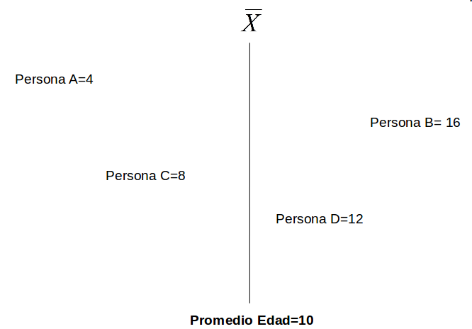{width="100%"}


## Dispersión: Varianza


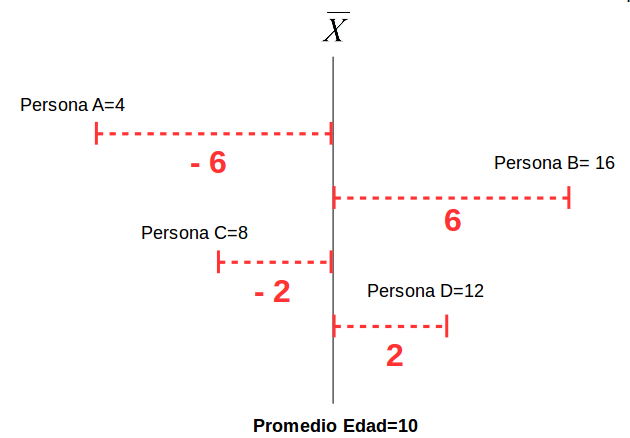{width="100%"}


## Dispersión: Varianza

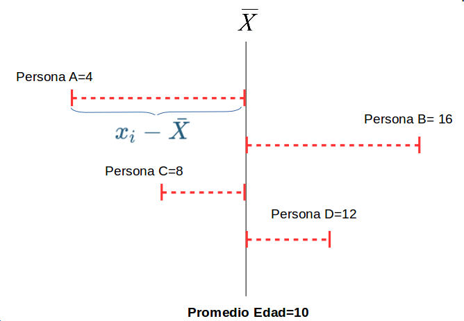{width="100%"}

## Dispersión:

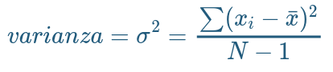{width="50%" fig-align="center"}

::: {.fragment style="color: #ff0000; text-align: center;"}
### [La VARIANZA equivale al promedio de la suma de las diferencias del promedio al cuadrado]{style="color: #ff0000; "} 
:::

## Desviación Estándar

:::: {.columns}
::: {.column width="50%"}

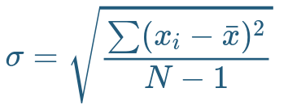{width="100%"}

:::

::: {.column width="50%"}

- Raíz Cuadrada de la varianza.

- Expresada en la mismas unidades que los puntajes de la escala original

:::
::::

# [Contenidos]{style="display: block; text-align: right; color: #00aaff; font-size: 0.9em;"} {data-background-color="#0C3547"}

<br>

::: {style="text-align: right;font-size: 1.3em; color: white;"}
1. [Bases]{style="color: #797b7d;"}
2. [**Probabilidad e inferencia**]{style="color: #797b7d;"}
:::


# {background-image="https://images.rawpixel.com/image_800/cHJpdmF0ZS9sci9pbWFnZXMvd2Vic2l0ZS8yMDIyLTEyL3JtNjE0LWotYmctMDA4LmpwZw.jpg" background-size="cover"}

::: {style="font-size: 0.7em;"}
En aquel Imperio, el Arte de la Cartografía logró tal Perfección que el mapa de una sola Provincia ocupaba toda una Ciudad, y el mapa del Imperio, toda una Provincia. Con el tiempo, estos Mapas Desmesurados no satisficieron y los Colegios de Cartógrafos levantaron un Mapa del Imperio, que tenía el tamaño del Imperio y coincidía puntualmente con él.

Menos Adictas al Estudio de la Cartografía, las Generaciones Siguientes entendieron que ese dilatado Mapa era Inútil y no sin Impiedad lo entregaron a las Inclemencias del Sol y los Inviernos. En los desiertos del Oeste perduran despedazadas Ruinas del Mapa, habitadas por Animales y por Mendigos; en todo el País no hay otra reliquia de las Disciplinas Geográficas.

Suárez Miranda, Viajes de Varones Prudentes, Libro Cuarto, Cap. XLV, Lérida, 1658.
:::

::: {.fragment style="text-align: right;"}
Borges - Del Rigor de la Ciencia
:::


## Inferencia

Cuando se analizan datos, 2 aspectos principales

:::: {.columns}
::: {.column width="50%"}

::: {.content-box-green}
**[Cálculo del estadístico:]{style="color: #fff706;"}**

- promedio
- desviación estándar
- correlación
- ...
:::

:::

::: {.column width="50%"}

::: {.content-box-red}
**[Inferencia:]{style="color: #fff706;"}** ¿existe este estadístico en la población?

- probabilidad
- error
- significación

:::

:::
::::

## 

{width="50%" fig-align="center"}

## Inferencia

:::: {.columns}
::: {.column width="15%"}

:::

::: {.column width="85%"}

¿En qué medida se pueden relacionar resultados que se encuentran en un [(sub)conjunto de unidades]{style="color: #27ae60;"} con lo que ocurre [en general]{style="color: #c0392b;"}?

::: {.fragment style="font-size:0.8em;"}
- Ej: si en un subconjunto de la población encuentro que el promedio de matemáticas es mayor en mujeres que en hombres ¿es esto un [reflejo]{style="color: #dfc117;"} de lo que ocurre en general, o se debe solo al [azar]{style="color: #c0392b;"}? ¿se puede [extrapolar]{style="color: #27ae60;"} a la población?
:::

:::
::::

## Conceptos clave

:::: {.columns style="font-size: 0.9em;"}
::: {.column width="30%"}

{width="100%"}

:::

::: {.column width="65%"}

::: {.incremental}
- La **inferencia** en estadística se refiere a la relación que existe entre los resultados obtenidos basados en nuestra muestra y la población
- **¿En qué medida podemos hacer inferencias desde nuestra muestra a la población?**
- Un concepto central es la probabilidad de **ERROR**
:::

:::
::::

## [Parámetros y estadísticos]{style="font-size: 0.8em;"}

|                     	| Población (parámetro)  	| Muestra (estadístico)  	|
|---------------------	|------------	|---------	|
| Promedio            	|  $\mu$           	|   $\bar{x}$           	|
| Varianza            	|        $\sigma²$      	|  $s²$                  	|
| Desviación estándar 	|        $\sigma$        	| $s$                    	|
| Correlación 	|        $\rho$        	| $r$                    	|


## [Muestreo y variabilidad]{style="font-size: 0.9em;"}

::: {.content-box-red}
¿Cómo es posible que la media x̄ obtenida a partir de una muestra de unos pocos hogares de todos los del país, pueda ser una estimación precisa de µ?
:::


Una segunda muestra aleatoria obtenida en el mismo momento estaría formada por hogares distintos y, sin duda, daría un valor distinto de x̄

## [Muestreo y variabilidad]{style="font-size: 0.9em;"}

**Variabilidad muestral**: el valor de un estadístico varía en un muestreo aleatorio repetido

::: {.incremental}
- ¿Cuánto varía?
- ¿En qué rangos?
- ¿Qué tan **probable** es el rango de variación?
- ¿Es un rango aceptable en términos de investigación social?
:::

## 

{width="70%" fig-align="center"}

## [Aleatoriedad y probabilidad]{style="font-size: 0.8em;"}

:::: {.columns}
::: {.column width="50%"}

::: {.content-box-red style="font-size: 0.9em;"}
Llamamos a un fenómeno **[aleatorio]{style="color: #f9fd00;"}** si los resultados individuales son inciertos y, sin embargo, existe una **[distribución regular]{style="color: #f9fd00;"}** de los resultados después de un gran número de repeticiones.
:::

:::

::: {.column width="50%" .fragment}

::: {.content-box-green}
La probabilidad de cualquier resultado de un fenómeno aleatorio es la **proporción de veces** que el resultado se da después de una larga serie de repeticiones
:::

:::
::::

## Azar y repetición

:::: {.columns}
::: {.column width="40%"}

El comportamiento del azar es impredecible con pocas repeticiones pero presenta un comportamiento regular y predecible con muchas repeticiones.

:::

::: {.column width="55%"}

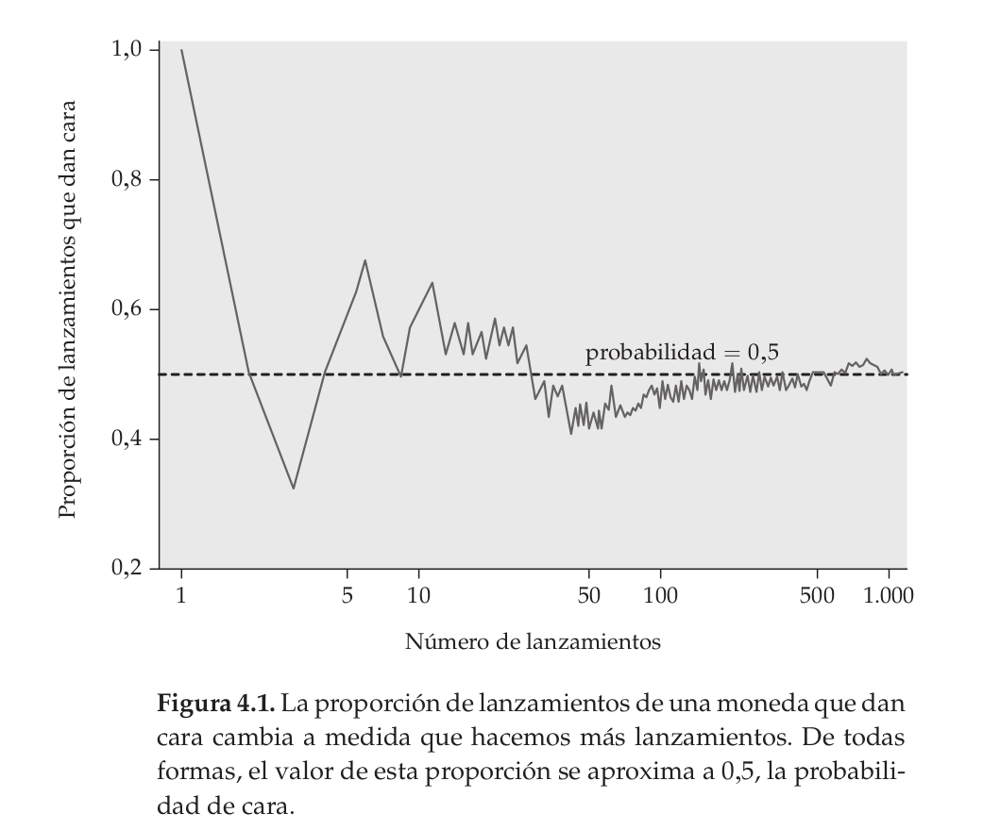{width="100%"}

:::
::::

## (Dato freak)

:::: {.columns}
::: {.column width="50%"}

Cerca del año 1900, el estadístico inglés Karl Pearson lanzó al aire una moneda **24.000** veces. El resultado: 12.012 caras, una proporción de 0,5005.

:::

::: {.column width="50%"}

{width="100%"}

:::
::::

## Dados

Tenemos 1 dado, ¿cuál es la probabilidad de que salga 3 al lanzarlo?

- Espacio muestral S = conjunto de todos los resultados posibles

  - $S=\{1,2,3,4,5,6\}$

- N del espacio muestral = 6 sucesos posibles

- Probabilidad de que salga 3 al tirar el dado = $\frac{1}{6}=0.166$

## 

::: {.incremental style="font-size: 1.1em;"}
- Un [modelo de probabilidad]{style="color: #df1717;"} para un fenómeno aleatorio consiste en un espacio muestral S y una asignación de probabilidades P.

- El [espacio muestral S]{style="color: #047400;"} es el conjunto de todos los resultados posibles de un fenómeno aleatorio.

- Un [suceso]{style="color: #1788df;"} es un conjunto de resultados. P asigna un número P(A) a un suceso A como su probabilidad.
:::

## [Dados, probabilidades y distribuciones]{style="font-size: 0.8em;"}

:::: {.columns}
::: {.column width="30%"}

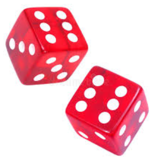{width="100%"}

:::

::: {.column width="70%"}

Ejercicio:

- probar lanzando 1 dado repetidas veces
- probar con 2 dados
- ... y con 6

-> [link](https://academo.org/demos/dice-roll-statistics/)

:::
::::

## Dados, probabilidades y áreas

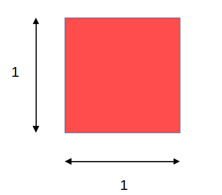{width="100%" fig-align="center"}

## Dados, probabilidades y áreas

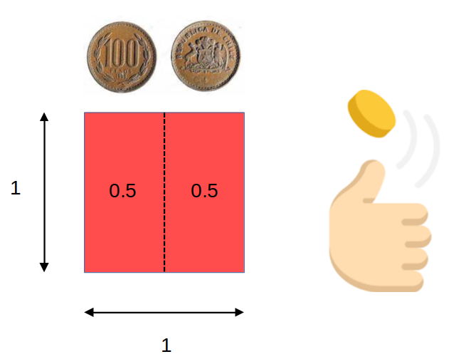{width="100%" fig-align="center"}

## Dados, probabilidades y áreas

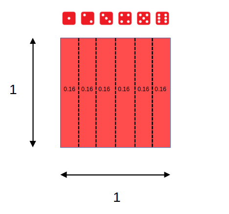{width="100%" fig-align="center"}

## [Dados, probabilidades y áreas]{style="font-size: 0.8em;"}

:::: {.columns}
::: {.column width="40%"}

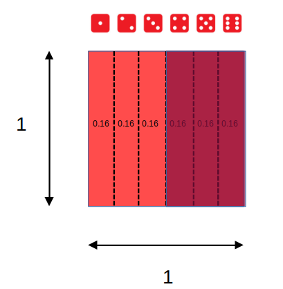{width="100%"}

:::

::: {.column width="60%" style="font-size: 0.8em;"}

<br>

Eventos posibles (espacio muestral S) = 6 = (1,2,3,4,5,6)

$$
\begin{align*}
P(x)\geq4&=P(4)+P(5)+P(6) \\
&=0.1\overline{6}+0.1\overline{6}+0.1\overline{6} \\
&=0.5
\end{align*}
$$

:::
::::

## [Sucesos con distinta probabilidad]{style="font-size: 0.6em;"}

Ej: suma de 2 dados al azar repetidos

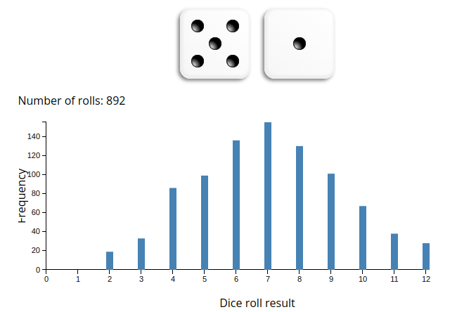{width="80%" fig-align="center"}

## [Distribución muestral del promedio]{style="font-size: 0.6em;"}

::: {.incremental style="font-size: 0.9em;"}
- si extraemos repetidamente 2 dados, y obtenemos su **promedio**, el gráfico de frecuencias tenderá a una forma **acampanada**
- esto ocurre simplemente porque la probabilidad de valores extremos (como promedio 1 o promedio 6) es mucho menor que la de obtener valores centrales
- por lo tanto, podemos aproximarnos al promedio de la población mediante el **promedio de los promedios** de muchas muestras
:::

# {data-background-color="#212525" .vcenter style="text-align: center;"}


### [¿Cómo estimar el promedio de los promedios con **una sola muestra**?]{style="color: #dfc117;"}?

{width="30%" fig-align="center"}

# [Próxima clase]{style="color: white;"} {data-background-color="#9B2626"}

::: {style="color: white;"}
-> Error estándar y distribución normal ... o cómo estimar el promedio de los promedios con una sola muestra
:::

## Y tarea:

```{r}
#| eval: false
#| echo: true
# Generar todas las combinaciones posibles de dos dados
dado1 <- rep(1:6, each = 6)
dado2 <- rep(1:6, times = 6)

# Calcular la suma y el promedio para cada combinación
suma <- dado1 + dado2
promedio <- suma / 2

# Crear un data frame con los resultados
resultados <- data.frame(dado1, dado2, suma, promedio)

# Mostrar el data frame
print(resultados)


# Cargar la librería para gráficos
library(ggplot2)

# Gráfico de frecuencias para la suma
ggplot(resultados, aes(x = suma)) +
  geom_bar() +
  labs(title = "Gráfico de Frecuencias de la Suma", x = "Suma", y = "Frecuencia")

# Gráfico de frecuencias para los promedios
ggplot(resultados, aes(x = promedio)) +
  geom_bar() +
  labs(title = "Gráfico de Frecuencias de los Promedios", x = "Promedio", y = "Frecuencia")
```

# {.hide-logo data-background-color="#0C3547"}

<br>

::::: columns
::: {.column width="30%"}

<br>

{width="100%" fig-align="right"}
:::

:::{.column width="2%"}

:::

::: {.column style="width: 65%; font-size: 25px; text-align: right; margin: 0 auto;"}

<br>

### [Estadística Correlacional]{style="font-size: 2em; color: white;"}

::: {style="border-top: 1px solid white; margin: 0.3em 0;"}
:::

[Inferencia, asociación, y reporte]{style="font-size: 1.5em; color: #dfc117;"}

[Juan Carlos Castillo]{style="font-size: 1em; color: white;"}\
[Sociología FACSO - UChile]{style="font-size: 1em; color: white;"}\
[2do Sem 2026]{style="font-size: 1em; color: white;"}

[correlacional.metodos-facso.org](https://correlacional.metodos-facso.org)

:::
:::::
