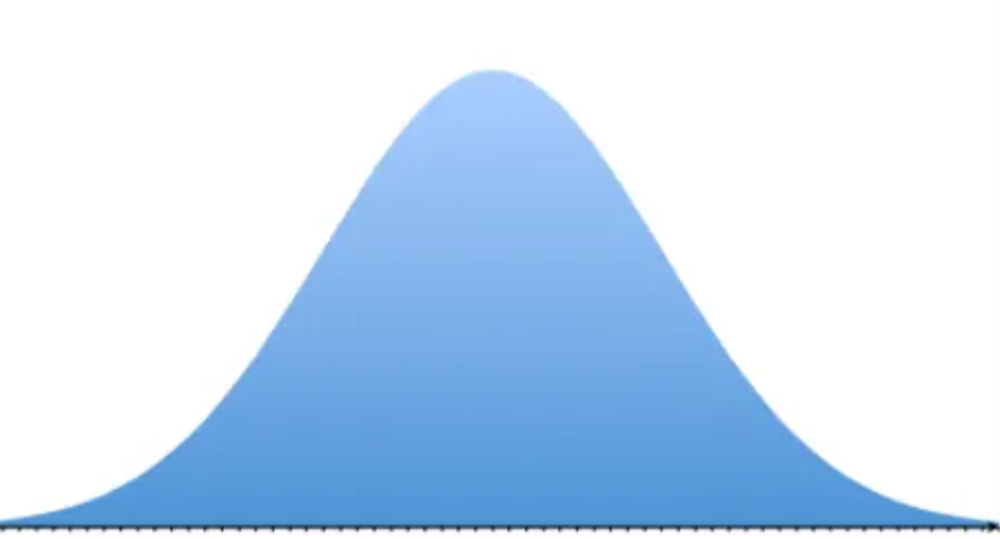
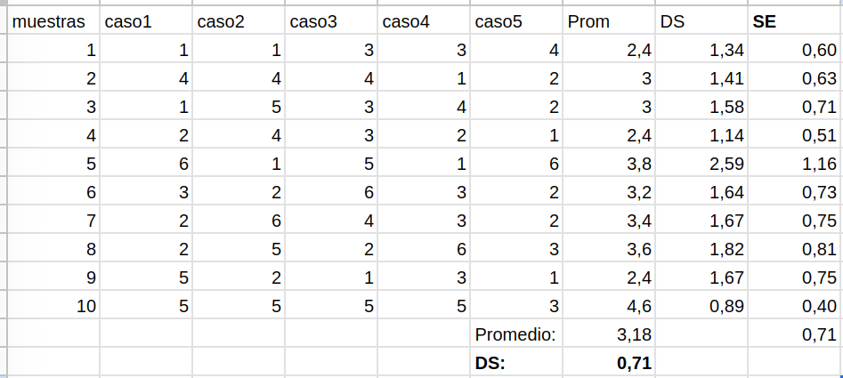

```{r setup}
#| include: false
library(ggplot2)
knitr::opts_chunk$set(warning = FALSE, message = FALSE, comment = "",
                       fig.width = 7, fig.height = 4.5)
```

# {.hide-logo data-background-color="#0C3547"}

<br>

::::: columns
::: {.column width="30%"}

<br>

{width="100%" fig-align="right"}
:::

:::{.column width="2%"}

:::

::: {.column style="width: 65%; font-size: 25px; text-align: right; margin: 0 auto;"}

<br>

### [Estadística Correlacional]{style="font-size: 2em; color: white;"}

::: {style="border-top: 1px solid white; margin: 0.3em 0;"}
:::

[Inferencia, asociación, y reporte]{style="font-size: 1.5em; color: #dfc117;"}

[Juan Carlos Castillo]{style="font-size: 1em; color: white;"}\
[Sociología FACSO - UChile]{style="font-size: 1em; color: white;"}\
[2do Sem 2026]{style="font-size: 1em; color: white;"}

[correlacional.metodos-facso.org](https://correlacional.metodos-facso.org)

<br>
[**Inferencia 2**:]{style="color: white; font-size: 1.3em;"}

[Error estándar y curva normal]{style="color: #dfc117;"}

:::
:::::

# La tarea

## 
```{r}
#| eval: false
#| echo: true
# Generar todas las combinaciones posibles de dos dados
dado1 <- rep(1:6, each = 6)
dado2 <- rep(1:6, times = 6)

# Calcular la suma y el promedio para cada combinación
suma <- dado1 + dado2
promedio <- suma / 2

# Crear un data frame con los resultados
resultados <- data.frame(dado1, dado2, suma, promedio)

# Mostrar el data frame
print(resultados)


# Cargar la librería para gráficos
library(ggplot2)

# Gráfico de frecuencias para la suma
ggplot(resultados, aes(x = suma)) +
  geom_bar() +
  labs(title = "Gráfico de Frecuencias de la Suma", x = "Suma", y = "Frecuencia")

# Gráfico de frecuencias para los promedios
ggplot(resultados, aes(x = promedio)) +
  geom_bar() +
  labs(title = "Gráfico de Frecuencias de los Promedios", x = "Promedio", y = "Frecuencia")
```

## La tarea: resultado

:::: {.columns style="font-size: 0.7em;"}
::: {.column width="45%"}

```{r}
#| eval: false
#| echo: true
# Generar todas las combinaciones posibles de dos dados
dado1 <- rep(1:6, each = 6)
dado2 <- rep(1:6, times = 6)

# Calcular la suma y el promedio para cada combinación
suma <- dado1 + dado2
promedio <- suma / 2

# Crear un data frame con los resultados
resultados <- data.frame(dado1, dado2, suma, promedio)

# Mostrar el data frame
print(resultados)
```

:::

::: {.column width="55%"}

```{r}
#| echo: false
# Generar todas las combinaciones posibles de dos dados
dado1 <- rep(1:6, each = 6)
dado2 <- rep(1:6, times = 6)

# Calcular la suma y el promedio para cada combinación
suma <- dado1 + dado2
promedio <- suma / 2

# Crear un data frame con los resultados
resultados <- data.frame(dado1, dado2, suma, promedio)

# Mostrar el data frame
print(resultados)
```

:::
::::

## La tarea: gráficos

:::: {.columns style="font-size: 0.7em;"}
::: {.column width="45%"}

```{r}
#| eval: false
#| echo: true
# Cargar la librería para gráficos
library(ggplot2)

# Gráfico de frecuencias para la suma
ggplot(resultados, aes(x = suma)) +
  geom_bar() +
  labs(title = "Gráfico de Frecuencias de la Suma", x = "Suma", y = "Frecuencia")

# Gráfico de frecuencias para los promedios
ggplot(resultados, aes(x = promedio)) +
  geom_bar() +
  labs(title = "Gráfico de Frecuencias de los Promedios", x = "Promedio", y = "Frecuencia")
```

:::

::: {.column width="55%"}

```{r}
#| echo: false
#| fig-width: 4
#| fig-height: 2.2
# Cargar la librería para gráficos
library(ggplot2)

# Gráfico de frecuencias para la suma
ggplot(resultados, aes(x = suma)) +
  geom_bar() +
  labs(title = "Gráfico de Frecuencias de la Suma", x = "Suma", y = "Frecuencia")

# Gráfico de frecuencias para los promedios
ggplot(resultados, aes(x = promedio)) +
  geom_bar() +
  labs(title = "Gráfico de Frecuencias de los Promedios", x = "Promedio", y = "Frecuencia")
```

:::
::::

## Probabilidad de promedio de 2 dados al azar {style="font-size: 0.75em;"}

```{r}
#| echo: false
# Generar todas las combinaciones posibles de dos dados
dado1 <- rep(1:6, each = 6)
dado2 <- rep(1:6, times = 6)

# Calcular la suma y el promedio para cada combinación
suma <- dado1 + dado2
promedio <- suma / 2

# Crear un data frame con los resultados
resultados_prom <- data.frame(promedio)

# Calcular las frecuencias de cada promedio
tabla_frecuencias <- table(resultados_prom$promedio)

# Calcular la probabilidad de ocurrencia de cada promedio
probabilidades <- tabla_frecuencias / sum(tabla_frecuencias)

# Crear la tabla final con valores de promedios y sus probabilidades
tabla_final <- data.frame(Promedio = as.numeric(names(probabilidades)),
                          Probabilidad = as.numeric(probabilidades))

# Mostrar la tabla final
print(tabla_final)
```

## ¿Qué aprendimos de esto?{style="font-size: 0.75em;"}

::: {style="font-size: 1.2em;"}
- la ocurrencia de algunos eventos (como la suma o promedio de dos dados) tienen una probabilidad determinada, lo que genera una **distribución teórica de probabilidad**

- si repito un evento aleatorio (ej: sacar muestras repetidas de dos dados y promediarlos) obtengo la **distribución empírica de probabilidad** (de frecuencias de los eventos)

- de acuerdo a la **ley de los grandes números**, el promedio empírico convergerá al teórico a medida que aumenta el número de repeticiones
:::

```{r}
#| echo: false
#| fig-show: hide
# Generación de gráficos de prob teóricas y empíricas
# Definimos los promedios posibles (1.5, 2, 2.5, ..., 5.5, 6)
promedios_posibles <- seq(1, 6, by = 0.5)

# Calculamos la distribución de probabilidad teórica para cada promedio
# Las probabilidades corresponden a los valores de promedios específicos
probabilidades_teoricas <- c(1/36, 2/36, 3/36, 4/36, 5/36, 6/36, 5/36, 4/36, 3/36, 2/36, 1/36)

# Graficamos la distribución de probabilidad teórica
barplot(probabilidades_teoricas,
        names.arg = promedios_posibles,
        main = "Distribución de Probabilidad Teórica del Promedio de Dos Dados",
        xlab = "Promedio de los Dados",
        ylab = "Probabilidad Teórica",
        ylim = c(0, 0.2),
        col = "orange")

teoric = recordPlot()

# Repeticiones

# Establecemos la semilla para reproducibilidad
set.seed(123)

# Simulamos 100 repeticiones de dos dados
dados1 <- sample(1:6, 100, replace = TRUE)
dados2 <- sample(1:6, 100, replace = TRUE)

# Calculamos el promedio de los resultados de ambos dados
promedio_dados <- (dados1 + dados2) / 2

# Calculamos las frecuencias de cada promedio posible
frecuencias_empiricas <- table(promedio_dados)

# Convertimos las frecuencias a probabilidades
probabilidades_empiricas <- frecuencias_empiricas / sum(frecuencias_empiricas)

# Graficamos las frecuencias de probabilidad empíricas
barplot(probabilidades_empiricas,
        main = "Frecuencia de Probabilidad del Promedio de Dos Dados (100 repeticiones)",
        xlab = "Promedio de los Dados",
        ylab = "Frecuencia de Probabilidad",
        col = rgb(0.1, 0.5, 0.8, 0.6), # Azul con transparencia
        ylim = c(0, 0.2))

rep100_puro = recordPlot()

# Superponemos las barras de la distribución teórica
barplot(probabilidades_teoricas,
        names.arg = promedios_posibles,
        col = rgb(0.8, 0.2, 0.2, 0.5), # Rojo con transparencia
        add = TRUE)

# Se agrega al gráfico existente
legend("topright", legend = c("Empírica", "Teórica"),
               fill = c(rgb(0.1, 0.5, 0.8, 0.6), rgb(0.8, 0.2, 0.2, 0.5)),
               border = "white")

rep100 = recordPlot()

# Rep 500
# Establecemos la semilla para reproducibilidad
set.seed(123)

# Simulamos 500 repeticiones de dos dados
dados1 <- sample(1:6, 500, replace = TRUE)
dados2 <- sample(1:6, 500, replace = TRUE)

# Calculamos el promedio de los resultados de ambos dados
promedio_dados <- (dados1 + dados2) / 2

# Calculamos las frecuencias de cada promedio posible
frecuencias_empiricas <- table(promedio_dados)

# Convertimos las frecuencias a probabilidades
probabilidades_empiricas <- frecuencias_empiricas / sum(frecuencias_empiricas)

# Graficamos las frecuencias de probabilidad empíricas
barplot(probabilidades_empiricas,
        main = "Frecuencia de Probabilidad del Promedio de Dos Dados (500 repeticiones)",
        xlab = "Promedio de los Dados",
        ylab = "Frecuencia de Probabilidad",
        col = rgb(0.1, 0.5, 0.8, 0.6), # Azul con transparencia
        ylim = c(0, 0.2))

# Superponemos las barras de la distribución teórica
barplot(probabilidades_teoricas,
        names.arg = promedios_posibles,
        col = rgb(0.8, 0.2, 0.2, 0.5), # Rojo con transparencia
        add = TRUE)

# Se agrega al gráfico existente
legend("topright", legend = c("Empírica", "Teórica"),
       fill = c(rgb(0.1, 0.5, 0.8, 0.6), rgb(0.8, 0.2, 0.2, 0.5)),
       border = "white")

rep500 = recordPlot()

# rep1500

# Establecemos la semilla para reproducibilidad
set.seed(123)

# Simulamos 1500 repeticiones de dos dados
dados1 <- sample(1:6, 1500, replace = TRUE)
dados2 <- sample(1:6, 1500, replace = TRUE)

# Calculamos el promedio de los resultados de ambos dados
promedio_dados <- (dados1 + dados2) / 2

# Calculamos las frecuencias de cada promedio posible
frecuencias_empiricas <- table(promedio_dados)

# Convertimos las frecuencias a probabilidades
probabilidades_empiricas <- frecuencias_empiricas / sum(frecuencias_empiricas)

# Graficamos las frecuencias de probabilidad empíricas
barplot(probabilidades_empiricas,
        main = "Frecuencia de Probabilidad del Promedio de Dos Dados (1500 repeticiones)",
        xlab = "Promedio de los Dados",
        ylab = "Frecuencia de Probabilidad",
        col = rgb(0.1, 0.5, 0.8, 0.6), # Azul con transparencia
        ylim = c(0, 0.2))

# Superponemos las barras de la distribución teórica
barplot(probabilidades_teoricas,
        names.arg = promedios_posibles,
        col = rgb(0.8, 0.2, 0.2, 0.5), # Rojo con transparencia
        add = TRUE)

# Se agrega al gráfico existente
legend("topright", legend = c("Empírica", "Teórica"),
       fill = c(rgb(0.1, 0.5, 0.8, 0.6), rgb(0.8, 0.2, 0.2, 0.5)),
       border = "white")

rep1500 = recordPlot()

# rep 5000

# Establecemos la semilla para reproducibilidad
set.seed(123)

# Simulamos 5000 repeticiones de dos dados
dados1 <- sample(1:6, 5000, replace = TRUE)
dados2 <- sample(1:6, 5000, replace = TRUE)

# Calculamos el promedio de los resultados de ambos dados
promedio_dados <- (dados1 + dados2) / 2

# Calculamos las frecuencias de cada promedio posible
frecuencias_empiricas <- table(promedio_dados)

# Convertimos las frecuencias a probabilidades
probabilidades_empiricas <- frecuencias_empiricas / sum(frecuencias_empiricas)

# Graficamos las frecuencias de probabilidad empíricas
barplot(probabilidades_empiricas,
        main = "Frecuencia de Probabilidad del Promedio de Dos Dados (5000 repeticiones)",
        xlab = "Promedio de los Dados",
        ylab = "Frecuencia de Probabilidad",
        col = rgb(0.1, 0.5, 0.8, 0.6), # Azul con transparencia
        ylim = c(0, 0.2))

# Superponemos las barras de la distribución teórica
barplot(probabilidades_teoricas,
        names.arg = promedios_posibles,
        col = rgb(0.8, 0.2, 0.2, 0.5), # Rojo con transparencia
        add = TRUE)

# Se agrega al gráfico existente
legend("topright", legend = c("Empírica", "Teórica"),
       fill = c(rgb(0.1, 0.5, 0.8, 0.6), rgb(0.8, 0.2, 0.2, 0.5)),
       border = "white")

rep5000 = recordPlot()
```

## Distribución teórica

```{r}
#| echo: false
teoric
```

## 100 repeticiones (empírica){style="font-size: 0.75em;"}

```{r}
#| echo: false
rep100_puro
```

## 100 repeticiones vs. teórica{style="font-size: 0.75em;"}

```{r}
#| echo: false
rep100
```

## 500 repeticiones vs. teórica {style="font-size: 0.75em;"}

```{r}
#| echo: false
rep500
```

## 1500 repeticiones vs. teórica {style="font-size: 0.75em;"}

```{r}
#| echo: false
rep1500
```

## 5000 repeticiones vs. teórica {style="font-size: 0.75em;"}

```{r}
#| echo: false
rep5000
```

## Muestra y distribución

- Sabemos que si sacamos muchos promedios de eventos aleatorios estos se van a aproximar a una distribución teórica de probabilidad

- ¿De qué nos sirve esta información si...

  - ¿contamos sólo con un evento aleatorio o muestra de datos (ej: un promedio de dos dados)?

  - ¿no conocemos la distribución teórica?

# [Curva normal: un modelo teórico de distribución conocido]{style="font-size: 0.85em;"} {data-background-color="#0C3547" style="text-align: right;"}

## Histograma vs. curvas de densidad {style="font-size: 0.75em;"}

:::: {.columns style="font-size: 0.9em;"}
::: {.column width="50%"}

**Histograma**

Frecuencias o probabilidad empírica de cada evento

```{r}
#| echo: false
#| fig-width: 4
#| fig-height: 2.4
#make this example reproducible
set.seed(0)

#define data
data <- data.frame(x=rnorm(1000))

#create histogram and overlay normal curve
ggplot(data, aes(x)) +
  geom_histogram(aes(y = ..density..), fill='lightgray', col='black')
```

:::

::: {.column width="50%"}

**Curvas de densidad**

Modelo teórico/matemático de la distribución

```{r}
#| echo: false
#| fig-width: 4
#| fig-height: 2.4
#make this example reproducible
set.seed(0)

#define data
data <- data.frame(x=rnorm(1000))

#create histogram and overlay normal curve
ggplot(data, aes(x)) +
  geom_histogram(aes(y = ..density..), fill='lightgray', col='black')+
    stat_function(fun = dnorm, args = list(mean=mean(data$x), sd=sd(data$x)))
```

:::
::::

## Curva de distribución

- Una **curva de distribución** de frecuencias es un sustituto de un histograma de frecuencias donde reemplazamos estos gráficos con una curva *suavizada*

- Representa una función/generalización de cómo se distribuyen las puntuaciones en la población de manera teórica

- Las puntuaciones se ordenan de izquierda (más bajo) a derecha (más alto) en el eje horizontal (x)

- El área bajo la curva representa el 100% de los casos de la población

## Curva de distribución normal {background-image="img/normal.png" background-size="cover" style="font-size: 0.75em;"}

::: {style="background-color: rgba(255,255,255,0.25);font-size: 1.2em;"}
- Es una curva que representa la distribución de los casos de la población en torno al promedio y con una varianza conocida

- Coinciden al centro el promedio, la mediana y la moda

- Es simétrica y de forma acampanada

- Establece áreas bajo la curva en base a desviaciones estándar del promedio
:::

## 

{width="70%" fig-align="center"}

## Distribución normal, desviaciones estándar y áreas bajo la curva {style="font-size: 0.7em;"}

{width="75%" fig-align="center"}

## ¿Por qué es importante la distribución normal en estadística? {style="font-size: 0.7em;"}

::: {.content-box-green style="font-size: 1.2em;" }
- Permite **comparar** puntajes de distintas distribuciones en base a un mismo estándar (puntajes Z)

- Permite estimar **proporciones** bajo la curva normal de cualquier valor de la distribución

- **Base** de la distribución muestral del promedio, error estándar, e inferencia estadística en general
:::

## Puntaje $z$ y estandarización {style="font-size: 0.75em;"}


:::: {.columns}

::: {.column width="25%"}

$$z=\frac{x_i-\mu}{\sigma}$$

:::

::: {.column width="75%"}

- **Estandarización**: expresar el valor de una distribución en términos de desviaciones estándar basados en la distribución normal

- Permite comparar valores de distribuciones distintas, ya que lleva los puntajes a un mismo **estándar**

- Para obtener el valor estandarizado (**puntaje Z**) resta la media y se divide por la desviación estándar

:::

::::

## Ejemplo comparación distribuciones (Ritchey, p. 148) {style="font-size: 0.65em;"}

:::: {.columns}

::: {.column style="width: 50%; font-size:1.2em;"}
- Mary obtiene 26 puntos en la prueba académica ACT, que va de 0 a 36, con media=22 y sd=2

- Jason obtiene 900 puntos en la prueba SAT, que va de 200 a 1600, con media=1000 y sd=100
:::

::: {.fragment .column .content-box-red style="width: 45%; text-align: center;"}
### ¿A quién le fue mejor?

### ¿Cómo le fue específicamente a cada uno?
:::

::::

## Comparando peras con manzanas

$$
\begin{align*}
Z_{Mary}&=\frac{x-\mu}{\sigma}=\frac{26-22}{2}=2 \\ \\
Z_{Jason}&=\frac{x-\mu}{\sigma}=\frac{900-1000}{100}=-1
\end{align*}
$$

- $Z$ entrega un puntaje comparable en términos de desviaciones estándar respecto del promedio

- Estos puntajes además pueden traducirse a la ubicación del puntaje en percentiles de la distribución normal

## Proporciones

:::: {.columns}
::: {.column width="45%"}

Asumiendo distribución normal, se puede obtener la proporción de casos bajo la curva normal que están sobre y bajo el puntaje Z

:::

::: {.column width="55%"}

```{r}
#| echo: false
#| fig-width: 4.8
#| fig-height: 3.4
# x-axis and y-axis for the pdf line
x <- seq(-4,4,0.01)
y <- dnorm(x)

# x-axis and y-axis for shaded area
x_shaded<- seq(-4, 1, 0.01)
y_shaded <- c(dnorm(x_shaded),0)
x_shaded<-c(x_shaded,1)

# plot it, alpha sets the level of transparency in color
ggplot() + geom_line(aes(x, y))+geom_polygon(data = data.frame(x=x_shaded, y=y_shaded), aes(x_shaded, y_shaded),fill = "red",alpha = 1/5)+
theme(panel.background = element_rect(fill='transparent'),
  axis.line.x = element_line(color="black", linewidth = 0.5),
  axis.line.y = element_line(color="black", linewidth = 0.5)) +
  scale_x_continuous(n.breaks=8) +
  theme(text = element_text(size = 14))
```

:::
::::

## Ejemplo 1 {.vcenter}

:::: {.columns}
::: {.column width="45%"}

{width="100%"}

:::

::: {.column width="55%"}

::: {style="font-size: 0.75em;"}
Pensemos en estatura de 1.65, en una muestra con $\bar{x}=160$ y $\sigma=5$.

$$z=\frac{x-\mu}{\sigma}=\frac{165-160}{5}=1$$

En base a la distribución normal sabemos que bajo 1 desviación estándar está el 68% de los datos + la cola izquierda de la curva, que es (100-68)/2=16%.

Ej: 84% (68+16) de los casos tienen una estatura menor a 165 cm
:::

:::
::::

## Ejemplo 2

:::: {.columns style="font-size: 0.75em;"}
::: {.column width="50%"}

Puntaje en prueba=450, en una muestra con media=500 y ds=100, en R

```{r}
#| eval: false
#| echo: true
# Definimos los parámetros
X <- 450  # Puntaje
mu <- 500  # Media
sigma <- 100  # Desviación estándar

# Calculamos el puntaje z
z <- (X - mu) / sigma
z

# Calculamos el percentil asociado al puntaje z
percentil <- pnorm(z) * 100

# Mostramos el resultado
percentil
```

:::

::: {.column width="50%"}

```{r}
#| echo: false
# Definimos los parámetros
X <- 450  # Puntaje
mu <- 500  # Media
sigma <- 100  # Desviación estándar

# Calculamos el puntaje z
z <- (X - mu) / sigma

# Calculamos el percentil asociado al puntaje z
percentil <- pnorm(z) * 100

# Mostramos el resultado
percentil
```

:::
::::

## Distribución muestral del promedio {style="font-size: 0.75em;"}

:::: {.columns}
::: {.column width="35%"}

{width="100%"}

:::

::: {.column style="width: 65%; font-size: 1.1em;"}

- Si tengo la desviación estándar de los promedios, puedo construir un [intervalo]{style="color: #c0392b;"} de probabilidad, basado en la curva normal

- Por ejemplo si mi promedio es 10 y la desviación estándar (ds) es 1, puedo decir que en un rango de 8 y 12 se encuentra (aprox) el 95% de los promedios (prom +/- 2 ds)

- Peeero...

:::
::::

# {data-background-color="#9B2626"}


### [Problema: tenemos 1 SOLA MUESTRA, y un solo promedio]{style="color: #dfc117;"} 

<br>

### [¿Cómo obtenemos entonces la desviación estándar de los promedios?]{style="color: white;"}


# [Error estándar y Teorema Central del Límite (TCL)]{style="font-size: 0.8em;"} {data-background-color="#0C3547" style="text-align: right;"}

## Desviación estándar y error estándar {style="font-size: 0.75em;"}

:::: {.columns}
::: {.column width="30%"}

{width="100%"}

:::

::: {.column width="65%"}

::: {style="background-color: #e2e2f9; color: #2c1a4d; padding: 0.6em; border-radius: 4px; "}
::: {.incremental}
- más que el promedio de la variable en nuestra **muestra**, en inferencia nos interesa estimar en qué medida ese promedio da cuenta del promedio de la **población**
- contamos con **una muestra**, pero sabemos que otras muestras podrían haber sido extraídas, probablemente con distintos resultados.
:::
:::

:::
::::

## Distribución muestral del promedio

{width="75%" fig-align="center"}

## Distribución muestral del promedio {auto-animate="true"}

{width="75%" fig-align="center"}

## Distribución muestral del promedio {auto-animate="true"}

{width="75%" fig-align="center"}

## Teorema central del límite {style="font-size: 0.8em;"}

- la distribución de los promedios de distintas muestras - o [distribución muestral del promedio]{style="color: #c0392b;"} - se aproxima a una distribución normal

- En muestras mayores a 30 la desviación estándar de los promedios (error estándar del promedio) equivale a:

::: {.fragment}
$$\sigma_{\bar{X}}=SE(error\ estándar)=\frac{s}{\sqrt{N}}$$

::: {style="font-size: 0.8em;"}
$s$ = desviación estándar de la muestra\
$N$ = tamaño de la muestra
:::

:::

## {data-background-color="#0C3547" .vcenter style="text-align: right;"}

Basados en el [Teorema Central del Límite]{style="color: #dfc117;"}, es posible calcular la desviación estándar de los promedios (error estándar) con

<br>

:::: {.columns }

::: {.column width="30%"}

:::

::: {.column width="70%"}
### [una sola muestra]{style="color: #df1717; font-size: 2em;"}
:::

::::


## Demostración: 10 muestras, 5 casos c/u {style="font-size: 0.65em;"}

{width="80%" fig-align="center"}

::: {style="font-size: 0.7em; text-align: right;"}
-> ver demostración con más casos [aquí](https://docs.google.com/spreadsheets/d/1YrMd_ds5zHgQWrdjYcX5Diwv7bQHDzf5r2A0oYWriyA/edit#gid=0)
:::

## [¿Para qué nos sirve el error estándar (SE) del promedio?]{style="font-size: 0.7em;"} {data-background-color="#0C3547" style="text-align: right;"}

### [(... y de otros estadísticos, como la correlación)]{style="color: #dfc117; font-size: 0.6em;"}

## Usos del error estándar

- Dos usos complementarios:

  - construcción de intervalos de confianza

  - test de hipótesis

::: {.fragment}

::: {.content-box-red}
### -> Próxima clase
:::
:::

# [Resumen]{style="color: #dfc117;"} {data-background-color="#0C3547"}

::: {style="color: white;"}
- Probabilidades teóricas y empíricas

- Curva normal y puntajes Z

- Teorema Central del Límite

- Error estándar
:::

# {.hide-logo data-background-color="#0C3547"}

<br>

::::: columns
::: {.column width="30%"}

<br>

{width="100%" fig-align="right"}
:::

:::{.column width="2%"}

:::

::: {.column style="width: 65%; font-size: 25px; text-align: right; margin: 0 auto;"}

<br>

### [Estadística Correlacional]{style="font-size: 2em; color: white;"}

::: {style="border-top: 1px solid white; margin: 0.3em 0;"}
:::

[Inferencia, asociación, y reporte]{style="font-size: 1.5em; color: #dfc117;"}

[Juan Carlos Castillo]{style="font-size: 1em; color: white;"}\
[Sociología FACSO - UChile]{style="font-size: 1em; color: white;"}\
[2do Sem 2026]{style="font-size: 1em; color: white;"}

[correlacional.metodos-facso.org](https://correlacional.metodos-facso.org)

:::
:::::
