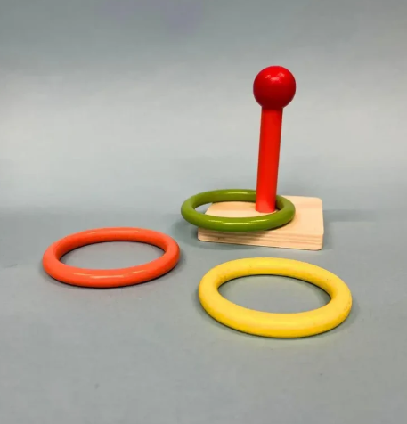
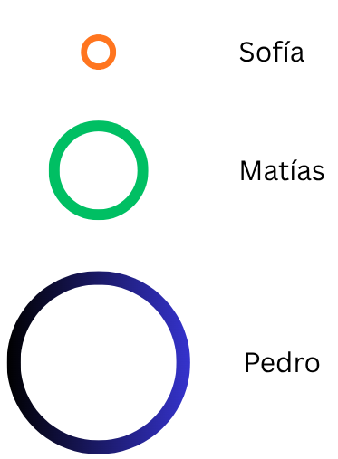
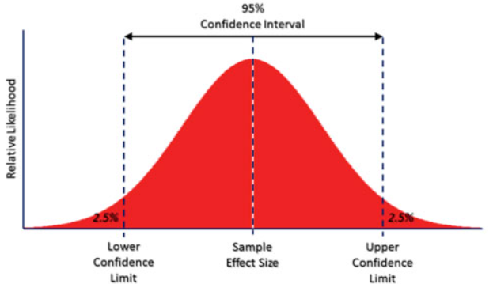
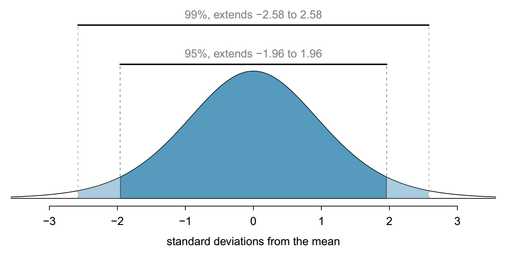

```{r setup}
#| include: false
library(ggplot2)
knitr::opts_chunk$set(warning = FALSE, message = FALSE, comment = "",
                       fig.width = 7, fig.height = 4.5)
```

# {.hide-logo data-background-color="#0C3547"}

<br>

::::: columns
::: {.column width="30%"}

<br>

{width="100%" fig-align="right"}
:::

:::{.column width="2%"}

:::

::: {.column style="width: 65%; font-size: 25px; text-align: right; margin: 0 auto;"}

<br>

### [Estadística Correlacional]{style="font-size: 2em; color: white;"}

::: {style="border-top: 1px solid white; margin: 0.3em 0;"}
:::

[Inferencia, asociación, y reporte]{style="font-size: 1.5em; color: #dfc117;"}

[Juan Carlos Castillo]{style="font-size: 1em; color: white;"}\
[Sociología FACSO - UChile]{style="font-size: 1em; color: white;"}\
[2do Sem 2026]{style="font-size: 1em; color: white;"}

[correlacional.metodos-facso.org](https://correlacional.metodos-facso.org)

<br>
[**Inferencia 3**:]{style="color: white; font-size: 1.3em;"}

[Intervalos de confianza y test de hipótesis (1)]{style="color: #dfc117;"}

:::
:::::

# ¿Preguntas? {data-background-color="#fbff14"}

## {data-background-color="#e90000" style="font-size: 1.3em;"}

### [Hoy:]{style="color: white;"} {data-background-color="#e90000"}

<br>

### 1. Intervalos de confianza
### 2. Test de hipótesis

# [Para comenzar: una historia sobre la confianza]{style="color: #dfc117;"} {data-background-color="#0C3547"}

## Dos amigos y una hora de llegada {style="font-size: 0.8em;"}

:::: {.columns}
::: {.column width="60%"}

Quedamos de juntarnos mañana temprano, y a cada uno le preguntamos a qué hora llega:

- [Sofía]{style="color: #c0392b;"}: *"llego a las 8:00 en punto"*

- [Matías]{style="color: #c0392b;"}: *"llego entre las 7:50 y las 8:10"*

:::

::: {.column width="40%"}

::: {.fragment}
::: {.content-box-red style="text-align: center;"}
### ¿A quién le creemos más?

### ¿Quién nos sirve más?
:::
:::

:::
::::

## Una semana después {style="font-size: 0.7em;"}

| Día | Llegó a las | Sofía: "8:00 en punto" | Matías: "entre 7:50 y 8:10" |
|-----------|:-----------:|:----------------------:|:---------------------------:|
| lunes | 8:07 | ✗ | ✓ |
| martes | 7:52 | ✗ | ✓ |
| miércoles | 8:09 | ✗ | ✓ |
| jueves | 8:21 | ✗ | ✗ |
| viernes | 7:58 | ✗ | ✓ |

::: {.fragment}
Sofía acertó **0 de 5** veces; Matías, **4 de 5** (80%)
:::

## Primera moraleja {style="font-size: 0.8em;"}

::: {.content-box-green style="text-align: center;"}
Una afirmación **puntual** suena muy bien, pero hay riesgo de que sea falsa 

Una afirmación con **rango** es menos precisa, pero entrega más probabilidad de ser verdadera 
:::

- Sofía no es mentirosa: es **precisa hasta lo imposible**

- Matías no es impreciso necesariamente por flojera: puede estar reconociendo aquello que no controla (el tráfico, la micro, la alarma)

## Pero aparece un tercer amigo... {style="font-size: 0.8em;"}

- [Pedro]{style="color: #c0392b;"}: *"llego entre las 6 de la mañana y las 12 del día"*

::: {.fragment}
Pedro **nunca** se va a equivocar: su rango va a acertar el 100% de las veces
:::

::: {.fragment}
::: {.content-box-red style="text-align: center;"}
... y su respuesta no nos sirve absolutamente de nada
:::
:::

## Segunda moraleja: la confianza se paga con ancho {style="font-size: 0.75em;"}

- Podemos aumentar nuestra confianza tanto como queramos, pero **ampliando el rango** (Pedro)

- Podemos ser tan precisos como queramos, pero **perdiendo confianza** (Sofía)

- Ser confiable no es no equivocarse nunca: es declarar **cuánto** nos podemos equivocar (Matías)


##


::: {.columns}

::: {.column}
{width="100%" fig-align="center"}


:::

::: {.column}

{width="100%" fig-align="center"}

:::

:::


## De la historia a la estadística {style="font-size: 0.65em;"}

| En la historia | En estadística |
|----------------------------------------|----------------------------------------|
| la hora exacta que promete Sofía | el **promedio de la muestra** (estimación puntual) |
| el rango que promete Matías | el **intervalo de confianza** |
| en qué proporción de los días el rango acierta | el **nivel de confianza** (ej: 95%) |
| el ancho del rango (± 10 minutos) | el **margen de error** |
| la hora real de llegada | el **parámetro** de la población, que no conocemos |


## Una precisión importante: el aro y la estaca {style="font-size: 0.7em;"}

:::: {.columns}
::: {.column width="42%"}

- En la historia, lo que cambiaba cada día era **la hora de llegada**

- En estadística es al revés: el parámetro de la población está **fijo** (pero oculto), y lo que cambia de muestra en muestra es **nuestro intervalo**

- Es como lanzar un aro a una estaca que no vemos: la estaca no se mueve, lo que varía es **el lanzamiento**

:::

::: {.column width="58%"}

```{r}
#| echo: false
#| fig-width: 6
#| fig-height: 4.2
set.seed(3)
mu <- 800     # promedio de ingresos en la población (miles de $)
sigma <- 100  # desviación estándar
n <- 100      # tamaño de cada muestra
k <- 20       # número de muestras

medias <- replicate(k, mean(rnorm(n, mu, sigma)))
se <- sigma / sqrt(n)

lazos <- data.frame(muestra = 1:k,
                    media = medias,
                    li = medias - 1.96 * se,
                    ls = medias + 1.96 * se)

lazos$captura <- ifelse(lazos$li <= mu & lazos$ls >= mu,
                        "atrapa la estaca", "falla")

ggplot(lazos, aes(y = muestra, x = media, color = captura)) +
  geom_vline(xintercept = mu, linetype = "dashed", linewidth = 0.7) +
  geom_segment(aes(x = li, xend = ls, y = muestra, yend = muestra),
               linewidth = 0.9) +
  geom_point(size = 1.7) +
  scale_color_manual(values = c("atrapa la estaca" = "#2c6e91",
                                "falla" = "#c0392b")) +
  labs(x = "promedio de ingresos estimado (miles de $)",
       y = "muestra", color = NULL,
       subtitle = "línea punteada: promedio real en la población (la estaca)") +
  theme_minimal(base_size = 13) +
  theme(legend.position = "bottom", panel.grid.minor = element_blank())
```

:::
::::


## {style="font-size: 0.8em;"}


:::: {.columns}

::: {.column width="50%"}
Un **95% de confianza** significa que **95 de cada 100 aros** lanzados de esta manera atrapan la estaca
:::

::: {.column width="50%" }


:::

::::

## Nivel de confianza

- en estadística inferencial, el **nivel de confianza** equivale a **1 - probabilidad de error**

- el nivel de probabilidad de error aceptado no es un criterio estadístico, es **convencional**

- por convención, se acepta como estadísticamente significativa una probabilidad de error **menor al 5%**, lo que equivale (al menos) a un **nivel de confianza del 95%**

## ¿Qué significa un 95% de confianza? {style="font-size: 0.8em;"}

- que si tuviéramos la posibilidad de extraer múltiples muestras, el 95% de las veces nuestro intervalo contendría el promedio

- o que existe un 5% de probabilidad de error, es decir, de que el promedio de la muestra no sea el de la población

- o que las chances de error son 1 de 20

- volviendo al ejemplo de los aros: que 95 de cada 100 aros que lancemos atrapan la estaca

## [Un **intervalo de confianza** (IC o CI) es la mejor estimación del rango de un estadístico en la población (parámetro poblacional) con una muestra aleatoria]{style="color: white;"} {data-background-color="#9B2626"}

# Pasos en la construcción del intervalo de confianza (para un promedio)

##

1. Obtención de la media y el error estándar

2. Determinar el nivel de confianza (expresado en puntaje Z) para la construcción del intervalo

3. Aplicar fórmula:

::: {.fragment}
$$\bar{x}\pm Z*\frac{\sigma}{\sqrt{N}}$$
:::

## 1. Media y error estándar

Ejemplo: 

- promedio de ingresos (media): 800.000 
- desviación estándar: 100.000
- N muestral: 1.600

::: {.fragment}
$$SE=\frac{s}{\sqrt{N}}=\frac{100.000}{\sqrt{1.600}}=\frac{100.000}{40}=2.500$$
:::

- **Error estándar = 2.500**


## 2. Establecer nivel de confianza {style="font-size: 0.8em;" }

:::: {.columns }
::: {.column width="40%"}
- Nuestro promedio muestral $\bar{x}$ posee una distribución normal con una desviación estándar = SE (error estándar)

- Esto nos permite estimar probabilidades basados en los valores de la curva normal (puntaje Z)
:::

::: {.column width="60%"}

{width="95%" fig-align="center"}

:::
::::

## Valores del intervalo

Determinar el valor del límite superior y el límite inferior del intervalo en la curva normal para un nivel de confianza del 95%:

{width="70%" fig-align="center"}

## Valores del intervalo

:::: {.columns}
::: {.column width="50%"}

El límite inferior de un intervalo al 95% de confianza corresponde al percentil 2,5%, y el límite superior al 97,5% (95% + 2,5%)

:::

::: {.column width="50%"}

{width="100%" fig-align="center"}

:::
::::

## 

Y sabemos por la distribución normal que entre +/- 2 desviaciones estándar de la curva normal se encuentra el 95,44% de los casos:

{width="45%" fig-align="center"}

Por lo tanto, para un 95% será algo menos que +/- 2ds ... pero cuánto **específicamente**?

## De percentil a puntaje Z

:::: {.columns}
::: {.column width="60%"}

- Recordemos que al calcular el puntaje Z, el resultado se expresa en desviaciones estándar de la curva normal, lo que puede ser transformado a percentiles.

- Por lo tanto, se puede hacer la operación inversa -> a qué puntaje Z corresponde un determinado percentil

:::

::: {.column width="30%"}

{width="100%" fig-align="center"}

:::
::::

## 

Para hacer la equivalencia entre puntajes Z y percentiles vamos a una tabla de puntajes Z ... o directamente en R:

```{r}
#| echo: true
qnorm(0.025) # límite inferior
qnorm(0.975) # límite superior
```

Y aproximando: $\pm{1.96}$ 


##




## 3. Contrucción del intervalo {style="font-size: 0.8em;"}

- Sumando y restando **1.96** errores estándar al promedio construimos un intervalo de confianza del 95%

- Volviendo al ejemplo inicial:
  - media: 800.000
  - error estándar: 2.500
  - nivel de confianza: 95% (Z=1.96)
  - intervalo: 800.000 ± 1.96*2.500 = 800.000 ± 4.900
  - límite inferior: 800.000 - 4.900 = 795.100
  - límite superior: 800.000 + 4.900 = 804.900


- Por lo tanto, podemos decir [con un 95% de confianza]{style="color: #c0392b;"} que el promedio de ingresos se encuentra entre 795.100 y 804.900 en la población

## Aumentando el nivel de confianza: 99%

- además del 95% de confianza, otro nivel convencional es el 99% de confianza

- con este nivel tenemos una menor probabilidad de error, pero un intervalo más grande

- en este caso, el límite inferior del intervalo es 0.5%, y el superior 99.5%

## En R {style="font-size: 0.8em;"}

Estimando valores Z para límites de intervalo de confianza al 99%:

```{r}
#| echo: true
qnorm(0.005) # límite inferior
qnorm(0.995) # límite superior
```
- $SE=2.500$, $\bar{x}_{ingresos}=800.000$
- $\bar{X}{\color{red}\pm}2.58SE$ abarcan el 99% de los valores alrededor del promedio
  - $800.000 - (2.58*2.500) = 800.000 - 6.450={\color{red}{793.550}}$
  - $800.000 + (2.58*2.500) = 800.000 + 6.450={\color{red}{806.450}}$

- Por lo tanto, podemos decir [con un 99% de confianza]{style="color: #c0392b;"} que el promedio de ingresos se encuentra entre 793.550 y 806.450

## Comparando intervalos:

- 95% de confianza: $800.000\pm4.900=[795.100 - 804.900]$

- 99% de confianza: $800.000\pm6.450=[793.550 - 806.450]$

:::{.fragment}
Por lo tanto, a mayor nivel de confianza, mayor es el intervalo, pero disminuye la precisión o aumenta el **margen de error**
:::


# Introducción a contraste de hipótesis {background-color="#0C3547"}

## [¿Existen diferencias salariales entre hombres y mujeres en Chile?]{style="color: white;"} {data-background-color="#0C3547"}

::: {style="color: white; font-size: 0.7em;"}
| Hipótesis general | Hipótesis estadística |
|-------------------------------|-------------------------------|
| Existen diferencias salariales entre hombres y mujeres | Hipótesis **alternativa**: Las diferencias son distintas de cero |
| No existen diferencias salariales entre hombres y mujeres | Hipótesis **nula**: Las diferencias no son distintas de cero |
:::

## Cuestionario CASEN

:::: {.columns}
::: {.column width="50%"}

{width="85%" fig-align="center"}

:::

::: {.column width="50%"}

{width="100%" fig-align="center"}

:::
::::

## Datos CASEN 2022 {style="font-size: 0.8em;"}

:::: {.columns}
::: {.column width="35%"}

{width="100%" fig-align="center"}

:::

::: {.column width="65%"}

Vamos a generar una submuestra de 350 casos de CASEN para ilustrar de mejor manera el sentido del test de hipótesis

```{r}
#| echo: true
pacman::p_load(sjmisc, haven, dplyr, stargazer, interpretCI, kableExtra)
load("casen2022_inf2.Rdata")
options(scipen = 999) # para evitar notación en los ceros
set.seed(20) # para fijar el resultado aleatorio
casen_350 <- casen2022_inf %>% select(salario, sexo) %>% sample_n(350)
casen_350 <- na.omit(casen_350)
stargazer(as.data.frame(casen_350), type = "text")
```

:::
::::

## 

```{r}
#| echo: true
casen_350 %>% # se especifica la base de datos
  dplyr::group_by(sexo = sjlabelled::as_label(sexo)) %>% # se agrupan por la variable categórica y se usan sus etiquetas con as_label
  dplyr::summarise(Obs. = n(), Promedio = mean(salario, na.rm = TRUE), SD = sd(salario, na.rm = TRUE)) %>% # se agregan las operaciones a presentar en la tabla
  kable(format = "markdown") # se genera la tabla
```

- Diferencia salarial = 654.585-604.420=**50.165**

::: {.fragment .content-box-red}

### ¿Es esta diferencia estadísticamente significativa?

:::


## [[Procedimiento: 5 pasos de la inferencia]{style="color: #dfc117;"} (ajustados de Ritchey)]{style="color: white;"} {data-background-color="#0C3547" style="font-size: 0.8em;"}

::: {style="color: white;"}
1. Formular hipótesis ( $H_0$ y $H_A$)

2. Obtener error estándar y estadístico de prueba empírico correspondiente (ej: Z o t)

3. Establecer la probabilidad de error $\alpha$ (usualmente 0.05) y obtener valor crítico (teórico) de la prueba correspondiente

4. Cálculo de intervalo de confianza / contraste valores empírico/crítico

5. Interpretación
:::


# 1. Formulación de hipótesis

## [Una [hipótesis]{style="color: #dfc117;"} es una aseveración o una predicción que se desprende de una teoría sobre una situación que ocurre en la población en estudio]{style="color: white;"} {data-background-color="#9B2626"}

## ¿Cuándo se puede verificar una hipótesis?

<br>

::: {.fragment style="font-size:1.5em;"}
### **NUNCA**
:::

<br>

::: {.fragment}
### ... pero, se puede **[falsar]{style="color: #e8871a;"}**
:::

## Contraste de hipótesis y falsación {style="font-size: 0.8em;"}

:::: {.columns}
::: {.column width="35%"}

{width="100%" fig-align="center"}

:::

::: {.column width="65%"}

- El **verificar** una hipótesis no hace que una teoría sea verdadera

- Se puede intentar refutar una teoría (**falsarla**) mediante un contraejemplo o hipótesis contraria

- Si no es posible refutar la hipótesis contraria, entonces la teoría queda aceptada **provisionalmente**

:::
::::

## Lógica de contraste de hipótesis

::: {style="color: white;"}
### [Intentar falsar lo que es contrario a nuestra hipótesis original]{style="color: #ff0000;"}

::: {.fragment}
### En estadística, esta "hipótesis contraria" se denomina la [HIPÓTESIS NULA]{style="color: #ff0000;"}
:::
:::

## Formulando hipótesis

Contrastamos la *hipótesis nula* (no hay diferencias de promedios entre grupos):

$$H_{0}: \bar{X}_{hombres} -  \bar{X}_{mujeres}= 0$$

En referencia a la siguiente hipótesis alternativa:

$$H_{a}: \bar{X}_{hombres} -  \bar{X}_{mujeres} \neq 0$$


## 2. Error estándar y estadístico de prueba

- El error estándar de la diferencia de promedios usa una fórmula distinta al del promedio (detalles próxima clase).

- Por ahora, lo vamos a dejar expresado así:

:::{.fragment}
$$SE=\sqrt{\frac{\sigma_{diff}}{n_a}+\frac{\sigma_{diff}}{n_b}}=50561$$
:::


## 3. Establecer probabilidad de error {style="font-size: 0.85em;"}

- Como ya sabemos, de manera convencional: $\alpha=0.05$

## 4. Intervalo de confianza 

- de la clase anterior con prueba Z sabemos que el valor crítico para un 95% de confianza es 1.96

- para diferencia de medias se utiliza prueba $t$, donde el valor crítico es variable según en tamaño muestral

- sin embargo, para muestras grandes, t=Z, y por lo tanto por ahora mantendremos los valores referenciales Z (de 1.96) hasta que profundicemos en t la próxima clase


## 4. Intervalo de confianza

$$
\begin{align*}
\bar{x}_1-\bar{x}_2 &\pm t_{\alpha/2}*SE_{\bar{x_1}-\bar{x_2}} \\\\
50165 &\pm 1.96*50561 \\\\
50165 &\pm 99099.56 \\\\
CI[-49287.48&;149617.63]
\end{align*}
$$

## 5. Interpretación {style="font-size: 0.85em;"}

Nuestro intervalo de confianza **contiene el cero**, por lo que no se rechaza la hipótesis nula

::: {.fragment}
::: {.content-box-red}
Con un 95% de confianza (5% de probabilidad de error) no se encuentra evidencia de diferencias salariales entre hombres y mujeres.

:::
:::

::: {.fragment}
::: {.content-box-green}
Alternativamente: No existe evidencia que las diferencias salariales entre hombres y mujeres son **distintas de cero**, con un 5% de probabilidad de error
:::
:::


# [Resumen]{style="color: #dfc117;"} {data-background-color="#0C3547"}

::: {style="color: white;"}
- Intervalos de confianza, precisión y error
- Hipótesis y falsación
- Generación de intervalos para contrastar hipótesis
- Si el intervalo contiene el 0, no se logra rechazar $H_0$
:::


# {.hide-logo data-background-color="#0C3547"}

<br>

::::: columns
::: {.column width="30%"}

<br>

{width="100%" fig-align="right"}
:::

:::{.column width="2%"}

:::

::: {.column style="width: 65%; font-size: 25px; text-align: right; margin: 0 auto;"}

<br>

### [Estadística Correlacional]{style="font-size: 2em; color: white;"}

::: {style="border-top: 1px solid white; margin: 0.3em 0;"}
:::

[Inferencia, asociación, y reporte]{style="font-size: 1.5em; color: #dfc117;"}

[Juan Carlos Castillo]{style="font-size: 1em; color: white;"}\
[Sociología FACSO - UChile]{style="font-size: 1em; color: white;"}\
[2do Sem 2026]{style="font-size: 1em; color: white;"}

[correlacional.metodos-facso.org](https://correlacional.metodos-facso.org)

:::
:::::
