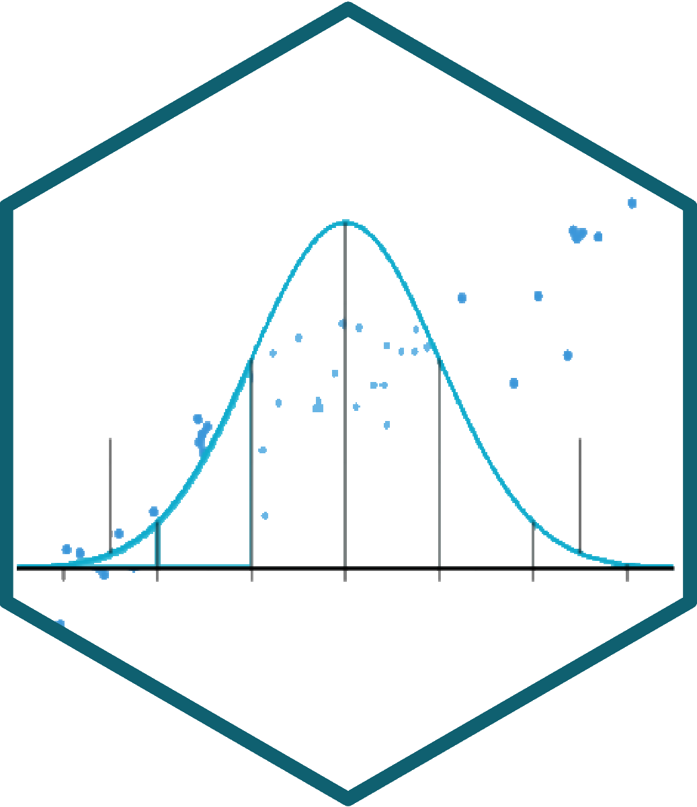
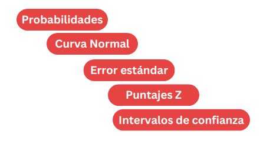
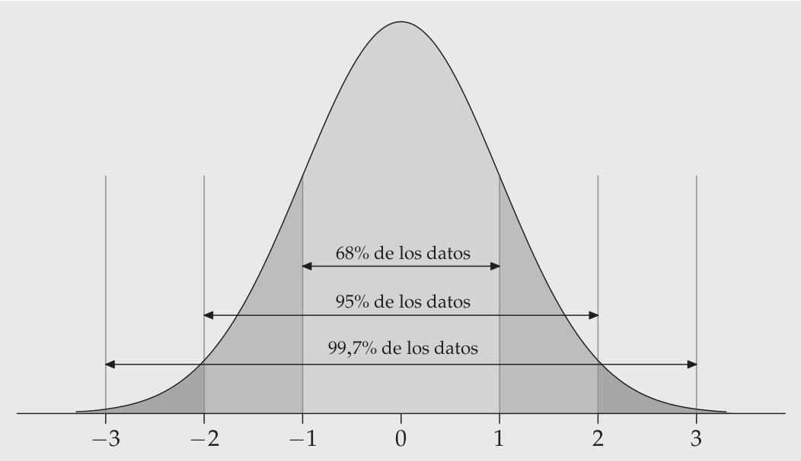
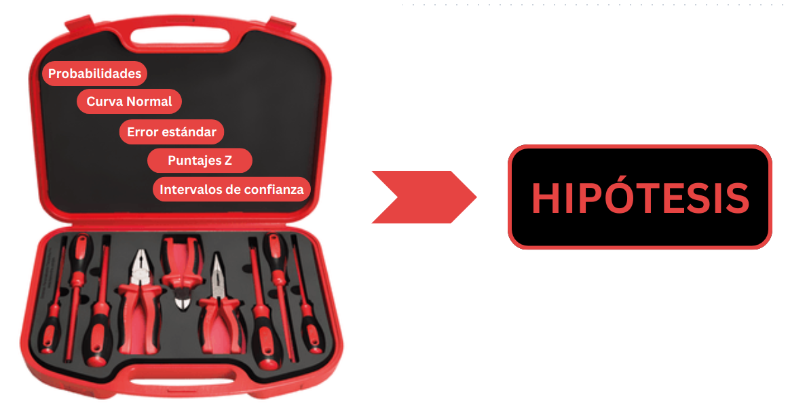
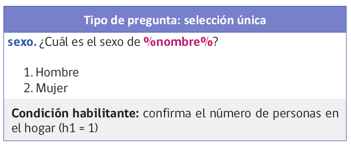
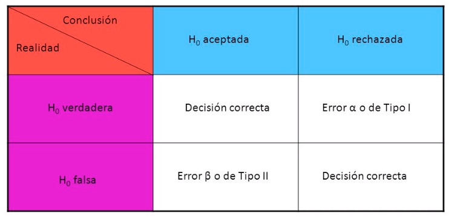
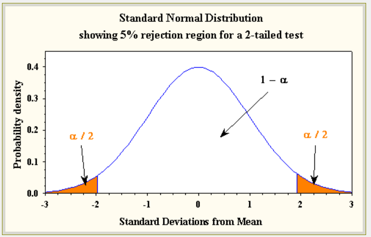
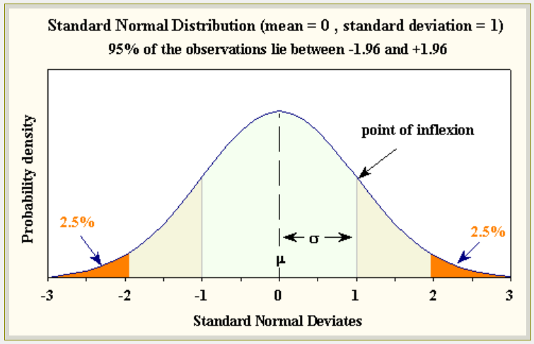

```{r setup}
#| include: false
library(ggplot2)
knitr::opts_chunk$set(warning = FALSE, message = FALSE, comment = "",
                       fig.width = 7, fig.height = 4.5)
```

```{r plots-dados}
#| echo: false
#| fig-show: hide
# Distribución teórica del promedio de dos dados
promedios_posibles <- seq(1, 6, by = 0.5)

probabilidades_teoricas <- c(1/36, 2/36, 3/36, 4/36, 5/36, 6/36, 5/36, 4/36, 3/36, 2/36, 1/36)

# 1500 repeticiones
set.seed(123)

dados1 <- sample(1:6, 1500, replace = TRUE)
dados2 <- sample(1:6, 1500, replace = TRUE)

promedio_dados <- (dados1 + dados2) / 2

frecuencias_empiricas <- table(promedio_dados)

probabilidades_empiricas <- frecuencias_empiricas / sum(frecuencias_empiricas)

# Probabilidades empíricas
barplot(probabilidades_empiricas,
        main = "Promedio de dos dados (1500 repeticiones)",
        xlab = "Promedio de los dados",
        ylab = "Frecuencia de probabilidad",
        col = rgb(0.1, 0.5, 0.8, 0.6), # Azul con transparencia
        ylim = c(0, 0.2))

# Superponemos las barras de la distribución teórica
barplot(probabilidades_teoricas,
        names.arg = promedios_posibles,
        col = rgb(0.8, 0.2, 0.2, 0.5), # Rojo con transparencia
        add = TRUE)

legend("topright", legend = c("Empírica", "Teórica"),
       fill = c(rgb(0.1, 0.5, 0.8, 0.6), rgb(0.8, 0.2, 0.2, 0.5)),
       border = "white")

rep1500 <- recordPlot()
```

# {.hide-logo data-background-color="#0C3547"}

<br>

::::: columns
::: {.column width="30%"}

<br>

{width="100%" fig-align="right"}
:::

:::{.column width="2%"}

:::

::: {.column style="width: 65%; font-size: 25px; text-align: right; margin: 0 auto;"}

<br>

### [Estadística Correlacional]{style="font-size: 2em; color: white;"}

::: {style="border-top: 1px solid white; margin: 0.3em 0;"}
:::

[Inferencia, asociación, y reporte]{style="font-size: 1.5em; color: #dfc117;"}

[Juan Carlos Castillo]{style="font-size: 1em; color: white;"}\
[Sociología FACSO - UChile]{style="font-size: 1em; color: white;"}\
[2do Sem 2026]{style="font-size: 1em; color: white;"}

[correlacional.metodos-facso.org](https://correlacional.metodos-facso.org)

<br>
[**Inferencia 4**:]{style="color: white; font-size: 1.3em;"}

[Falsación, tipos de error y prueba t]{style="color: #dfc117;"}

:::
:::::

# [¿Qué hemos visto hasta ahora?]{style="color: #dfc117;"} {data-background-color="#0C3547"}

##

{width="100%" fig-align="center"}

## ¿Qué puedo decir de la población a partir de mi muestra? {style="font-size: 0.8em;"}

PROBABILIDADES ... de un rango de valores

:::: {.columns}
::: {.column width="70%"}

### ¿Cómo llego al rango de valores probables de un parámetro poblacional obtenido a partir de **una muestra**?

:::

::: {.column width="30%"}

{width="80%" fig-align="center"}

:::
::::

## Probabilidades {style="font-size: 0.8em;"}

:::: {.columns}
::: {.column width="45%"}

- Podemos calcular probabilidades basados en una distribución teórica de ocurrencia de eventos.

- Ej: En teoría, la probabilidad de que salga sello al tirar una moneda es 50%

- Mientras más repetimos el evento, más se van a acercar los resultados (distribución empírica) a la probabilidad del evento (distribución teórica)

:::

::: {.column width="55%"}

```{r}
#| echo: false
rep1500
```

:::
::::

## Curva normal {style="font-size: 0.8em;"}

:::: {.columns}
::: {.column width="50%"}

- Hay una serie de eventos que en términos teóricos y empíricos tienen una distribución particular en torno al valor central -> **normal**

- La [curva normal]{style="color: #c0392b;"} es una distribución teórica que nos permite tener un estándar con el cual comparar distribuciones empíricas

:::

::: {.column width="50%"}

<br>

{width="100%" fig-align="center"}

:::
::::

## Teorema central del límite y error estándar {style="font-size: 0.8em;"}

:::: {.columns}
::: {.column width="55%"}

- si pudiera calcular un estadístico en muchas muestras distintas (ej: promedio) este se distribuiría de manera normal

- el **error estándar** es la formula que nos permite obtener el valor de la desviación estándar de los promedios con una sola muestra

:::

::: {.column width="45%"}

<br>

$$\sigma_{\bar{X}}=\frac{s}{\sqrt{N}}$$

:::
::::

## Puntajes Z {style="font-size: 0.8em;"}

:::: {.columns}
::: {.column width="50%"}

- el puntaje Z es una transformación a una métrica de desviaciones estándar del promedio

- asumiendo distribución normal, el puntaje Z permite además obtener el valor del percentil de cada puntaje

  - es decir, qué porcentaje de la población tiene un valor menor/mayor que el puntaje Z 

:::

::: {.column width="50%"}

$$z=\frac{x-\mu}{\sigma}$$

{width="90%" fig-align="center"}

:::
::::

## Intervalos de confianza [para el promedio] {style="font-size: 0.75em;"}

:::: {.columns}
::: {.column width="50%"}

- rango de probabilidad del valor de un parámetro en la población

- Para construirlo, 4 pasos:

  1- establecer **nivel de confianza** (convencionalmente 95%)

  2- definir **puntaje Z** correspondiente a este intervalo (para 95% es 1.96)

:::

::: {.column .fragment width="50%"}

3- multiplicar Z por el **error estándar**

4- restar al promedio (límite inferior) y sumar (límite superior)

$$\bar{X}\pm Z*\frac{\sigma}{\sqrt{N}}$$

:::
::::

## {data-background-color="#0C3547"}

{width="90%" fig-align="center"}

# [¿Qué es una hipótesis?]{style="color: white;"} {data-background-color="#0C3547"}

## [Una [hipótesis]{style="color: #dfc117;"} es una aseveración o una predicción que se desprende de una teoría sobre una situación que ocurre en la población en estudio]{style="color: white;"} {data-background-color="#9B2626"}

## [¿Cuándo se puede verificar una hipótesis?]{style="color: white;"} {data-background-color="#0C3547"}

::: {.fragment}
### [-> [NUNCA]{style="color: #dfc117;"}]{style="color: white;"}
:::

::: {.fragment}
### [... pero, se puede **[falsar]{style="color: #e8871a;"}**]{style="color: white;"}
:::

## Popper y la falsabilidad {style="font-size: 0.8em;"}

:::: {.columns}
::: {.column width="35%"}

{width="80%" fig-align="center"}

:::

::: {.column width="58%"}

_"el criterio de demarcación que hemos de adoptar no es el de la verificabilidad, sino el de la [falsabilidad]{style="color: #c0392b;"} de los sistemas. Dicho de otro modo: no exigiré que un sistema científico pueda ser seleccionado, de una vez para siempre, en un sentido positivo; pero sí que sea susceptible de selección en un sentido negativo por medio de contrastes o pruebas empíricas: ha de ser posible refutar por la experiencia un sistema científico empírico" (Popper, 1982, p. 40)_

:::
::::

## Contraste de hipótesis y falsación {style="font-size: 0.8em;"}

:::: {.columns}
::: {.column width="35%"}

{width="100%" fig-align="center"}

:::

::: {.column width="65%"}

- El **verificar** una hipótesis no hace que una teoría sea verdadera

- Se puede intentar refutar una teoría (**falsarla**) mediante un contraejemplo o hipótesis contraria

- Si no es posible refutar la hipótesis contraria, entonces la teoría queda aceptada **provisionalmente**

:::
::::

## Ejemplo

:::: {.columns}
::: {.column width="60%"}

Teoría: todos los cuervos son negros

Hipótesis de **verificación**: hay cuervos negros

Hipótesis de **falsación**: hay cuervos blancos

:::

::: {.column width="40%"}

<br>

{width="90%" fig-align="center"}

:::
::::

## [Lógica de contraste de hipótesis]{style="color: white;"} {data-background-color="#0C3547"}

-  [Intentar falsar lo que es contrario a nuestra hipótesis original]{style="color: #dfc117;"}
-  En estadística, esta "hipótesis contraria" se denomina la [HIPÓTESIS NULA]{style="color: #dfc117;"}

## [buscamos RECHAZAR LA HIPÓTESIS NULA]{style="color: white;"} {data-background-color="#9B2626"}

::: {style="color: white; font-size: 0.8em;"}
si logramos rechazar la hipótesis nula (o sea, que lo contrario de nuestra teoría no es verdad), entonces encontramos evidencia a favor de nuestra teoría

Buscamos NO ENCONTRAR cuervos blancos {width="10%"}
:::

## Hipótesis nula

- Hipótesis se denota con la letra $H$

- La hipótesis nula se denota $H_0$ (hache cero)

- **Cero** porque en general se refiere a que lo que señala la teoría no existe o **es cero en la población**

## Volvamos a nuestro ejemplo (clase pasada)

**¿Existen diferencias salariales entre hombres y mujeres en Chile?**

::: {style="font-size: 0.7em;"}
| Hipótesis general | Hipótesis estadística |
|-------------------------------|-------------------------------|
| Existen diferencias salariales entre hombres y mujeres | Hipótesis **alternativa**: Las diferencias son distintas de cero |
| No existen diferencias salariales entre hombres y mujeres | Hipótesis **nula**: Las diferencias no son distintas de cero |
:::

## Cuestionario CASEN

:::: {.columns}
::: {.column width="50%"}

{width="85%" fig-align="center"}

:::

::: {.column width="50%"}

{width="100%" fig-align="center"}

:::
::::

## Datos CASEN 2022 {style="font-size: 0.8em;"}

:::: {.columns}
::: {.column width="35%"}

{width="100%" fig-align="center"}

:::

::: {.column width="65%"}

Vamos a generar una submuestra de 350 casos de CASEN para ilustrar de mejor manera el sentido del test de hipótesis

```{r}
#| echo: true
pacman::p_load(sjmisc, haven, dplyr, stargazer, interpretCI, kableExtra)
load("casen2022_inf2.Rdata")
options(scipen = 999) # para evitar notación en los ceros
set.seed(20) # para fijar el resultado aleatorio
casen_350 <- casen2022_inf %>% select(salario, sexo) %>% sample_n(350)
casen_350 <- na.omit(casen_350)
```

:::
::::

## Datos {style="font-size: 0.85em;"}

::: {.fragment style="font-size: 1.2em;"}

```{r}
#| echo: true
stargazer(as.data.frame(casen_350), type = "text")
```


```{r}
#| echo: true
casen_350 %>% # se especifica la base de datos
  dplyr::group_by(sexo = sjlabelled::as_label(sexo)) %>% # se agrupan por la variable categórica y se usan sus etiquetas con as_label
  dplyr::summarise(Obs. = n(), Promedio = mean(salario, na.rm = TRUE), SD = sd(salario, na.rm = TRUE)) %>% # se agregan las operaciones a presentar en la tabla
  kable(format = "markdown") # se genera la tabla
```
:::

Diferencia salarial = 654.585-604.420=**50.165**

## [Procedimiento: 5 pasos de la inferencia]{style="color: #dfc117;"} (ajustados de Ritchey){data-background-color="#0C3547" style="font-size: 0.8em;"}

1. Formular hipótesis ( $H_0$ y $H_A$)

2. Estadístico de prueba empírico (ej: Z o t)

3. Establecer la probabilidad de error $\alpha$ (usualmente 0.05) y obtener valor crítico (teórico) de la prueba correspondiente

4. Cálculo de intervalo de confianza / contraste valores empírico/crítico

5. Interpretación


## 1. Formular hipótesis

Contrastamos la *hipótesis nula* (no hay diferencias de promedios entre grupos):

$$H_{0}: \bar{X}_{hombres} -  \bar{X}_{mujeres}= 0$$

En referencia a la siguiente hipótesis alternativa:

$$H_{a}: \bar{X}_{hombres} -  \bar{X}_{mujeres} \neq 0$$

## 2. Estadístico de prueba {style="font-size: 0.75em;"}


- Para la diferencia de medias, el estadístico de prueba es:


::: {.fragment}
$$t=\frac{\bar{X}_{hombres}-\bar{X}_{mujeres}}{SE}$$
:::

- este valor nos va a permitir contrastar la diferencia de medias **empírica** con la diferencia de medias **teórica** (que es 0, según $H_0$)

::: {.fragment .callout-important}
En general el estadístico de prueba es la magnitud de interés (en este caso, la diferencia de medias) dividido por el error estándar. Por lo tanto, su resultado nos dice cuántos errores estándar hay entre la diferencia de medias empírica y la diferencia de medias teórica (que es 0, según $H_0$)
:::


## 2. Estadístico de prueba {style="font-size: 0.75em;"}

- Cada estadístico tiene su propia fórmula de error estándar

- En el caso de la **diferencia de medias** (en este caso, de hombres y mujeres), el error estándar es:

::: {.fragment}
$$SE=\sqrt{\frac{\sigma_{diff}}{n_a}+\frac{\sigma_{diff}}{n_b}}$$

Donde

$$\sigma_{diff}=\frac{\sigma^2_{a}(n_a-1)+\sigma^2_{b}(n_b-1)}{n_a+n_b-2}$$

:::

- como se puede apreciar, es una extensión del error estándar del promedio pero para dos grupos distintos


## 2. Estadístico de prueba {style="font-size: 0.75em;"}

Cálculo de la desviación estándar de las diferencias de promedios:

$$
\begin{align*}
\sigma_{diff}&=\frac{468692^2(205-1)+444666^2(138-1)}{205+138-2} \\ \\
&=\frac{44813126936256+27088715663172}{341}\\ \\
&=210855843400
\end{align*}
$$

## 2. Estadístico de prueba{style="font-size: 0.75em;"}

Y entonces el error estándar de la diferencia de medias:

$$
\begin{align*}
SE&=\sqrt{\frac{\sigma_{diff}}{n_a}+\frac{\sigma_{diff}}{n_b}} \\ \\
&=\sqrt{\frac{210855843400}{205}+\frac{210855843400}{138}}\\ \\
&=50561
\end{align*}
$$

## 2. Estadístico de prueba {style="font-size: 0.75em;"}

- Ya que tenemos ahora el Error Estándar (SE), reemplazamos:

::: {.fragment}
$$t=\frac{\bar{X}_{hombres}-\bar{X}_{mujeres}}{SE}=\frac{50165}{50561}=0.9904$$
:::


- El valor de $t$ obtenido de 0.9904(empírico) nos permite contrastar la diferencia de medias empírica con la diferencia de medias teórica (que es 0, según $H_0$). 

- Por lo tanto, la pregunta es: ¿es 0.9904 un valor **suficientemente grande** para rechazar la hipótesis nula?

- Para poder responder esto, necesitamos establecer un **nivel de confianza/probabilidad de error** 


## 3. Probabilidad de error {style="font-size: 0.85em;"}

- asumimos que existe una probabilidad de error al rechazar $H_0$, para lo cual fijamos un límite convencional -> usualmente un 5%

- ¿error **de qué**? -> de rechazar $H_0$ cuando esta existe en la población.

- Esto se conoce como la **probabilidad de error Tipo I o $\alpha$ (alfa)**

## 

{width="100%" fig-align="center"}

## 3. Probabilidad de error {style="font-size: 0.85em;"}

- En nuestro ejemplo: {style="font-size: 0.8em;"}

$$H_{0}: \bar{X}_{sueldo\ mujeres} -  \bar{X}_{sueldo\ hombres}= 0$$

- Si **hay** diferencias de sueldo en la población y rechazamos $H_0$: decisión correcta

- Si **no hay** diferencias de sueldo en la población y rechazamos $H_0$: Error tipo I


::: {.fragment .content-box-red style="text-align: center;"}
El Error Tipo I equivale a encontrar cosas en nuestra muestra que no existen en la población
:::

## 3. Probabilidad de error {style="font-size: 0.85em;"}

{width="70%" fig-align="center"}

## 3. Probabilidad de error {style="font-size: 0.85em;"}

<br>

:::: {.columns}
::: {.column width="48%".content-box-red}
### Error Tipo I

Encontrar algo que no existe en la población
:::

::: {.column width="48%" .content-box-green}
### Error Tipo II

No encontrar algo que si existe en la población
:::

::::

## 3. Probabilidad de error {style="font-size: 0.85em;"}

### Hipótesis nula y $\alpha$ {style="font-size: 0.85em;"}

- Entonces, el $\alpha$ es la probabilidad de error que fijamos para rechazar la hipótesis nula

- en lenguaje de prueba de hipótesis, es la probabilidad de rechazar la hipótesis nula cuando esta es verdadera

- o la probabilidad de encontrar diferencias entre grupos de la población cuando estas no existen

- o en simple, la probabilidad de que nos estemos equivocando

## 3. Probabilidad de error {style="font-size: 0.85em;"}

### Nivel de confianza y probabilidad de error $\alpha$ 

- el nivel de confianza de una estimación se determina de manera **convencional**, usualmente se acepta 95% o 99% de confianza

- un nivel de confianza se expresa en una probabilidad de error $\alpha$ ([alfa]{style="color: #c0392b;"}), que es 1 - nivel de confianza

  - para un nivel de confianza de 95%, $\alpha=1-0.95=0.05$

  - para un nivel de confianza de 99%, $\alpha=1-0.99=0.01$

##

{width="90%" fig-align="center"}

##

{width="90%" fig-align="center"}

## 4. [Intervalo y valor crítico]{style="font-size: 0.8em;"}

- En el paso 2 calculamos el _t_ empírico. En este paso calcularemos el **_t_ crítico**
  
- Si el _t_ empírico es mayor que el _t_ crítico, entonces rechazamos la hipótesis nula  
 
- a diferencia de la prueba Z (donde los valores son fijos), el los valores críticos de t dependen del **tamaño muestral**

- el tamaño muestral determina los **grados de libertad** (df) de la prueba t, que se calculan como $df=n_1+n_2-2$ (es decir, es el tamaño de la muestra menos 2)


## _t_


## 4. Intervalo y valor crítico {style="font-size: 0.8em;"}

- Para el caso de nuestra muestra, con un tamaño de 350 casos, los grados de libertad son:

::: {.fragment}
$$df=n_1+n_2-2=205+138-2=341$$
:::

- Lo que corresponde a un valor crítico de $t_{0.975}=1.96$ (para un nivel de confianza de 95%)

- Esto se puede obtener en R con la función `qt()`:

::: {.fragment style="font-size: 1.5em;"}

```{r echo=TRUE}
qt(0.975, df = 341)
```
:::

::: {.fragment .callout-important}
El valor crítico de t se aproxima al valor crítico de Z cuando el tamaño muestral es grande (usualmente n>30)

:::

## 4. Intervalo y valor crítico {style="font-size: 0.8em;"}

Ahora podemos calcular el **intervalo de confianza** para la diferencia de medias:

::: {.fragment}
$$
\begin{align*}
\bar{x}_1-\bar{x}_2 &\pm t_{\alpha/2}*SE_{\bar{x_1}-\bar{x_2}} \\\\
50165 &\pm 1.96*50561 \\\\
50165 &\pm 99099.56 \\\\
CI[-49287.48&;149617.63]
\end{align*}
$$
:::

## 4. Intervalo y valor crítico {style="font-size: 0.8em;"}

- Test de hipótesis de diferencias en R 

::: {.fragment style="font-size: 1.5em;"}

```{r}
#| echo: true
t.test(salario ~ sexo, data = casen_350, var.equal = TRUE)
```
:::

## 4. Intervalo y valor crítico {style="font-size: 0.8em;"}

- Además del intervalo de confianza, podemos realizar el test de hipótesis comparando el valor empírico de t con el valor crítico de t
- Si el valor empírico de t es mayor que el valor crítico de t, entonces rechazamos la hipótesis nula
- En nuestro caso:

::: {.fragment}
$$
t_{\text{emp}}=0.9904 > t_{\text{crít}}=1.96 \Rightarrow \text{rechazamos } H_0
$$
:::

## 5. Interpretación {style="font-size: 0.85em;"}

- Nuestro intervalo de confianza **contiene el cero**, ya que el valor empírico de t es menor que el valor crítico de t,  por lo que **no se rechaza la hipótesis nula**

::: {.fragment .content-box-red}
Con un 95% de confianza (5% de probabilidad de error) no se encuentra evidencia de diferencias salariales entre hombres y mujeres.

Alternativamente: No existe evidencia que las diferencias salariales entre hombres y mujeres sean distintas de cero, con un 5% de probabilidad de error
:::


# [Resumen]{style="color: #dfc117;"} {data-background-color="#0C3547"}

::: {style="color: white; font-size: 0.85em;"}
- hipótesis: aseveraciones sobre algo que ocurre en la población, usualmente asociaciones entre conceptos / variables

- las hipótesis se contrastan con un criterio de falsabilidad: se trata de falsar/rechazar la **Hipótesis nula (H0)** 

- para rechazar necesitamos un estadístico de prueba empírico, que se contrasta con un valor crítico (teórico) de rechazo según una probabilidad de error $\alpha$

- para la diferencia de medias, el estadístico de prueba es **t**

:::

## Recomendaciones

[{width="30%" fig-align="center"}](https://cienciassocialesfcpys.wordpress.com/wp-content/uploads/2016/03/5la-logica-de-las-ciencias-sociales-popper-adorno-dahrendorf-habermas.pdf)

# {.hide-logo data-background-color="#0C3547"}

<br>

::::: columns
::: {.column width="30%"}

<br>

{width="100%" fig-align="right"}
:::

:::{.column width="2%"}

:::

::: {.column style="width: 65%; font-size: 25px; text-align: right; margin: 0 auto;"}

<br>

### [Estadística Correlacional]{style="font-size: 2em; color: white;"}

::: {style="border-top: 1px solid white; margin: 0.3em 0;"}
:::

[Inferencia, asociación, y reporte]{style="font-size: 1.5em; color: #dfc117;"}

[Juan Carlos Castillo]{style="font-size: 1em; color: white;"}\
[Sociología FACSO - UChile]{style="font-size: 1em; color: white;"}\
[2do Sem 2026]{style="font-size: 1em; color: white;"}

[correlacional.metodos-facso.org](https://correlacional.metodos-facso.org)

:::
:::::
