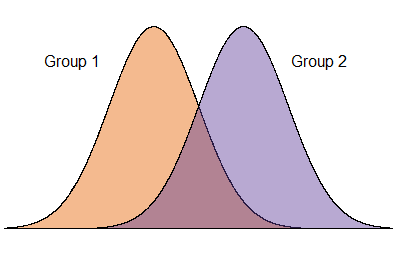
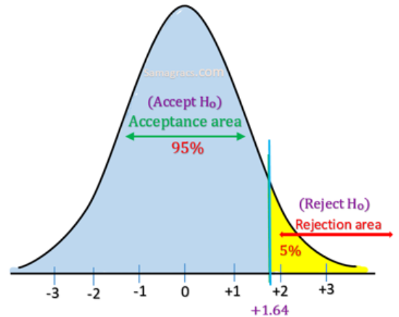
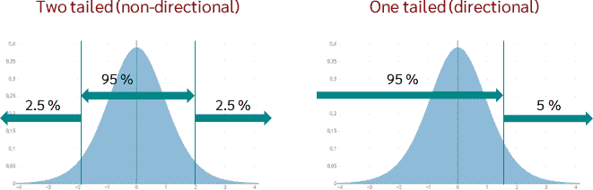

```{r setup}
#| include: false
library(ggplot2)
knitr::opts_chunk$set(warning = FALSE, message = FALSE, comment = "",
                       fig.width = 7, fig.height = 4.5, cache = TRUE, autodep = TRUE)
```

```{r datos-casen-350}
#| echo: false
pacman::p_load(sjmisc, haven, dplyr, stargazer, interpretCI, kableExtra, rempsyc, broom, gginference)
load("casen2022_inf2.Rdata")
options(scipen = 999) # para evitar notación en los ceros
set.seed(20) # para fijar el resultado aleatorio
casen_350 <- casen2022_inf %>% select(salario, sexo) %>% sample_n(350)
casen_350 <- na.omit(casen_350)
```

```{r datos-casen-1500}
#| echo: false
casen_1500 <- casen2022_inf %>% select(salario, sexo) %>% sample_n(1500)
casen_1500 <- na.omit(casen_1500)
```

# {.hide-logo data-background-color="#0C3547"}

<br>

::::: columns
::: {.column width="30%"}

<br>

{width="100%" fig-align="right"}
:::

:::{.column width="2%"}

:::

::: {.column style="width: 65%; font-size: 25px; text-align: right; margin: 0 auto;"}

<br>

### [Estadística Correlacional]{style="font-size: 2em; color: white;"}

::: {style="border-top: 1px solid white; margin: 0.3em 0;"}
:::

[Inferencia, asociación, y reporte]{style="font-size: 1.5em; color: #dfc117;"}

[Juan Carlos Castillo]{style="font-size: 1em; color: white;"}\
[Sociología FACSO - UChile]{style="font-size: 1em; color: white;"}\
[2do Sem 2026]{style="font-size: 1em; color: white;"}

[correlacional.metodos-facso.org](https://correlacional.metodos-facso.org)

<br>
[**Inferencia 5**:]{style="color: white; font-size: 1.3em;"}

[Hipótesis direccionales y de proporciones]{style="color: #dfc117;"}

:::
:::::

# 

[Recordando 5 pasos de la inferencia]{style="color: #ef0303; font-size: 1.3em;"} 

1. Formular hipótesis ( $H_0$ y $H_A$)

2. Obtener error estándar y estadístico de prueba empírico correspondiente (ej: Z o t)

3. Establecer la probabilidad de error $\alpha$ (usualmente 0.05) y obtener valor crítico (teórico) de la prueba correspondiente

4. Cálculo de intervalo de confianza / contraste valores empírico/crítico

5. Interpretación

## Esta clase {data-background-color="#9B2626"}

::: {style="color: white;"}
1. hipótesis direccionales de diferencia de medias

2. hipótesis para proporciones (por ejemplo, mayor o menor qué)
:::

# [1. Hipótesis direccionales]{style="color: white;"} {data-background-color="#0C3547"}

## [Comparación entre grupos]{style="font-size: 0.9em;"} 

:::{.columns}

:::{.column width="45%" style="font-size: 0.9em;"}

  - gran parte de las hipótesis de investigación se relacionan con **diferencias entre grupos**, ej:

  - hombres obtienen mayor salario que las mujeres

  - los chilenos son más prejuiciosos que los migrantes

  - ahora se apoyan los cambios más graduales que antes (comparación en el tiempo)
:::

:::{.column width="50%"}



:::

:::


## {data-background-color="#0C3547"}

::: {style="color: white; font-size: 1.3em; text-align: right;"}
_"la sociología comparada no es una rama especial de la sociología, sino que es la sociología misma en tanto deja de ser puramente descriptiva y aspira a dar razón de los hechos"_
:::

::: {style="color: white; text-align: right;"}
Durkheim (1895), *Les règles de la méthode sociologique*, op. cit., p. 137
:::

## {data-background-color="#0c4712" style="color: white; text-align: center;"}

### [_¿Es posible traducir una pregunta de investigación en una hipótesis de diferencia de medias?_]{style="color: #dfc117; font-size: 1.3em;"}

## Comparación de **medias** ( $\bar{X}$) {style="font-size: 0.85em;"}

- la comparación de medias es una manera de contrastar empíricamente teorías e hipótesis de investigación

- al traducir a este lenguaje, se puede aplicar **inferencia estadística** para contrastar la hipótesis planteada

## La prueba t {style="font-size: 0.9em;"}

- tenemos un valor de diferencia de medias: $\bar{X}_1 - \bar{X}_2$
  
- vamos a **TRANSFORMAR** este valor a un estándar comparable que nos permita evaluar **QUE TAN GRANDE** es esta diferencia

- ¿Qué es GRANDE? -> qué tan distinto es de 0 en términos de **desviaciones estándar**

- para esto, la diferencia de medias se divide por su ERROR ESTANDAR - >  **PRUEBA t**

- Este valor t de nuesta diferencia de medias (t empírico) se compara con el **t crítico**

## Visualización interactiva: prueba $t$ {style="font-size: 0.8em;"}

```{=html}
<div class="ttest-widget" style="font-size: 0.5em; color: #222; line-height: 1.4;">
  <div style="display:flex; gap:2em; flex-wrap:wrap; align-items:center; margin-bottom:0.4em;">
    <label>grados de libertad (df): <input type="range" id="tt-df" min="1" max="300" value="20" style="vertical-align:middle;"> <span id="tt-df-val">20</span></label>
    <label>&alpha; (significancia): <input type="range" id="tt-alpha" min="0.001" max="0.5" step="0.001" value="0.05" style="vertical-align:middle;"> <span id="tt-alpha-val">0.05</span></label>
    <label>t empírico: <input type="range" id="tt-tval" min="-6" max="6" step="0.01" value="1.62" style="vertical-align:middle;"> <span id="tt-tval-val">1.62</span></label>
  </div>
  <div style="margin-bottom:0.4em;">
    <label style="margin-right:1.5em;"><input type="radio" name="tt-tail" value="two" checked> H1: &mu; &ne; &mu;0 (dos colas)</label>
    <label style="margin-right:1.5em;"><input type="radio" name="tt-tail" value="less"> H1: &mu; &lt; &mu;0</label>
    <label><input type="radio" name="tt-tail" value="greater"> H1: &mu; &gt; &mu;0</label>
  </div>
  <div id="tt-plot" style="width:100%; height:420px;"></div>
</div>

<script src="https://cdn.plot.ly/plotly-2.32.0.min.js"></script>
<script>
(function() {
  function gammaln(xx) {
    var cof = [76.18009172947146,-86.50532032941677,24.01409824083091,
               -1.231739572450155,0.1208650973866179e-2,-0.5395239384953e-5];
    var x = xx, y = xx;
    var tmp = x + 5.5;
    tmp -= (x + 0.5) * Math.log(tmp);
    var ser = 1.000000000190015;
    for (var j = 0; j <= 5; j++) { y += 1; ser += cof[j] / y; }
    return -tmp + Math.log(2.5066282746310005 * ser / x);
  }

  function betacf(x, a, b) {
    var MAXIT = 200, EPS = 3e-7, FPMIN = 1e-30;
    var qab = a + b, qap = a + 1, qam = a - 1;
    var c = 1, d = 1 - qab * x / qap;
    if (Math.abs(d) < FPMIN) d = FPMIN;
    d = 1 / d;
    var h = d;
    for (var m = 1; m <= MAXIT; m++) {
      var m2 = 2 * m;
      var aa = m * (b - m) * x / ((qam + m2) * (a + m2));
      d = 1 + aa * d; if (Math.abs(d) < FPMIN) d = FPMIN;
      c = 1 + aa / c; if (Math.abs(c) < FPMIN) c = FPMIN;
      d = 1 / d; h *= d * c;
      aa = -(a + m) * (qab + m) * x / ((a + m2) * (qap + m2));
      d = 1 + aa * d; if (Math.abs(d) < FPMIN) d = FPMIN;
      c = 1 + aa / c; if (Math.abs(c) < FPMIN) c = FPMIN;
      d = 1 / d;
      var del = d * c; h *= del;
      if (Math.abs(del - 1) < EPS) break;
    }
    return h;
  }

  function betai(x, a, b) {
    if (x <= 0) return 0;
    if (x >= 1) return 1;
    var bt = Math.exp(gammaln(a + b) - gammaln(a) - gammaln(b) +
                       a * Math.log(x) + b * Math.log(1 - x));
    if (x < (a + 1) / (a + b + 2)) return bt * betacf(x, a, b) / a;
    else return 1 - bt * betacf(1 - x, b, a) / b;
  }

  function tcdf(t, df) {
    var x = df / (df + t * t);
    var p = betai(x, df / 2, 0.5);
    return t > 0 ? 1 - 0.5 * p : 0.5 * p;
  }

  function upperTail(t, df) { return 1 - tcdf(t, df); }

  function findCritT(targetUpper, df) {
    var lo = 0, hi = 100;
    for (var i = 0; i < 100; i++) {
      var mid = (lo + hi) / 2;
      if (upperTail(mid, df) > targetUpper) lo = mid; else hi = mid;
    }
    return (lo + hi) / 2;
  }

  function tpdf(t, df) {
    var logC = gammaln((df + 1) / 2) - gammaln(df / 2) - 0.5 * Math.log(df * Math.PI);
    return Math.exp(logC) * Math.pow(1 + (t * t) / df, -(df + 1) / 2);
  }

  var elDf = document.getElementById('tt-df');
  var elAlpha = document.getElementById('tt-alpha');
  var elTval = document.getElementById('tt-tval');
  var elDfVal = document.getElementById('tt-df-val');
  var elAlphaVal = document.getElementById('tt-alpha-val');
  var elTvalVal = document.getElementById('tt-tval-val');
  var plotDiv = document.getElementById('tt-plot');

  function getTail() {
    var radios = document.getElementsByName('tt-tail');
    for (var i = 0; i < radios.length; i++) if (radios[i].checked) return radios[i].value;
    return 'two';
  }

  function render() {
    var df = parseInt(elDf.value, 10);
    var alpha = parseFloat(elAlpha.value);
    var tval = parseFloat(elTval.value);
    var tail = getTail();
    elDfVal.textContent = df;
    elAlphaVal.textContent = alpha.toFixed(3);
    elTvalVal.textContent = tval.toFixed(2);

    var xs = [], ys = [];
    for (var x = -6; x <= 6; x += 0.03) { xs.push(x); ys.push(tpdf(x, df)); }

    var critPos, critNeg, rejectRegions = [], pVal, reject, comparisonText;

    if (tail === 'two') {
      critPos = findCritT(alpha / 2, df);
      critNeg = -critPos;
      rejectRegions.push([-6, critNeg]);
      rejectRegions.push([critPos, 6]);
      pVal = 2 * upperTail(Math.abs(tval), df);
      reject = Math.abs(tval) >= critPos;
      comparisonText = '|t| = ' + Math.abs(tval).toFixed(3) + (reject ? ' ≥ ' : ' < ') + critPos.toFixed(3);
    } else if (tail === 'greater') {
      critPos = findCritT(alpha, df);
      critNeg = null;
      rejectRegions.push([critPos, 6]);
      pVal = upperTail(tval, df);
      reject = tval >= critPos;
      comparisonText = 't = ' + tval.toFixed(3) + (reject ? ' ≥ ' : ' < ') + critPos.toFixed(3);
    } else {
      critNeg = -findCritT(alpha, df);
      critPos = null;
      rejectRegions.push([-6, critNeg]);
      pVal = tcdf(tval, df);
      reject = tval <= critNeg;
      comparisonText = 't = ' + tval.toFixed(3) + (reject ? ' ≤ ' : ' > ') + critNeg.toFixed(3);
    }

    var traces = [{
      x: xs, y: ys, type: 'scatter', mode: 'lines',
      line: { color: '#2c7fb8', width: 2 }, name: 'distribución t', hoverinfo: 'skip'
    }];

    rejectRegions.forEach(function(region) {
      var rx = [], ry = [];
      for (var x = region[0]; x <= region[1]; x += 0.03) { rx.push(x); ry.push(tpdf(x, df)); }
      traces.push({
        x: rx, y: ry, type: 'scatter', mode: 'lines',
        fill: 'tozeroy', fillcolor: 'rgba(34,139,34,0.35)',
        line: { color: 'rgba(34,139,34,0.6)', width: 1 },
        name: 'zona de rechazo', hoverinfo: 'skip', showlegend: false
      });
    });

    var shapes = [];
    var maxY = Math.max.apply(null, ys) * 1.15;
    [critPos, critNeg].forEach(function(cv) {
      if (cv === null) return;
      shapes.push({
        type: 'line', x0: cv, x1: cv, y0: 0, y1: maxY,
        line: { color: '#d62728', width: 2, dash: 'dash' }
      });
    });
    shapes.push({
      type: 'line', x0: tval, x1: tval, y0: 0, y1: maxY,
      line: { color: '#111', width: 2, dash: 'dash' }
    });

    var annotations = [{
      x: 0, y: maxY, xref: 'x', yref: 'y', showarrow: false, yanchor: 'bottom',
      text: 'df = ' + df + ',  α = ' + alpha.toFixed(3),
      font: { size: 13 }
    }, {
      x: (critNeg !== null ? critNeg : critPos), y: maxY * 0.9, xref: 'x', yref: 'y',
      showarrow: false, font: { size: 11, color: '#d62728' },
      text: 't crítico = ' + (critPos !== null ? critPos.toFixed(3) : critNeg.toFixed(3))
    }, {
      x: tval, y: maxY * 0.55, xref: 'x', yref: 'y', showarrow: false,
      font: { size: 11, color: '#111' }, xanchor: tval >= 0 ? 'left' : 'right',
      text: 't = ' + tval.toFixed(3)
    }, {
      x: -4.8, y: maxY * 0.75, xref: 'x', yref: 'y', showarrow: false,
      font: { size: 20, color: reject ? '#1a7a1a' : '#c0392b' },
      text: '<b>' + (reject ? 'Se rechaza H0' : 'No se rechaza H0') + '</b>'
    }, {
      x: 4.8, y: maxY * 0.75, xref: 'x', yref: 'y', showarrow: false,
      font: { size: 18, color: reject ? '#1a7a1a' : '#c0392b' },
      text: '<b>' + comparisonText + '<br>p = ' + pVal.toFixed(4) + '</b>'
    }];

    var layout = {
      margin: { l: 40, r: 20, t: 25, b: 30 },
      xaxis: { range: [-6, 6], title: 't' },
      yaxis: { range: [0, maxY], title: 'densidad' },
      shapes: shapes,
      annotations: annotations,
      showlegend: false
    };

    Plotly.react(plotDiv, traces, layout, { responsive: true, displayModeBar: false });
  }

  elDf.addEventListener('input', render);
  elAlpha.addEventListener('input', render);
  elTval.addEventListener('input', render);
  var radios = document.getElementsByName('tt-tail');
  for (var i = 0; i < radios.length; i++) radios[i].addEventListener('change', render);

  render();
})();
</script>
```


## [El **valor crítico** es el punto (o los puntos) en la distribución de un estadístico de prueba que separa la región de aceptación de la región de rechazo en una prueba de hipótesis]{style="color: white;"} {data-background-color="#9B2626"}

## Los **grados de libertad** son la cantidad de información independiente disponible para estimar parámetros o calcular un estadístico {data-background-color="#0C3547" style="font-size: 0.8em;"}


- Cada restricción (como conocer un promedio, fijar una suma, etc.) reduce en 1 los grados de libertad.

- Por ejemplo, si hay tres números que tienen promedio 10, se pueden elegir libremente 2 de ellos, y el tercero ya está determinado. Por lo tanto, hay 3-1 grados de libertad

## $t$ y probabilidad de error $p$ {style="font-size: 0.9em;"}

- el cálculo de $t$ (estimado) nos da un valor que puede ser transformado a un valor de área bajo la curva (tal como en Z)

- _¿cuál es la probabilidad de error (valor p) de un $t$ específico?_

- hay que recordar que tanto Z como t tienen promedio 0 y son simétricas, y por lo tanto el 0 divide el área de la curva en 0.5

- 0.5 es la mayor probabilidad de error (=azar total), y a medida que se aleja del 0.5 disminuye la probabilidad de error

## 

```{r}
#| echo: true
#| eval: false
(qt(t, df, lower.tail = FALSE)) * 2
```

Donde:

- qt: función que entrega la probabilidad para un valor $t$

- df: grados de libertad (degrees of freedom)

- lower.tail=FALSE: considera las probabilidades acumuladas hacia la cola superior de la curva

- *2: al ser una prueba de diferencias, considera zona de rechazo en ambas direcciones de la curva, por lo que las probabilidades se multiplican por 2

## En nuestro ejemplo {style="font-size: 0.8em;"}

```{r}
#| echo: true
(pt(0.99215, 341, lower.tail = FALSE)) * 2
```

- La probabilidad de error del $t$ estimado es de 0.322.

- Esto quiere decir es que en la estimación de esta diferencia de medias, nos estamos equivocando aproximadamente un tercio de las veces (lejos del nivel convencional de rechazo de $H_0$ de 0.05)

## _p_ y mayores niveles de confianza {style="font-size: 0.8em;"}

- La obtención del valor $p$ podría también entregar información para rechazar $H_0$ con un mayor nivel de confianza al establecido

- Si bien el p<0.05 es aceptado, en el caso que el p sea menor a 0.01 o 0.001, se reporta por convención el valor p menor

- Usualmente en los trabajos de investigación esto se representa con asteriscos: $^{\ast}p<0.05$, $^{\ast\ast}p<0.01$, y $^{\ast\ast\ast}p<0.001$

## [A mayor valor $t$, menor probabilidad de error $p$]{style="color: white;"} {data-background-color="#0C3547"}

## Test de hipótesis: insumos complementarios {style="font-size: 0.8em;"}

Entonces, se logra rechazar la hipótesis nula cuando:

- el intervalo de confianza no contiene el 0

- $t_{calculado} > t_{crítico}$

- $p_{calculado} < p_{crítico}$

  - o en términos generales convencionales, p<0.05

## Test de hipótesis de diferencias en R {style="font-size: 0.8em;"}

```{r}
#| echo: true
t.test(salario ~ sexo, data = casen_350, var.equal = TRUE)
```


## Reporte formato APA {style="font-size: 0.75em;"}

<br>

_"Se realizó una prueba t para muestras independientes para comparar los salarios entre hombres y mujeres. Los resultados indicaron una diferencia no significativa en los salarios entre hombres (M = 654585, SD = 468692) y mujeres (M = 604420, SD = 444666); t(341)=0.9921, p=0.321. El intervalo de confianza del 95% para la diferencia de medias fue [−49288.49;149618.5]._

[diferencia no significativa=no se logra rechazar $H_0$]

## En R con librería `report` {style="font-size: 0.75em;"}

```{r}
#| echo: true
#| results: hide
model <- t.test(salario ~ sexo, data = casen_350, var.equal = TRUE)
report::report(model)
```

_La prueba t de dos muestras que evalúa la diferencia de salario según sexo (media en el grupo 1 = 654585, media en el grupo 2 = 604420) sugiere que el efecto es positivo, estadísticamente no significativo y muy pequeño (diferencia = 50165, IC del 95% [-49,287.48, 150,000], t(341) = 0.99, p = 0.322)._

[traducido y con mínima edición]{style="font-size: 0.7em;"}

## Tipos de preguntas e hipótesis (ej: con promedio(s)) {style="font-size: 0.65em;"}

| **Pregunta**| **Hipótesis**   | **Prueba** |
|---------------------|------------------------------------------------------|------------|
| A. ¿Existe el promedio en la población? | $H_{a}: \bar{X}_1 \neq 0$ <br> $H_{0}: \bar{X}_1 = 0$ | Dos colas (no direccional) |
| B. ¿Existen diferencias de promedios en la población? | $H_{a}: \bar{X}_1 -  \bar{X}_2 \neq 0$ <br> $H_{0}: \bar{X}_1 -  \bar{X}_2= 0$ | Dos colas (no direccional) |
| C. ¿Es un promedio (1) superior (o inferior) al otro (2)? | $H_{a}: \bar{X}_1 -  \bar{X}_2 \gt 0$ <br> $H_{0}: \bar{X}_1 -  \bar{X}_2 \leq 0$ | Una cola (direccional) |

## {style="font-size: 0.8em;"}

:::: {.columns}
::: {.column width="50%"}

{width="100%" fig-align="center"}

:::

::: {.column width="50%"}

Si bien en teoría las hipótesis direccionales se pueden plantear en ambas direcciones, en general (y por simpleza) se expresan en términos de "mayor que", quedando la zona de rechazo de $H_0$ a la derecha

:::
::::

## Pasos en test de hipótesis {style="font-size: 0.75em;"}

1. Formulación: El salario de los hombres (grupo 1) es mayor al de las mujeres (grupo 2)

::: {.fragment}
$$
\begin{align*}
H_{a}: \bar{X}_1 \gt  \bar{X}_2 \\
H_{0}: \bar{X}_1 \leq  \bar{X}_2
\end{align*}
$$
:::

2. Obtener error estándar y estadístico de prueba (lo mismo que para el caso anterior)

::: {.fragment}
$$t=\frac{(\bar{x}_1-\bar{x}_2)}{\sqrt{\frac{s_1²}{\sqrt{n_1}}+\frac{s_2²}{\sqrt{n_2}} }}=\frac{50165}{50561}=0.9921$$
:::

## 3. Probabilidad de error y valor crítico {style="font-size: 0.8em;"}

- seguimos con probabilidad de error ( $\alpha$ 0.05), pero a diferencia de las no-direccionales no se divide entre 2 (colas), sino que es solo para una

::: {.fragment}
{width="80%" fig-align="center"}
:::

## 3. Probabilidad de error y valor crítico {style="font-size: 0.8em;"}

:::: {.columns}
::: {.column width="50%"}

- para un nivel de error $\alpha=0.05$ (de una cola)

- grados de libertad N-2= 343-2 = 341

:::

::: {.column .fragment width="50%"}

```{r}
#| echo: true
qt(p = .05,
   df = 341,
   lower.tail = FALSE)
```

[lower.tail=FALSE se refiere que el cálculo refiere a la cola superior]{style="font-size: 0.8em;"}

:::
::::

## 4. Contraste {style="font-size: 0.8em;"}

:::: {.columns}
::: {.column width="50%"}

- Recordemos nuestra hipótesis nula:

::: {.fragment}
$$H_{0}: \bar{X}_{hombres} \leq  \bar{X}_{mujeres}$$
:::

- Considerando los valores de contraste:

::: {.fragment}
$$t_{estimado}=0.992 < t_{crítico}=1.6$$
:::

:::

::: {.column .fragment width="50%"}

```{r}
#| echo: false
#| results: hide
model_dir <- t.test(salario ~ sexo, data = casen_350, alternative = "greater", var.equal = TRUE, conf.level = 0.95)
stats.table3 <- tidy(model_dir)
nice_table(stats.table3, broom = "t.test")
directional <- ggttest(model_dir)
```

```{r}
#| echo: false
directional
```

:::
::::

## 5. Interpretación {style="font-size: 0.8em;"}

```{r}
#| echo: false
nice_table(stats.table3, broom = "t.test")
```

_"Se realizó una prueba t para muestras independientes para examinar si el salario promedio de los hombres (M = 654585, SD = 468692) es mayor que el de las mujeres (M = 604420, SD = 444666), siendo la diferencia entre ambos de 50.165. Los resultados no fueron estadísticamente significativos, t(341)=0.9921, p=0.161. Por lo tanto, con un 95% de confianza no se puede rechazar la hipótesis nula, lo que no permite sustentar la hipótesis inicial (alternativa) que el salario de los hombres es mayor que el de las mujeres."_

<!--
Nota: en el práctico cambiar el N de la muestra y establecer distintos niveles de confianza
-->

## [¿Qué habría pasado con un tamaño muestral más grande, y/o con un nivel de probabilidad de error distinto?]{style="color: white;"} {data-background-color="#0C3547"}

## sub-muestra CASEN 1500 casos {style="font-size: 0.8em;"}

```{r}
#| echo: true
casen_1500 %>% # se especifica la base de datos
  dplyr::group_by(sexo = sjlabelled::as_label(sexo)) %>% # se agrupan por la variable categórica y se usan sus etiquetas con as_label
  dplyr::summarise(Obs. = n(), Promedio = mean(salario, na.rm = TRUE), SD = sd(salario, na.rm = TRUE)) %>% # se agregan las operaciones a presentar en la tabla
  kable(format = "markdown") # se genera la tabla
```

## {style="font-size: 0.75em;"}

:::: {.columns}
::: {.column width="50%"}

```{r}
#| echo: true
model_dir2 <- t.test(
  salario ~ sexo,
  data = casen_1500,
  alternative = "greater",
  var.equal = TRUE,
  conf.level = 0.95)
stats.table4 <- tidy(model_dir2)
nice_table(stats.table4,
           broom = "t.test")
```

:::

::: {.column width="50%"}

```{r}
#| echo: false
directional2 <- ggttest(model_dir2)
directional2
```

:::
::::

## Actividad práctica


# [Hipótesis para proporciones]{style="color: white;"} {data-background-color="#0C3547"}

## Test para proporciones {style="font-size: 0.8em;"}

- además de las inferencias con medidas de tendencia central (como promedios), es posible también realizar inferencia sobre porcentajes/proporciones, ej:

  - El 20% de l_s chilen_s asiste a la educación superior (hipótesis puntual)

  - Los hombres y las mujeres tienen un distinto porcentaje de acceso a la educación superior (hipótesis de diferencia)

  - Las mujeres asisten más a la educación superior que los hombres (hipótesis direccional)

## Datos {style="font-size: 1.2em;"}

```{r}
#| echo: true
stargazer(as.data.frame(casen2022_inf), type = "text")
```

## {style="font-size: 0.8em;"}

```{r}
#| echo: true
frq(casen2022_inf$educacion)
```

## Variable ed. universitaria {style="font-size: 0.85em;"}

```{r}
#| echo: true
casen2022_inf$educ_sup <- rec(casen2022_inf$educacion, rec = "1:12=0;13:15=1", val.labels = c("Menos que universitaria", "Universitaria o más"))
frq(casen2022_inf$educ_sup)
```

## {style="font-size: 0.8em;"}

:::: {.columns}
::: {.column width="55%" style="font-size: 0.8em;"}

```{r}
#| echo: true
pacman::p_load(sjPlot)
casen2022_inf %>%
  sjtab(educ_sup, sexo,
  show.col.prc = TRUE)
```

:::

::: {.column .fragment width="45%"}

<br>

$p_m - p_h=0.297-0.214=0.083$

<br>


El porcentaje de mujeres con educación universitaria es [8.3%]{style="color: #c0392b;"} superior en las mujeres

<br>

::: {.content-box-red style="text-align: center;"}
[¿Es significativa esta diferencia?]{style="color: #ffffff;"}
:::

:::
::::

<!--
ver: http://www.sthda.com/english/wiki/two-proportions-z-test-in-r
-->

## Diferencias entre proporciones {style="font-size: 0.8em;"}

1. Establecer las hipótesis (y definir si son o no direccionales)

2. Calcular error estándar

3. Estimar estadístico de prueba (Z)

4. Establecer valor crítico de la prueba (de acuerdo a un cierto nivel de confianza)

5. Contraste e interpretación

## Diferencias entre proporciones {style="font-size: 0.8em;"}
### 1. Establecer las hipótesis

¿Existen diferencias entre el porcentaje de mujeres y hombres con nivel educacional universitario?

$$H_{a}: p_{mujeres} -  p_{hombres} \neq 0$$
$$H_{0}: p_{mujeres} -  p_{hombres}= 0$$

## Diferencias entre proporciones {style="font-size: 0.8em;"}
### 2. Cálculo de error estándar (SE)

El SE para una proporción es:

$$SE_p=\sqrt{\frac{p(1-p)}{n}}$$

Y para diferencia de proporciones:

$$SE_{p_1 - p_2}=\sqrt{\frac{p_1(1-p_1)}{n_1}+\frac{p_2(1-p_2)}{n_2}}$$

<!--
https://online.stat.psu.edu/stat415/lesson/9/9.4
-->

## Estimación de error estándar {style="font-size: 0.8em;"}

$$
\begin{align*}
SE_{p_a - p_b}&=\sqrt{\frac{p_a(1-p_a)}{n_a}+\frac{p_b(1-p_b)}{n_b}} \\\\
SE_{p_m - p_h}&=\sqrt{\frac{0.297(1-0.297)}{7603}+\frac{0.214(1-0.214)}{6818}} \\\\
SE_{p_m - p_h}&=\sqrt{\frac{0.209}{7603}+\frac{0.168}{6818}}=\sqrt{0.0000275+0.0000246}=0.00722
\end{align*}
$$

## Diferencias entre proporciones {style="font-size: 0.8em;"}
### 3. Cálculo de estadístico de prueba

Para diferencia de proporciones se utiliza la prueba $Z$

$$Z_{est}=\frac{p_m -  p_h}{SE_{p_m -p_h}}=\frac{0.083}{0.0072}=11.528$$

## Diferencias entre proporciones {style="font-size: 0.8em;"}
### 4. Establecer valor crítico de prueba

Y comparamos este valor con el Z crítico para un $\alpha=0.05$ de dos colas (porque es hipótesis de diferencia)

```{r}
#| echo: true
qnorm(p = .05/2, lower.tail = FALSE)
```

## Diferencias entre proporciones {style="font-size: 0.8em;"}
### 5. Interpretación

En este caso, nuestro $Z_{est}=11.528 > Z_{crít}=1.96$, por lo tanto se rechaza $H_0$

La proporción de universitarias y universitarios es diferente, con un 95% de confianza

## Diferencias entre proporciones {style="font-size: 0.8em;"}

### (6). Construcción intervalo de confianza

Para obtener un intervalo de confianza, a la diferencia de proporciones se le suman/restan errores estándar multiplicados por el valor Z crítico según nivel de confianza, en este caso $\alpha/2=0.05/2$ (prueba de dos colas)

$$
\begin{align*}
p_1 - p_2 &\pm Z_{crit_{\alpha/2}}*SE_{p_a - p_b} \\
0.297-0.214 &\pm1.96*0.00722\\
0.083&\pm 0.0142 \\
\end{align*}
$$

$$CI[0.07;0.09]$$

Podemos entonces decir con un 95% de confianza que la diferencia de proporción de universitari_s entre hombres y mujeres se encuentra entre un 7% y un 9%


## Estimación directamente en R con `prop.test` {style="font-size: 0.7em;"}

:::: {.columns}
::: {.column width="55%"}

```{r}
#| echo: true
#| eval: false
prop_dif <- prop.test(x = c(7603, 6818), n = c(25610, 31920))
prop_dif
```

```
2-sample test for equality of proportions with continuity
	correction

data:  c(7603, 6818) out of c(25610, 31920)
X-squared = 524.22, df = 1, p-value < 0.00000000000000022
alternative hypothesis: two.sided
95 percent confidence interval:
 0.07606640 0.09049306
sample estimates:
   prop 1    prop 2
0.2968762 0.2135965
```

:::

::: {.column .fragment width="45%"}

Dos cosas importantes para reporte de este output:

- probabilidad de error p: si es menor al nivel de error especificado ( $\alpha$), se rechaza la hipótesis nula. En este caso, las diferencias entre grupos son significativamente distintas de cero.

- el intervalo de confianza: rango de valores con un 95% de confianza para la diferencia estimada.

:::
::::

## Hipótesis direccionales de proporciones {style="font-size: 0.8em;"}
### Paso 1: hipótesis

¿Es superior la proporción de mujeres con educación superior?

En este caso,

$$H_{0}: p_{mujeres} \leq  p_{hombres}$$

En relación a la siguiente hipótesis alternativa:

$$H_{a}: p_{mujeres} \gt  p_{hombres}$$

## Hipótesis direccionales de proporciones {style="font-size: 0.8em;"}
### Paso 2 (SE) y 3 (estadístico de prueba) igual que para hipótesis no direccionales

## Hipótesis direccionales de proporciones {style="font-size: 0.8em;"}
### Paso 4: Valor crítico de prueba

Valor crítico de Z para una cola

```{r}
#| echo: true
qnorm(p = .05, lower.tail = FALSE)
```

## Hipótesis direccionales de proporciones {style="font-size: 0.8em;"}
### Paso 5: Interpretación

Valor crítico se compara con el valor estimado de Z para la diferencia de proporciones,

En este caso, $$Z_{est}=11.528 \gt Z_{crít}=1.644$$

Por lo tanto se rechaza $H_0$, con un 95% de confianza podemos decir que la proporción de mujeres universitarias es mayor en mujeres que en hombres.

## Estimación directamente en R con `prop.test` {style="font-size: 0.7em;"}

```{r}
#| echo: true
#| eval: false
prop_greater <- prop.test(x = c(7603, 6818), n = c(25610, 31920), alternative = "greater")
prop_greater
```

```
	2-sample test for equality of proportions with continuity
	correction

data:  c(7603, 6818) out of c(25610, 31920)
X-squared = 524.22, df = 1, p-value < 0.00000000000000022
alternative hypothesis: greater
95 percent confidence interval:
 0.07722045 1.00000000
sample estimates:
   prop 1    prop 2
0.2968762 0.2135965
```

## Visualización interactiva: prueba de diferencia de proporciones {style="font-size: 0.8em;"}

```{=html}
<div class="pp-widget" style="font-size: 0.5em; color: #222; line-height: 1.4;">
  <div style="display:flex; gap:2em; flex-wrap:wrap; align-items:center; margin-bottom:0.4em;">
    <label>p1: <input type="range" id="pp-p1" min="0.01" max="0.99" step="0.001" value="0.297" style="vertical-align:middle;"> <span id="pp-p1-val">0.297</span></label>
    <label>n1: <input type="range" id="pp-n1" min="10" max="30000" step="1" value="7603" style="vertical-align:middle;"> <span id="pp-n1-val">7603</span></label>
    <label>p2: <input type="range" id="pp-p2" min="0.01" max="0.99" step="0.001" value="0.214" style="vertical-align:middle;"> <span id="pp-p2-val">0.214</span></label>
    <label>n2: <input type="range" id="pp-n2" min="10" max="30000" step="1" value="6818" style="vertical-align:middle;"> <span id="pp-n2-val">6818</span></label>
    <label>&alpha; (significancia): <input type="range" id="pp-alpha" min="0.001" max="0.5" step="0.001" value="0.05" style="vertical-align:middle;"> <span id="pp-alpha-val">0.05</span></label>
  </div>
  <div style="margin-bottom:0.4em;">
    <label style="margin-right:1.5em;"><input type="radio" name="pp-tail" value="two" checked> H1: p1 &ne; p2 (dos colas)</label>
    <label style="margin-right:1.5em;"><input type="radio" name="pp-tail" value="less"> H1: p1 &lt; p2</label>
    <label><input type="radio" name="pp-tail" value="greater"> H1: p1 &gt; p2</label>
  </div>
  <div id="pp-plot" style="width:100%; height:420px;"></div>
</div>

<script src="https://cdn.plot.ly/plotly-2.32.0.min.js"></script>
<script>
(function() {
  function erf(x) {
    var sign = x >= 0 ? 1 : -1;
    x = Math.abs(x);
    var a1 = 0.254829592, a2 = -0.284496736, a3 = 1.421413741,
        a4 = -1.453152027, a5 = 1.061405429, p = 0.3275911;
    var t = 1 / (1 + p * x);
    var y = 1 - (((((a5 * t + a4) * t) + a3) * t + a2) * t + a1) * t * Math.exp(-x * x);
    return sign * y;
  }

  function normCDF(z) { return 0.5 * (1 + erf(z / Math.SQRT2)); }
  function normPDF(z) { return Math.exp(-z * z / 2) / Math.sqrt(2 * Math.PI); }
  function upperTail(z) { return 1 - normCDF(z); }

  function findCritZ(targetUpper) {
    var lo = 0, hi = 10;
    for (var i = 0; i < 100; i++) {
      var mid = (lo + hi) / 2;
      if (upperTail(mid) > targetUpper) lo = mid; else hi = mid;
    }
    return (lo + hi) / 2;
  }

  var elP1 = document.getElementById('pp-p1');
  var elN1 = document.getElementById('pp-n1');
  var elP2 = document.getElementById('pp-p2');
  var elN2 = document.getElementById('pp-n2');
  var elAlpha = document.getElementById('pp-alpha');
  var elP1Val = document.getElementById('pp-p1-val');
  var elN1Val = document.getElementById('pp-n1-val');
  var elP2Val = document.getElementById('pp-p2-val');
  var elN2Val = document.getElementById('pp-n2-val');
  var elAlphaVal = document.getElementById('pp-alpha-val');
  var plotDiv = document.getElementById('pp-plot');

  function getTail() {
    var radios = document.getElementsByName('pp-tail');
    for (var i = 0; i < radios.length; i++) if (radios[i].checked) return radios[i].value;
    return 'two';
  }

  function render() {
    var p1 = parseFloat(elP1.value);
    var n1 = parseInt(elN1.value, 10);
    var p2 = parseFloat(elP2.value);
    var n2 = parseInt(elN2.value, 10);
    var alpha = parseFloat(elAlpha.value);
    var tail = getTail();
    elP1Val.textContent = p1.toFixed(3);
    elN1Val.textContent = n1;
    elP2Val.textContent = p2.toFixed(3);
    elN2Val.textContent = n2;
    elAlphaVal.textContent = alpha.toFixed(3);

    var se = Math.sqrt(p1 * (1 - p1) / n1 + p2 * (1 - p2) / n2);
    var zest = (p1 - p2) / se;

    var xs = [], ys = [];
    for (var x = -5; x <= 5; x += 0.03) { xs.push(x); ys.push(normPDF(x)); }

    var critPos, critNeg, rejectRegions = [], pVal, reject, comparisonText;

    if (tail === 'two') {
      critPos = findCritZ(alpha / 2);
      critNeg = -critPos;
      rejectRegions.push([-5, critNeg]);
      rejectRegions.push([critPos, 5]);
      pVal = 2 * upperTail(Math.abs(zest));
      reject = Math.abs(zest) >= critPos;
      comparisonText = '|Z| = ' + Math.abs(zest).toFixed(3) + (reject ? ' ≥ ' : ' < ') + critPos.toFixed(3);
    } else if (tail === 'greater') {
      critPos = findCritZ(alpha);
      critNeg = null;
      rejectRegions.push([critPos, 5]);
      pVal = upperTail(zest);
      reject = zest >= critPos;
      comparisonText = 'Z = ' + zest.toFixed(3) + (reject ? ' ≥ ' : ' < ') + critPos.toFixed(3);
    } else {
      critNeg = -findCritZ(alpha);
      critPos = null;
      rejectRegions.push([-5, critNeg]);
      pVal = normCDF(zest);
      reject = zest <= critNeg;
      comparisonText = 'Z = ' + zest.toFixed(3) + (reject ? ' ≤ ' : ' > ') + critNeg.toFixed(3);
    }

    var traces = [{
      x: xs, y: ys, type: 'scatter', mode: 'lines',
      line: { color: '#2c7fb8', width: 2 }, name: 'distribución Z', hoverinfo: 'skip'
    }];

    rejectRegions.forEach(function(region) {
      var rx = [], ry = [];
      for (var x = region[0]; x <= region[1]; x += 0.03) { rx.push(x); ry.push(normPDF(x)); }
      traces.push({
        x: rx, y: ry, type: 'scatter', mode: 'lines',
        fill: 'tozeroy', fillcolor: 'rgba(34,139,34,0.35)',
        line: { color: 'rgba(34,139,34,0.6)', width: 1 },
        name: 'zona de rechazo', hoverinfo: 'skip', showlegend: false
      });
    });

    var shapes = [];
    var maxY = Math.max.apply(null, ys) * 1.15;
    [critPos, critNeg].forEach(function(cv) {
      if (cv === null) return;
      shapes.push({
        type: 'line', x0: cv, x1: cv, y0: 0, y1: maxY,
        line: { color: '#d62728', width: 2, dash: 'dash' }
      });
    });
    var zClamped = Math.max(-5, Math.min(5, zest));
    var zWasClamped = zClamped !== zest;
    shapes.push({
      type: 'line', x0: zClamped, x1: zClamped, y0: 0, y1: maxY,
      line: { color: '#111', width: 2, dash: 'dash' }
    });

    var annotations = [{
      x: 0, y: maxY, xref: 'x', yref: 'y', showarrow: false, yanchor: 'bottom',
      text: 'SE = ' + se.toFixed(4) + ',  α = ' + alpha.toFixed(3),
      font: { size: 13 }
    }, {
      x: (critNeg !== null ? critNeg : critPos), y: maxY * 0.9, xref: 'x', yref: 'y',
      showarrow: false, font: { size: 11, color: '#d62728' },
      text: 'Z crítico = ' + (critPos !== null ? critPos.toFixed(3) : critNeg.toFixed(3))
    }, {
      x: zClamped, y: maxY * 0.55, xref: 'x', yref: 'y', showarrow: false,
      font: { size: 11, color: '#111' },
      xanchor: zWasClamped ? (zClamped >= 0 ? 'right' : 'left') : (zClamped >= 0 ? 'left' : 'right'),
      text: 'Z = ' + zest.toFixed(3)
    }, {
      x: -3.9, y: maxY * 0.75, xref: 'x', yref: 'y', showarrow: false,
      font: { size: 20, color: reject ? '#1a7a1a' : '#c0392b' },
      text: '<b>' + (reject ? 'Se rechaza H0' : 'No se rechaza H0') + '</b>'
    }, {
      x: 3.9, y: maxY * 0.75, xref: 'x', yref: 'y', showarrow: false,
      font: { size: 18, color: reject ? '#1a7a1a' : '#c0392b' },
      text: '<b>' + comparisonText + '<br>p = ' + pVal.toFixed(4) + '</b>'
    }];

    var layout = {
      margin: { l: 40, r: 20, t: 25, b: 30 },
      xaxis: { range: [-5, 5], title: 'Z' },
      yaxis: { range: [0, maxY], title: 'densidad' },
      shapes: shapes,
      annotations: annotations,
      showlegend: false
    };

    Plotly.react(plotDiv, traces, layout, { responsive: true, displayModeBar: false });
  }

  elP1.addEventListener('input', render);
  elN1.addEventListener('input', render);
  elP2.addEventListener('input', render);
  elN2.addEventListener('input', render);
  elAlpha.addEventListener('input', render);
  var radios = document.getElementsByName('pp-tail');
  for (var i = 0; i < radios.length; i++) radios[i].addEventListener('change', render);

  render();
})();
</script>
```

## Resumen de inferencia 

- La inferencia estadística permite sacar conclusiones sobre una población a partir de una muestra.
- Se basa en un contraste de hipótesis, que puede ser direccional o no direccional.
- La lógica de falsación busca rechazar la hipótesis nula, y se basa en el cálculo de un estadístico de prueba y su comparación con un valor crítico.


# {.hide-logo data-background-color="#0C3547"}

<br>

::::: columns
::: {.column width="30%"}

<br>

{width="100%" fig-align="right"}
:::

:::{.column width="2%"}

:::

::: {.column style="width: 65%; font-size: 25px; text-align: right; margin: 0 auto;"}

<br>

### [Estadística Correlacional]{style="font-size: 2em; color: white;"}

::: {style="border-top: 1px solid white; margin: 0.3em 0;"}
:::

[Inferencia, asociación, y reporte]{style="font-size: 1.5em; color: #dfc117;"}

[Juan Carlos Castillo]{style="font-size: 1em; color: white;"}\
[Sociología FACSO - UChile]{style="font-size: 1em; color: white;"}\
[2do Sem 2026]{style="font-size: 1em; color: white;"}

[correlacional.metodos-facso.org](https://correlacional.metodos-facso.org)

:::
:::::
