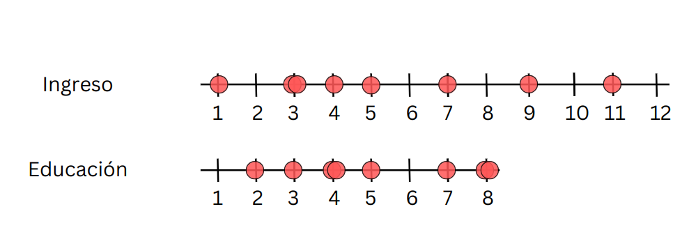
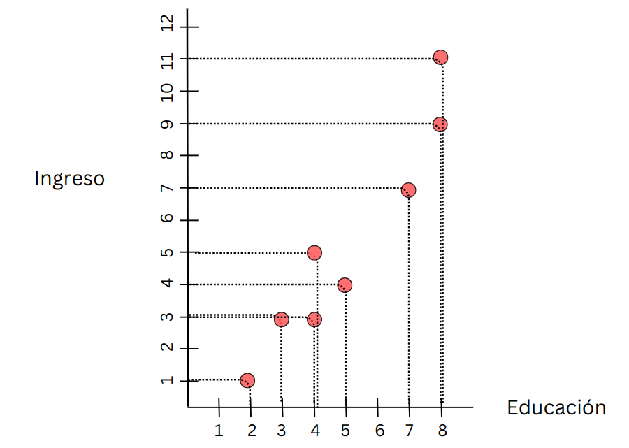
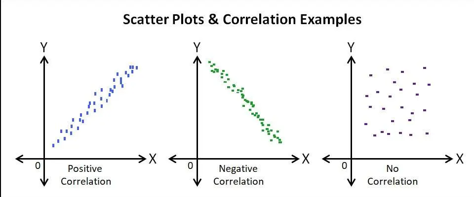
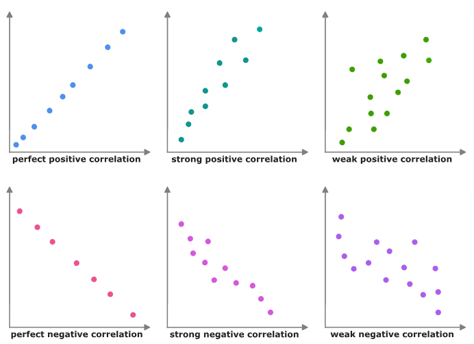
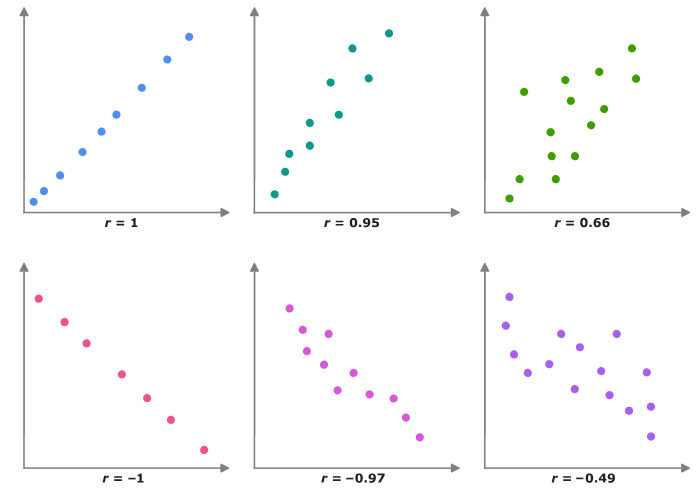
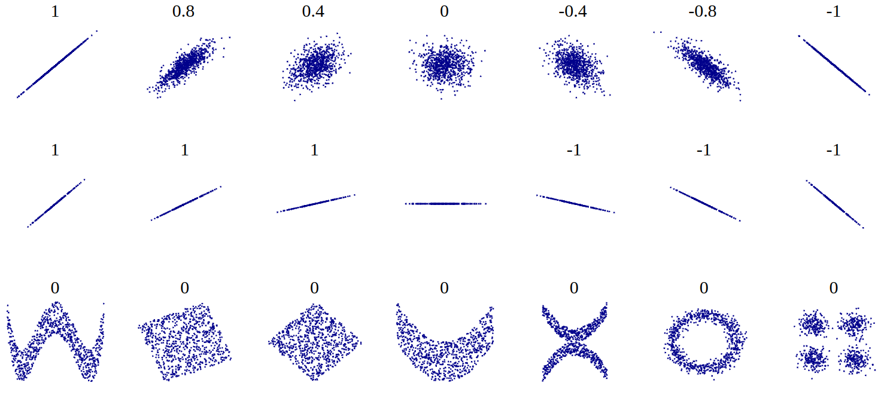
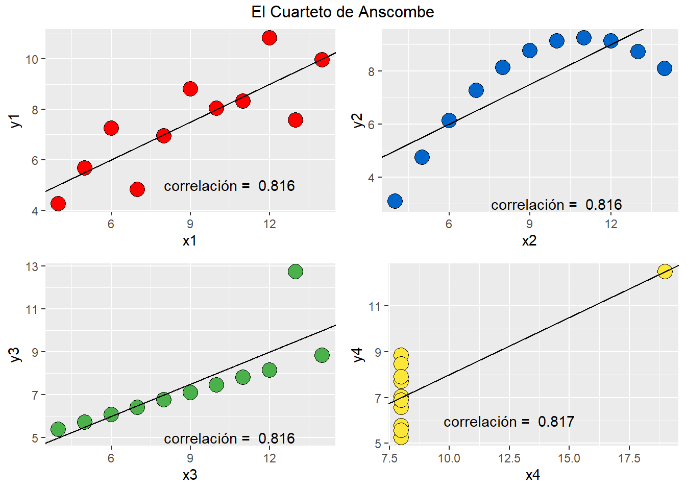

```{r setup}
#| include: false
pacman::p_load(tidyverse, kableExtra)
knitr::opts_chunk$set(warning = FALSE, message = FALSE, comment = "",
                       fig.width = 7, fig.height = 4.5, cache = TRUE, autodep = TRUE)
```

# {.hide-logo data-background-color="#0C3547"}

<br>

::::: columns
::: {.column width="30%"}

<br>

{width="100%" fig-align="right"}
:::

:::{.column width="2%"}

:::

::: {.column style="width: 65%; font-size: 25px; text-align: right; margin: 0 auto;"}

<br>

### [Estadística Correlacional]{style="font-size: 2em; color: white;"}

::: {style="border-top: 1px solid white; margin: 0.3em 0;"}
:::

[Inferencia, asociación, y reporte]{style="font-size: 1.5em; color: #dfc117;"}

[Juan Carlos Castillo]{style="font-size: 1em; color: white;"}\
[Sociología FACSO - UChile]{style="font-size: 1em; color: white;"}\
[2do Sem 2026]{style="font-size: 1em; color: white;"}

[correlacional.metodos-facso.org](https://correlacional.metodos-facso.org)

<br>
[**Sesión 8**:]{style="color: white; font-size: 1.3em;"}

[Asociación y covarianza]{style="color: #dfc117;"}

:::
:::::

# {style="font-size: 0.85em;"}

:::: {.columns}
::: {.column width="50%"}
::: {.content-box-red}
[Hasta ahora (Unidad 1)]{style="font-size: 1.4em; font-weight: bold;"}

- Probabilidad, teorema central del límite, error estándar, hipótesis, **diferencias entre grupos**
:::
:::

::: {.column .fragment width="50%"}
::: {.content-box-green}
[Ahora (Unidad 2)]{style="font-size: 1.4em; font-weight: bold;"}

- Asociación: ¿en qué medida dos fenómenos (sociales) se encuentran **vinculados**?
:::
:::
::::

## [¿Por qué es importante estudiar [asociación]{style="color: #dfc117;"} en ciencias sociales?]{style="color: white;"} {data-background-color="#0C3547"}

## Ejemplo: origen escolar y puntaje PAES {style="font-size: 0.85em;"}

Porcentaje de estudiantes que obtiene puntajes en el 20% superior a nivel nacional, según tipo de colegio:

| Tipo de colegio | % en el 20% superior |
|-------------------------|---------------------:|
| Particular pagado | 61,3% |
| Particular subvencionado | 16,8% |
| Público | 9,5% |

[Fuente: [CIPER, "PAES: una radiografía de la educación y el país"](https://www.ciperchile.cl/2025/01/08/paes-una-radiografia-de-la-educacion-y-el-pais/)]{style="font-size: 0.7em;"}

## Objetivos de la sesión de hoy {data-background-color="#9B2626"} 

::: {style="color: white;"}
1. Comprender los conceptos de covarianza y correlación

2. Aprender el cálculo de ambos coeficientes y su interpretación

3. Entender las limitaciones del coeficiente de corelación y su consideración en el cálculo e interpretación
:::

## Lectura: Moore 97-131 Análisis de relaciones {style="text-align: center;"}

# [1. Varianza y nube de puntos]{style="color: white;"} {data-background-color="#0C3547"}

## Ejemplo minimalista: educación e ingreso {style="font-size: 0.85em;"}

- simulamos datos para

  - 8 casos

  - 8 niveles de [educación]{style="color: #c0392b;"} (ej: desde básica incompleta=1 hasta postgrado=8)

  - 12 niveles de rangos de [ingreso]{style="color: #c0392b;"} (ej: desde menos de 100.000=1 hasta más de 10.000.000=12)

## Generación de datos ejemplo {style="font-size: 0.8em;"}

:::: {.columns}
::: {.column width="50%"}

::: {style="font-size: 1.3em;"}

```{r}
#| echo: true
educ <- c(2,3,4,4,5,7,8,8)
ing <- c(1,3,3,5,4,7,9,11)

data <- data.frame(educ, ing)
```
:::

:::

::: {.column width="50%"}

::: {style="font-size: 1.3em;"}

```{r}
#| echo: true
kableExtra::kbl(data)
```
:::

:::
::::

## {style="text-align: center;"}

{fig-align="center"}

## [Midiendo dispersión:]{style="color: white;"} {data-background-color="#0C3547"}

::: {style="color: white; text-align: center;"}
$$Varianza=\sigma^{2}={\sum_{i=1}^{N}(x_{i}-\bar{x})^{2}\over {N - 1}}$$
:::

##

:::: {.columns}
::: {.column width="30%"}

<br>
<br>

$$\sigma^{2}={\sum_{i=1}^{N}(x_{i}-\bar{x})^{2}\over {N - 1}}$$

:::

::: {.column width="70%"}

{width="100%"}

:::
::::

##

:::: {.columns}
::: {.column width="30%"}

<br>
<br>

$$\sigma^{2}={\sum_{i=1}^{N}(x_{i}-\bar{x})^{2}\over {N - 1}}$$

:::

::: {.column width="70%"}

{width="100%"}

:::
::::

##

```{r}
#| echo: false
data$id <- seq(1,8) # agregar para graficos univariados
data <- data %>% select(id,educ,ing)
ggplot(
  data = data,
  aes(y = educ, x = id)) +
  geom_point() +
  geom_hline(yintercept=5.12) +
  annotate("text", x=7.5, y=4.8,
           label="Prom Educ") +
  geom_segment(aes(y=5.12, yend = educ,
                  xend=id,  color = "resid")) +
  scale_color_discrete(name="") +
  theme(text = element_text(size = 20)) +
  scale_y_continuous(breaks=seq(0,8,1)) +
  scale_x_continuous(breaks=seq(0,8,1))
```

## Varianza educación {style="font-size: 0.75em;"}

:::: {.columns}
::: {.column width="50%"}

$$Varianza=\sigma^{2}={\sum_{i=1}^{N}(x_{i}-\bar{x})^{2}\over {N - 1}}$$

::: {style="font-size: 1.3em;"}

```{r}
#| echo: true
mean(data$educ)
```
:::

::: {style="font-size: 1.3em;"}

```{r}
#| echo: true
data$mean_educ <- mean(data$educ)
data$dif_m_educ <- data$educ-data$mean_educ
data$dif_m_educ2 <- (data$dif_m_educ)^2
```
:::

:::

::: {.column .fragment width="50%"}

::: {style="font-size: 1.3em;"}

```{r}
#| echo: true
kbl(data, digits = 2) %>%
  scroll_box(width = "500px", height = "500px")
```
:::

:::
::::

## {style="font-size: 0.75em;"}

:::: {.columns}
::: {.column width="50%"}

```{r}
#| echo: false
kableExtra::kbl(data, digits = 2) %>%
  scroll_box(width = "500px", height = "500px")
```
<br>

::: {style="font-size: 1.3em;"}

```{r}
#| echo: true
sum(data$dif_m_educ2)
```
:::


:::

::: {.column .fragment width="50%"}

[Varianza educación]{style="font-size: 1.2em; font-weight: bold;"}

$$
\begin{align*}
Varianza =\sigma^{2} &={\sum_{i=1}^{N}(x_{i}-\bar{x})^{2}\over {N - 1}}\\
\sigma^{2} &={(36,875)\over {8 - 1}}\\
\sigma^{2} &= 5,267\\
\end{align*}
$$

<br>

::: {style="font-size: 1.3em;"}

```{r}
#| echo: true
var(data$educ)
```
:::

:::
::::

## Varianza ingreso {style="font-size: 0.75em;"}

:::: {.columns}
::: {.column width="50%"}

Promedio ingreso:

::: {style="font-size: 1.3em;"}

```{r}
#| echo: true
mean(data$ing)
```
:::

<br>
SS ingreso $(x_{i}-\bar{x})^{2}$:

::: {style="font-size: 1.3em;"}

```{r}
#| echo: true
data$mean_ing <- mean(data$ing)
data$dif_m_ing <- data$ing-data$mean_ing
data$dif_m_ing2 <- (data$dif_m_ing)^2
sum(data$dif_m_ing2)
```
:::

:::

::: {.column style="width: 50%; font-size: 0.8em;"}

$$
\begin{align*}
Varianza =\sigma^{2} &={\sum_{i=1}^{N}(x_{i}-\bar{x})^{2}\over {N - 1}}\\
\sigma^{2} &={(79,875)\over {8 - 1}}\\
\sigma^{2} &= 11.41071\\
\end{align*}
$$

<br>

::: {style="font-size: 1.6em;"}

```{r}
#| echo: true
var(data$ing)
```
:::

:::
::::

## ¿Por qué es importante la **varianza**? {data-background-color="#0C3547"}

<br>

:::: {.columns}

::: {.column width="50%" .content-box-red}
Indica la dispersión (variabilidad) de los datos en torno al promedio

:::

::: {.column width="50%" .content-box-green}

Permite cuantificar relaciones entre variables: [covarianza]{style="color: #c0392b;"}
:::

::::

## Asociación {style="font-size: 0.8em;"}

:::: {.columns}
::: {.column width="35%"}

```{r}
#| echo: false
data %>% select(id,educ,ing) %>% kbl(.)
```

:::

::: {.column width="65%"}

Graficando cada caso:

{width="80%" fig-align="center"}

:::
::::

## En R {style="font-size: 0.8em;"}

:::: {.columns}
::: {.column width="45%"}

::: {style="font-size: 1.3em;"}

```{r}
#| echo: true
plot1 <- ggplot(data,
  aes(x=educ, y=ing)) +
  geom_point(
    colour = "red",
    size = 5) +
  scale_x_continuous(breaks = 1:8, limits = c(1, 8)) +
  scale_y_continuous(breaks = 1:12, limits = c(1, 12)) +
  theme(text =
    element_text(size = 20))
```
:::


:::

Nube de puntos:

::: {.column width="65%"}

```{r}
#| echo: false
#| fig-width: 4.5
#| fig-height: 6
plot1
```

:::
::::

## [La **nube de puntos** o scatterplot es una representación gráfica de la asociación de dos variables, donde cada punto representa el valor de cada caso en cada una de las variables]{style="color: white;"} {data-background-color="#0C3547"}

##

:::: {.columns}
::: {.column width="35%"}

```{r}
#| echo: false
#| fig-width: 4.5
#| fig-height: 6
plot1
```

:::

::: {.column width="45%"}

<br>
<br>

::: {.content-box-red}
¿Cómo expresar matemáticamente este patrón de asociación?
:::

:::
::::

# [2. Covarianza]{style="color: white;"} {data-background-color="#0C3547"}

## Hacia la covarianza {style="font-size: 0.8em;"}

:::: {.columns}
::: {.column width="50%"}

```{r}
#| echo: false
ggplot(
  data = data,
  aes(y = educ, x = id)) +
  geom_point() +
  geom_hline(yintercept=5.12) +
  annotate("text", x=7.5, y=4.8,
           label="Prom Educ") +
  geom_segment(aes(y=5.12, yend = educ,
                  xend=id,  color = "resid")) +
  scale_color_discrete(name="") +
  theme(text = element_text(size = 20)) +
  scale_y_continuous(breaks=seq(0,8,1)) +
  scale_x_continuous(breaks=seq(0,8,1))
```

::: {style="text-align: center;"}
[Educación]{style="font-size: 1.3em; font-weight: bold;"}
:::

:::

::: {.column width="50%"}

```{r}
#| echo: false
ggplot(
  data = data,
  aes(y = ing, x = id)) +
  geom_point() +
  geom_hline(yintercept=5.375) +
  annotate("text", x=7.5, y=4.8,
           label="Prom Ing.") +
  geom_segment(aes(y=5.375, yend = ing,
                  xend=id,  color = "resid")) +
  scale_color_discrete(name="") +
  theme(text = element_text(size = 20)) +
  scale_y_continuous(breaks=seq(0,12,1)) +
  scale_x_continuous(breaks=seq(0,8,1))
```

::: {style="text-align: center;"}
[Ingreso]{style="font-size: 1.3em; font-weight: bold;"}
:::

:::
::::

## Covarianza {style="font-size: 0.8em;"}

:::: {.columns}
::: {.column width="50%"}

::: {style="text-align: center;"}
[Varianza educación (x)]{style="font-size: 1.3em; font-weight: bold;"}

$$\sigma_{edu}^{2}={\sum_{i=1}^{N}(x_{i}-\bar{x})^{2}\over {N - 1}}$$
$$\sigma_{edu}^{2}={\sum_{i=1}^{N}(x_{i}-\bar{x})(x_{i}-\bar{x})\over {N - 1}}$$
:::

:::

::: {.column width="50%"}

::: {style="text-align: center;"}
[Varianza ingreso (y)]{style="font-size: 1.3em; font-weight: bold;"}

$$\sigma_{ing}^{2}={\sum_{i=1}^{N}(y_{i}-\bar{y})^{2}\over {N - 1}}$$
$$\sigma_{ing}^{2}={\sum_{i=1}^{N}(y_{i}-\bar{y})(y_{i}-\bar{y})\over {N - 1}}$$
:::

:::
::::

::: {.content-box-red .fragment}
$$Covarianza=cov(x,y) = \frac{\sum_{i=1}^{N}(x_i - \bar{x})(y_i - \bar{y})} {N-1}$$
:::

## Cálculo covarianza {style="font-size: 0.75em;"}

:::: {.columns}
::: {.column width="40%"}

::: {style="font-size: 1.3em;"}

```{r}
#| echo: true
data$dif_xy <-
  data$dif_m_educ*
  data$dif_m_ing
```
:::

::: {style="font-size: 1.3em;"}

```{r}
#| echo: true
#| eval: false
data %>% select(educ,ing,
        dif_m_educ,
        dif_m_ing,
        dif_xy) %>% kbl
```
:::

:::

::: {.column .fragment width="60%"}

```{r}
#| echo: false
data %>% select(educ,ing,dif_m_educ,dif_m_ing, dif_xy) %>% kbl
```

::: {style="font-size: 1.3em;"}

```{r}
#| echo: true
sum(data$dif_xy)
```
:::

:::
::::

## Covarianza {style="font-size: 0.85em;"}

$$
\begin{align*}
Covarianza=cov(x,y) &= \frac{\sum_{i=1}^{n}(x_i - \bar{x})(y_i - \bar{y})} {N-1} \\
 &= \frac{51.625} {8-1} \\
 &=7.375
\end{align*}
$$

::: {style="font-size: 1.3em;"}

```{r}
#| echo: true
cov(data$educ,data$ing)
```
:::

## {data-background-color="#0C3547"}

::: {style="color: white; font-size: 1em;"}
- La [covarianza]{style="color: #dfc117;"} es una medida de asociación entre variables basada en la variabilidad de cada una de ellas

- La distancia del promedio del valor de una variable (residuo): ¿tiene relación con el residuo de otra variable?

- Expresa la medida en que los valores de cada variable se distancian respectivamente de su promedio

- [Su valor no es interpretable directamente]{style="color: #dfc117;"}
:::

# [3. Correlación de Pearson]{style="color: white;"} {data-background-color="#0C3547"}

## Correlación producto-momento de Pearson {style="font-size: 0.85em;"}

:::: {.columns}
::: {.column width="30%"}

{width="100%"}

:::

::: {.column width="70%"}

<br>

- Medida estandarizada de covarianza

- Basada en los trabajos de Galton y de Bravais

- Desarrollada por Karl Pearson (1857-1936): físico, matemático, estadístico y germanista. Y eugenista ...

:::
::::

## Correlación producto-momento (Pearson): _r_ {style="font-size: 0.8em;"}

$$
\begin{align*}
Covarianza = cov(x,y) &= \frac{\sum_{i=1}^{n}(x_i - \bar{x})(y_i - \bar{y})} {n-1}\\
\\
Correlación=r &= \frac{\sum_{i=1}^{n}(x_i - \bar{x})(y_i - \bar{y})} {(n-1)\sigma_x \sigma_y }\\ \\
 &= \frac{\sum(x-\bar{x})(y-\bar{y})}{\sqrt{\sum(x-\bar{x})^{2} \sum(y-\bar{y})^{2}}}
\end{align*}
$$

## Cálculo correlación r de Pearson {style="font-size: 0.75em;"}

:::: {.columns}
::: {.column width="50%"}

```{r}
#| echo: false
data %>% select(educ,ing,dif_m_educ2,dif_m_ing2, dif_xy) %>% kbl(., digits = 2) %>%
  scroll_box(width = "500px", height = "450px")
```

:::

::: {.column width="50%"}

$$r=\frac{\sum(x-\bar{x})(y-\bar{y})}{\sqrt{\sum(x-\bar{x})^{2} \sum(y-\bar{y})^{2}}}$$

::: {style="font-size: 1.3em;"}

```{r}
#| echo: true
sum(data$dif_xy); sum(data$dif_m_educ2);sum(data$dif_m_ing2)
```
:::

:::
::::

## Cálculo correlación {style="font-size: 0.8em;"}

:::: {.columns}
::: {.column width="55%"}

$$
\begin{align*}
r &= \frac{\sum(x-\bar{x})(y-\bar{y})}{\sqrt{\sum(x-\bar{x})^{2} \sum(y-\bar{y})^{2}}} \\ \\
&= \frac{51.625}{ \sqrt{36.875*79.875}} \\ \\
&= \frac{51.625}{54.271} \\ \\
&= 0.951
\end{align*}
$$

:::

::: {.column .fragment width="45%"}

::: {style="font-size: 1.3em;"}

```{r}
#| echo: true
cor(data$educ,data$ing)
```
:::

:::
::::

## Interpretación {data-background-color="#9B2626"}

::: {style="color: white;"}
- El coeficiente de correlación (de Pearson) es una medida de asociación lineal entre variables, que indica el sentido y la fuerza de la asociación

- Varía entre +1 y -1, donde

  - valores **positivos** indican relación directa (aumenta una, aumenta la otra)

  - valores **negativos** indican relación inversa (aumenta una, disminuye la otra)
:::

## Nubes de puntos (scatterplot)

{fig-align="center"}

## Nubes de puntos (scatterplot)

{fig-align="center"}

## Nubes de puntos (scatterplot)

{fig-align="center"}

## Adivine la correlación: {style="text-align: center;"}

### [guessthecorrelation.com](https://www.guessthecorrelation.com)

## Nubes de puntos (scatterplot)

{fig-align="center"}

# [4. Limitaciones]{style="color: white;"} {data-background-color="#0C3547"}

## Limitaciones correlación

- medida de asociación [lineal]{style="color: #c0392b;"} entre variables

- no captura apropiadamente asociaciones no lineales

- posee supuestos distribucionales de x e y (distribución normal)

- sensible a valores extremos

- un mismo coeficiente puede reflejar distintas distribuciones bivariadas

##

{width="80%" fig-align="center"}

# [Resumen]{style="color: #dfc117;"} {data-background-color="#0C3547"}

::: {style="color: white; font-size: 1.2em;"}
- Asociación, explicación y ciencias sociales

- Varianza y covarianza

- Pearson: asociación en un número en rango fijo
:::

## Recomendación

:::: {.columns}
::: {.column width="40%"}

{width="90%" fig-align="center"}

:::

::: {.column width="60%"}

<br>

[Alice Lee: Correlación, inteligencia y tamaño del cráneo en hombres y mujeres](https://es.wikipedia.org/wiki/Alice_Lee)

:::
::::

# {.hide-logo data-background-color="#0C3547"}

<br>

::::: columns
::: {.column width="30%"}

<br>

{width="100%" fig-align="right"}
:::

:::{.column width="2%"}

:::

::: {.column style="width: 65%; font-size: 25px; text-align: right; margin: 0 auto;"}

<br>

### [Estadística Correlacional]{style="font-size: 2em; color: white;"}

::: {style="border-top: 1px solid white; margin: 0.3em 0;"}
:::

[Inferencia, asociación, y reporte]{style="font-size: 1.5em; color: #dfc117;"}

[Juan Carlos Castillo]{style="font-size: 1em; color: white;"}\
[Sociología FACSO - UChile]{style="font-size: 1em; color: white;"}\
[2do Sem 2026]{style="font-size: 1em; color: white;"}

[correlacional.metodos-facso.org](https://correlacional.metodos-facso.org)

:::
:::::
