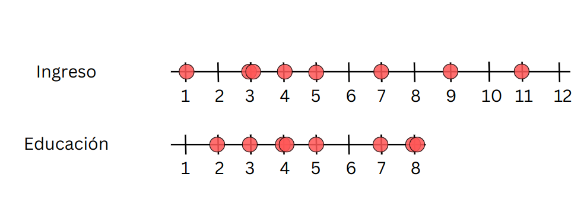
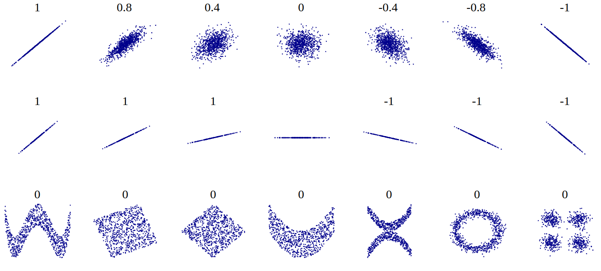
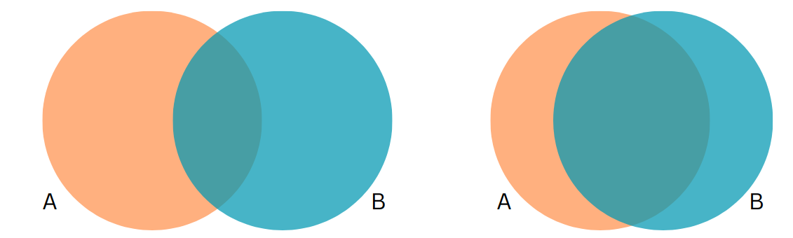

```{r setup}
#| include: false
pacman::p_load(tidyverse, kableExtra)
knitr::opts_chunk$set(warning = FALSE, message = FALSE, comment = "",
                       fig.width = 7, fig.height = 4.5, cache = TRUE, autodep = TRUE)
```

# {.hide-logo data-background-color="#0C3547"}

<br>

::::: columns
::: {.column width="30%"}

<br>

{width="100%" fig-align="right"}
:::

:::{.column width="2%"}

:::

::: {.column style="width: 65%; font-size: 25px; text-align: right; margin: 0 auto;"}

<br>

### [Estadística Correlacional]{style="font-size: 2em; color: white;"}

::: {style="border-top: 1px solid white; margin: 0.3em 0;"}
:::

[Inferencia, asociación, y reporte]{style="font-size: 1.5em; color: #dfc117;"}

[Juan Carlos Castillo]{style="font-size: 1em; color: white;"}\
[Sociología FACSO - UChile]{style="font-size: 1em; color: white;"}\
[2do Sem 2026]{style="font-size: 1em; color: white;"}

[correlacional.metodos-facso.org](https://correlacional.metodos-facso.org)

<br>
[**Sesión 9**:]{style="color: white; font-size: 1.3em;"}

[Inferencia en correlación y magnitud del coeficiente]{style="color: #dfc117;"}

:::
:::::

# Lecturas {style="text-align: center;"}

- Pardo 307 - 330 Relación lineal

- Huck 183 - 203 Statistical Inferences Concerning Bivariate Correlation Coefficients

# {data-background-color="#0C3547"}

::: {.nonincremental style="color: white; text-align: right;"}
[1. Resumen sesión anterior]{style="color: #dfc117; font-weight: bold;"}

2\. Inferencia en correlación

3\. Magnitud del coeficiente de correlación
:::

##

<br>

:::: {.columns}
::: {.column width="35%" style="font-size: 0.7em;"}

```{r}
#| echo: false
# Datos ejemplo
id <- seq(1,8)
educ <-c(2,3,4,4,5,7,8,8)
ing <-c(1,3,3,5,4,7,9,11)
data <-data.frame(id,educ,ing)
data %>% select (id,educ,ing) %>% kableExtra::kbl(.)
```

:::

::: {.column width="65%"}

{fig-align="center"}

:::
::::

```{r}
#| echo: false
data$mean_educ <- mean(data$educ)
data$dif_m_educ <- data$educ-data$mean_educ
data$dif_m_educ2 <- (data$dif_m_educ)^2
data$mean_ing <- mean(data$ing)
data$dif_m_ing <- data$ing-data$mean_ing
data$dif_m_ing2 <- (data$dif_m_ing)^2
data$dif_xy <-
  data$dif_m_educ*
  data$dif_m_ing
```

## Varianzas {style="font-size: 0.85em;"}

:::: {.columns}
::: {.column width="50%"}

```{r}
#| echo: false
ggplot(
  data = data,
  aes(y = educ, x = id)) +
  geom_point() +
  geom_hline(yintercept=5.12) +
  annotate("text", x=7.5, y=4.8,
           label="Prom Educ") +
  geom_segment(aes(y=5.12, yend = educ,
                  xend=id,  color = "resid")) +
  scale_color_discrete(name="") +
  theme(text = element_text(size = 20)) +
  scale_y_continuous(breaks=seq(0,8,1)) +
  scale_x_continuous(breaks=seq(0,8,1))
```

::: {style="text-align: center;"}
[Educación]{style="font-size: 1.3em; font-weight: bold;"}
:::

:::

::: {.column width="50%"}

```{r}
#| echo: false
ggplot(
  data = data,
  aes(y = ing, x = id)) +
  geom_point() +
  geom_hline(yintercept=5.375) +
  annotate("text", x=7.5, y=4.8,
           label="Prom Ing.") +
  geom_segment(aes(y=5.375, yend = ing,
                  xend=id,  color = "resid")) +
  scale_color_discrete(name="") +
  theme(text = element_text(size = 20)) +
  scale_y_continuous(breaks=seq(0,12,1)) +
  scale_x_continuous(breaks=seq(0,8,1))
```

::: {style="text-align: center;"}
[Ingreso]{style="font-size: 1.3em; font-weight: bold;"}
:::

:::
::::

## Nube de puntos {style="font-size: 0.85em;"}

:::: {.columns}
::: {.column width="30%"}

:::

::: {.column width="70%"}

```{r}
#| echo: false
ggplot(data,
  aes(x=educ, y=ing)) +
  geom_point(
    colour = "red",
    size = 5) +
  theme(text =
    element_text(size = 20))
```

:::
::::

## Covarianza {style="font-size: 0.8em;"}

:::: {.columns}
::: {.column width="50%"}

::: {style="text-align: center;"}
[Varianza educación (x)]{style="font-size: 1.3em; font-weight: bold;"}

$$\sigma_{edu}^{2}={\sum_{i=1}^{N}(x_{i}-\bar{x})^{2}\over {N - 1}}$$
$$\sigma_{edu}^{2}={\sum_{i=1}^{N}(x_{i}-\bar{x})(x_{i}-\bar{x})\over {N - 1}}$$
:::

:::

::: {.column width="50%"}

::: {style="text-align: center;"}
[Varianza ingreso (y)]{style="font-size: 1.3em; font-weight: bold;"}

$$\sigma_{ing}^{2}={\sum_{i=1}^{N}(y_{i}-\bar{y})^{2}\over {N - 1}}$$
$$\sigma_{ing}^{2}={\sum_{i=1}^{N}(y_{i}-\bar{y})(y_{i}-\bar{y})\over {N - 1}}$$
:::

:::
::::

::: {.content-box-red .fragment}
$$Covarianza=cov(x,y) = \frac{\sum_{i=1}^{N}(x_i - \bar{x})(y_i - \bar{y})} {N-1}$$
:::

## {style="font-size: 0.85em;"}

:::: {.columns}
::: {.column width="50%"}

[Covarianza]{style="font-size: 1.3em; font-weight: bold;"}

::: {.content-box-green}
- valor numérico que refleja la asociación entre dos variables

- el signo indica si la asociación es positiva o negativa

- valor no interpretable directamente, depende de valores de cada variable
:::

:::

::: {.column .fragment width="50%"}

[Correlación]{style="font-size: 1.3em; font-weight: bold;"}

::: {.content-box-red}
- valor numérico que refleja la asociación entre dos variables

- el signo indica si la asociación es positiva o negativa

- rango de variación fijo entre -1 y +1, interpretable en términos de magnitud
:::

:::
::::

## Cálculo correlación {style="font-size: 0.75em;"}

:::: {.columns}
::: {.column width="50%"}

```{r}
#| echo: false
data %>% select(educ,ing,dif_m_educ2,dif_m_ing2, dif_xy) %>% kbl(., digits = 2) %>%
  scroll_box(width = "500px", height = "550px")
```

:::

::: {.column width="50%"}

$$r=\frac{\sum(x-\bar{x})(y-\bar{y})}{\sqrt{\sum(x-\bar{x})^{2} \sum(y-\bar{y})^{2}}}$$

::: {style="font-size: 1.3em;"}

```{r}
#| echo: true
sum(data$dif_xy)
sum(data$dif_m_educ2)
sum(data$dif_m_ing2)
```
:::

:::
::::

## Cálculo correlación {style="font-size: 0.8em;"}

:::: {.columns}
::: {.column width="55%"}

$$
\begin{align*}
r &= \frac{\sum(x-\bar{x})(y-\bar{y})}{\sqrt{\sum(x-\bar{x})^{2} \sum(y-\bar{y})^{2}}} \\ \\
&= \frac{51.625}{ \sqrt{36.875*79.875}} \\ \\
&= \frac{51.625}{54.271} \\ \\
&= 0.951
\end{align*}
$$

:::

::: {.column .fragment width="45%"}

::: {style="font-size: 1.3em;"}

En R:

```{r}
#| echo: true
cor(data$educ,data$ing)
```
:::

:::
::::

## Interpretación {data-background-color="#9B2626"}

::: {style="color: white;"}
- El coeficiente de correlación (de Pearson) es una medida de asociación lineal entre variables, que indica el sentido y la fuerza de la asociación

- Varía entre +1 y -1, donde

  - valores **positivos** indican relación directa (aumenta una, aumenta la otra)

  - valores **negativos** indican relación inversa (aumenta una, disminuye la otra)
:::

## Nubes de puntos (scatterplot) y correlación

{fig-align="center"}

# {data-background-color="#0C3547"}

::: {.nonincremental style="color: white; text-align: right;"}
1\. Resumen sesión anterior

[2. Inferencia en correlación]{style="color: #dfc117; font-weight: bold;"}

3\. Magnitud del coeficiente de correlación
:::

## Datos {style="font-size: 0.85em;"}

::: {style="font-size: 1.3em;"}
Simulamos dos variables: edad, y puntaje en escala de izquierda (1) - derecha (10):

```{r}
#| echo: true
edad <-c(18,25,40,55,70, 82)
iz_der <-c(5,4,5,9,5,7)
cor(edad,iz_der)
```
:::

## {style="font-size: 0.85em;"}

:::: {.columns}
::: {.column width="50%"}

```{r}
#| echo: true
plot1 <- ggplot(,
  aes(x=edad, y=iz_der)) +
  geom_point(
    colour = "red",
    size = 5) +
  theme(text =
    element_text(size = 20))
```

:::

::: {.column width="50%"}

```{r}
#| echo: false
plot1
```

:::
::::

## Prueba de hipótesis de correlación {style="font-size: 0.75em;"}

### 1. Formulación de hipótesis

Siendo $\rho$ (rho) la correlación $r$ en la población:

$$H_0: \rho = 0$$
$$H_a: \rho \neq 0$$

## [La hipótesis de correlación refiere a asociación, no a explicación ni a causalidad]{style="color: white;"} {data-background-color="#9B2626"}

## Prueba de hipótesis de correlación {style="font-size: 0.75em;"}

### 2. Error estándar y estadístico de prueba ($t$)

:::: {.columns}
::: {.column width="50%"}

$$
\begin{align*}
SE_r=&\sqrt{\frac{1-r²}{n-2}} \\\\
=&\sqrt{\frac{1-0.257}{6-2}} \\\\
=&\sqrt{\frac{0.743}{4}}=\sqrt{0.186}=0.431
\end{align*}
$$

:::

::: {.column width="50%"}

$$
\begin{align*}
t_r&=\frac{r}{SE_r} \\\\
&=\frac{0.51}{0.431} \\\\
&=1.18
\end{align*}
$$

:::
::::

## Prueba de hipótesis de correlación {style="font-size: 0.75em;"}

### 3. Probabilidad de error y valor crítico para $t$

:::: {.columns}
::: {.column width="50%"}

- para un nivel de error $\alpha=0.05$

- y una hipótesis de diferencia de dos colas: $\alpha/2=[0.025-0.975]$

- grados de libertad N-2= 6-2 = 4

:::

::: {.fragment .column width="50%" style="font-size: 1.3em;"}

```{r}
#| echo: true
qt(p=.05/2,
   df=4,
   lower.tail=FALSE) # bidireccional
```

:::
::::

## Prueba de hipótesis de correlación {style="font-size: 0.75em;"}

### 4. Contraste de valores empírico y crítico

- Contraste: $t_{r}=1.18 < t_{cri}=2.77$

::: {.fragment}

### 5. Interpretación

_Nuestro t estimado es menor que el valor t crítico para un 95% de confianza, por lo tanto no rechazamos la hipótesis nula. No existe evidencia en nuestros datos para afirmar que la correlación entre la escala izquierda-derecha y edad es distinta de cero en la población._
 
:::

## En R

```{r}
#| echo: true
cor.test(iz_der,edad)
```

##

```{r}
#| echo: false
pacman::p_load(gginference)
ggttest(cor.test(iz_der,edad))
```


# Algunas consideraciones {background-color="#0C3547"}

## a) ¿Por qué usamos la prueba t? {style="font-size: 0.8em;"}

::: {.fragment}
La prueba $t$ la conocemos originalmente para contrastar **diferencias de medias**:

$$t=\frac{\bar{x}-\mu_0}{SE_{\bar{x}}}$$
:::

::: {.fragment}
Su lógica es general: siempre compara un **estimador** con un valor hipotetizado, en unidades de su **error estándar**

$$t=\frac{\text{estimador} - \text{valor hipotetizado}}{SE_{\text{estimador}}}$$
:::

## a) ¿Por qué usamos la prueba t? {style="font-size: 0.7em;"}

::: {.fragment}
Esta misma lógica se extiende al coeficiente de correlación, reemplazando el estimador por $r$ (y el valor hipotetizado por 0):

$$t_r=\frac{r-0}{SE_r}=\frac{r\sqrt{n-2}}{\sqrt{1-r^{2}}}$$
:::

::: {.fragment}
El coeficiente $r$ se calcula a partir de una **muestra**, por lo que su error estándar poblacional es desconocido y debe **estimarse** de los datos, tal como ocurre con el promedio
:::

::: {.fragment}
Esa incertidumbre adicional es la que modela la distribución $t$, según los grados de libertad disponibles ($n-2$)
:::

::: {.fragment}
Con muestras grandes, $t$ se aproxima a la normal ($z$)
:::

## b) Base estadística del error estándar {style="font-size: 0.75em;"}

::: {.fragment}
$$SE_r=\sqrt{\frac{1-r^{2}}{n-2}}$$
:::

::: {.fragment .nonincremental}
- $1-r^{2}$: proporción de varianza **no explicada** por la asociación entre las variables

  - mientras más fuerte la correlación, menor el error estándar
:::

::: {.fragment .nonincremental}
- $n-2$: grados de libertad disponibles, descontando los dos parámetros estimados (pendiente e intercepto de la recta que relaciona las variables)

  - a mayor tamaño muestral, menor el error estándar y mayor la certeza de la estimación
:::

## c) Intervalos de confianza en correlación {style="font-size: 0.7em;"}

:::: {.columns}
::: {.column width="50%"}

::: {.fragment}
El coeficiente $r$ **no** se distribuye de forma normal, especialmente cuando su valor se acerca a $\pm1$
:::

::: {.fragment}
Solución: la **transformación z de Fisher**, que normaliza la distribución de $r$

$$z'=\frac{1}{2}\ln\left(\frac{1+r}{1-r}\right)$$
$$SE_{z'}=\frac{1}{\sqrt{n-3}}$$
:::

:::

::: {.column width="50%"}

::: {.fragment}
Se construye el intervalo en la escala $z'$ y luego se transforma de vuelta a la escala de $r$:

$$r=\frac{e^{2z}-1}{e^{2z}+1}$$
:::

::: {.fragment}
::: {style="font-size: 1.1em;"}

```{r}
#| echo: true
r <- cor(edad, iz_der)
n <- length(edad)
z <- atanh(r)
se_z <- 1/sqrt(n-3)
crit <- qnorm(0.975)
ci_z <- z + c(-1,1)*crit*se_z
tanh(ci_z)
```
:::
:::

:::
::::

## c) Intervalos de confianza en correlación {style="font-size: 0.75em;"}

::: {.fragment}
En R, `cor.test()` entrega directamente el intervalo de confianza (ya calculado con la transformación de Fisher):

::: {style="font-size: 1.3em;"}

```{r}
#| echo: true
cor.test(iz_der, edad)$conf.int
```
:::
:::

::: {.content-box-red .fragment}
_Interpretación: con un 95% de confianza, el verdadero valor de la correlación poblacional entre edad y orientación izquierda-derecha se encuentra en este intervalo, el cual incluye el cero, consistente con la prueba de hipótesis anterior_
:::

# {data-background-color="#0C3547"}

::: {.nonincremental style="color: white; text-align: right;"}
1\. Resumen sesión anterior

2\. Inferencia en correlación

[3. Magnitud del coeficiente de correlación]{style="color: #dfc117; font-weight: bold;"}
:::

##

Si dos variables covarían, entonces [comparten varianza]{style="color: #c0392b;"}

{fig-align="center"}

::: {.fragment}
[¿Cuánta varianza comparten?]{style="color: #c0392b; float: right;"}
:::

## Estableciendo la varianza compartida {style="font-size: 0.85em;"}

:::: {.columns}
::: {.column width="50%"}

La varianza compartida puede pensarse como 1 - la varianza no compartida (o varianza única)

La varianza no compartida se asocia al concepto de [residuos]{style="color: #c0392b;"}, es decir, la cantidad de varianza que no está contenida en la correlación

:::

::: {.column width="50%"}

{width="100%"}

:::
::::

## Estableciendo la varianza compartida {style="font-size: 0.85em;"}

:::: {.columns}
::: {.column width="50%"}

Para poder obtener los residuos vamos a generar una [recta]{style="color: #c0392b;"} que represente la asociación entre las variables. Esta es la recta de **regresión** <sup>1</sup>

Esta recta nos permite obtener un valor estimado de $y$ para cada valor de $x$

<br>

[[1] Detalles próximo semestre]{style="font-size: 0.7em;"}

:::

::: {.column width="50%"}

```{r}
#| echo: false
#| fig-width: 8
#| fig-height: 6
ggplot(data,
  aes(x=educ, y=ing)) +
  geom_point(
    colour = "red",
    size = 5) +
  theme(text =
    element_text(size = 20))+
  stat_smooth(method = "lm",
    se = FALSE, fullrange = T)
```

:::
::::

## {style="font-size: 0.8em;"}

:::: {.columns}
::: {.column width="50%"}

::: {style="font-size: 1.3em;"}

```{r}
#| echo: true
reg1 <- lm(ing ~ educ, data=data)
data$predict <-predict.lm(reg1)

plot2 <-ggplot(data,
  aes(x=educ, y=predict)) +
  geom_point(
    colour = "red",
    size = 5) +
  theme(text =
    element_text(size = 20))+
  stat_smooth(method = "lm",
    se = FALSE, fullrange = T)
```
:::

:::

::: {.column width="50%"}

::: {style="font-size: 1.3em;"}

```{r}
#| echo: true
plot2
```
:::

:::
::::

##

{width="90%" fig-align="center"}

$$
\begin{align*}
SS_{tot}&=SS_{reg} + SS_{error} \\
\Sigma(y_i - \bar{y})^2&=\Sigma (\hat{y}_i-\bar{y})^2 +\Sigma(y_i-\hat{y}_i)^2
\end{align*}
$$

## Varianza compartida

::: {.fragment}
$$SS_{tot}=SS_{reg} + SS_{error}$$
:::

::: {.fragment}
$$\frac{SS_{tot}}{SS_{tot}}=\frac{SS_{reg}}{SS_{tot}} + \frac{SS_{error}}{SS_{tot}}$$
:::

::: {.fragment}
$$1=\frac{SS_{reg}}{SS_{tot}}+\frac{SS_{error}}{SS_{tot}}$$
:::

::: {.fragment}
$$\frac{SS_{reg}}{SS_{tot}}= 1- \frac{SS_{error}}{SS_{tot}}=R^2$$
:::


## ¿Qué relación tienen $R^2$ y $r$ (correlación)? {style="font-size: 0.85em;"}

:::: {.columns}
::: {.column width="50%"}

$R^2=r^2$

Por lo tanto, en nuestro ejemplo:

::: {style="font-size: 1.3em;"}

```{r}
#| echo: true
cor(edad,iz_der)
cor(edad,iz_der)^2
```
:::

$$
\begin{align*}
R^2&= 0.25
\end{align*}
$$

:::

::: {.column .fragment width="50%"}

::: {.content-box-red}
Interpretación:

_El porcentaje de varianza compartida entre edad y orientación izquierda-derecha es de 25%._

_Es decir, ambas variables comparten el 25% de su varianza_
:::

:::
::::

## $R^2$ o coeficiente de determinación

- ¿Cuánto de los ingresos se asocia a educación, y viceversa?

- el $R^2$
  - es la proporción de la varianza de Y que se asocia a X

  - varía entre 0 y 1, y usualmente se expresa en porcentaje

## Tamaños de efecto 

- El coeficiente de correlación $r$ de Pearson nos indica la dirección y la fuerza/intensidad de la asociación.

- Pero, ¿qué nos dice el tamaño del coeficiente? Por ejemplo, si el coeficiente es 0.5, ¿esto es pequeño, mediano o grande?

- **Cohen** (1988, 1992) sugiere una serie de criterios convencionales para clasificar efectos como **pequeños, medianos o grandes**.

## Criterios de Cohen  {style="font-size: 1.2em;"}

- tamaño de efecto [pequeño]{style="color: #c0392b;"}: alrededor de [0.10]{style="color: #c0392b;"}

- tamaño de efecto [mediano]{style="color: #c0392b;"}: alrededor de [0.30]{style="color: #c0392b;"}

- tamaño de efecto [grande]{style="color: #c0392b;"}: alrededor de [0.50]{style="color: #c0392b;"} y más

# [Resumen]{style="color: #dfc117;"} {data-background-color="#0C3547"}

::: {style="color: white; font-size: 1.2em;"}
- **[Inferencia en correlación]{style="color: #dfc117;"}**: contraste con valor crítico t

- **[Coeficiente de determinación]{style="color: #dfc117;"}** $R^2$: varianza compartida entre variables

- **[Tamaño de efecto]{style="color: #dfc117;"}**: valores convencionales para establecer si una magnitud es pequeña, mediana o grande.
:::

# {.hide-logo data-background-color="#0C3547"}

<br>

::::: columns
::: {.column width="30%"}

<br>

{width="100%" fig-align="right"}
:::

:::{.column width="2%"}

:::

::: {.column style="width: 65%; font-size: 25px; text-align: right; margin: 0 auto;"}

<br>

### [Estadística Correlacional]{style="font-size: 2em; color: white;"}

::: {style="border-top: 1px solid white; margin: 0.3em 0;"}
:::

[Inferencia, asociación, y reporte]{style="font-size: 1.5em; color: #dfc117;"}

[Juan Carlos Castillo]{style="font-size: 1em; color: white;"}\
[Sociología FACSO - UChile]{style="font-size: 1em; color: white;"}\
[2do Sem 2026]{style="font-size: 1em; color: white;"}

[correlacional.metodos-facso.org](https://correlacional.metodos-facso.org)

:::
:::::
