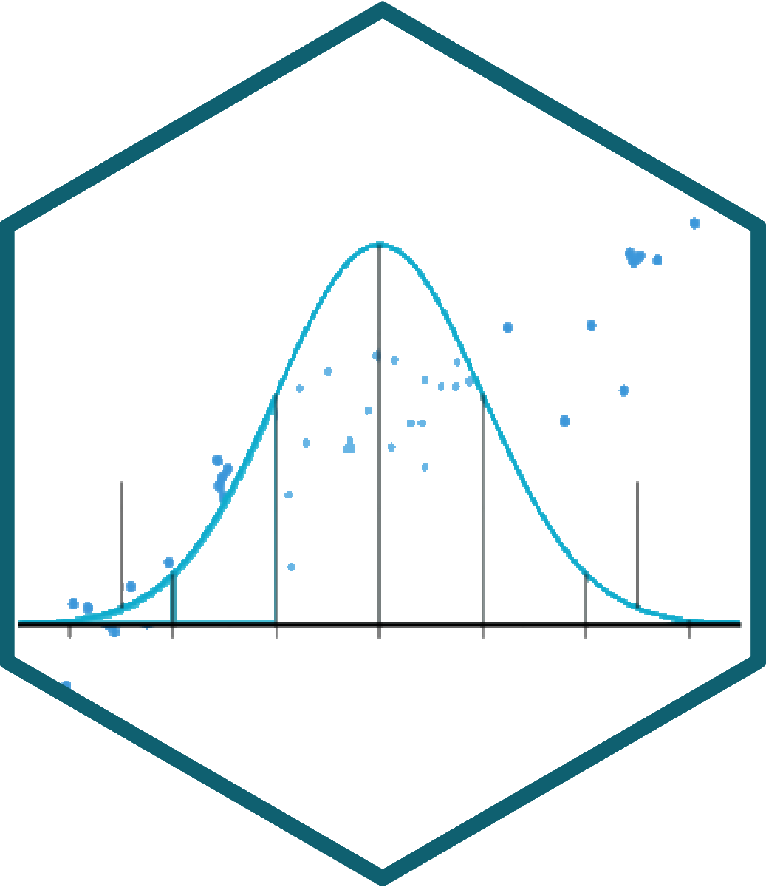
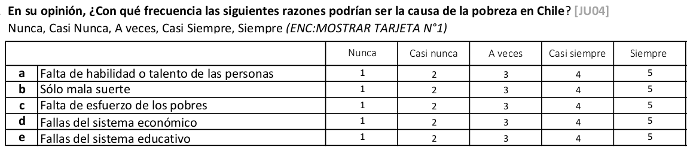
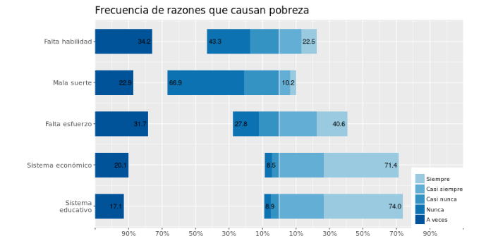
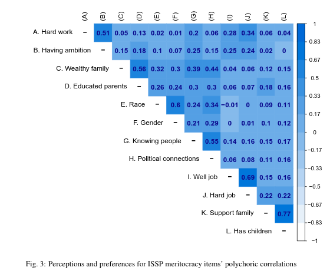
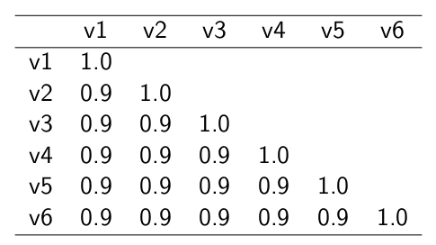
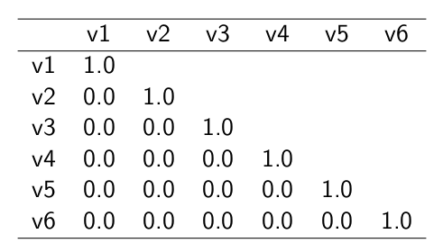
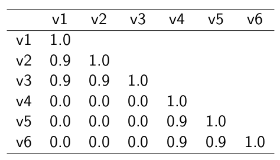

```{r setup}
#| include: false
pacman::p_load(tidyverse, kableExtra, corrplot, sjPlot, psych)
knitr::opts_chunk$set(warning = FALSE, message = FALSE, comment = "",
                       fig.width = 7, fig.height = 4.5, cache = TRUE, autodep = TRUE)
```

# {.hide-logo data-background-color="#0C3547"}

<br>

::::: columns
::: {.column width="30%"}

<br>

{width="100%" fig-align="right"}
:::

:::{.column width="2%"}

:::

::: {.column style="width: 65%; font-size: 25px; text-align: right; margin: 0 auto;"}

<br>

### [Estadística Correlacional]{style="font-size: 2em; color: white;"}

::: {style="border-top: 1px solid white; margin: 0.3em 0;"}
:::

[Inferencia, asociación, y reporte]{style="font-size: 1.5em; color: #dfc117;"}

[Juan Carlos Castillo]{style="font-size: 1em; color: white;"}\
[Sociología FACSO - UChile]{style="font-size: 1em; color: white;"}\
[2do Sem 2026]{style="font-size: 1em; color: white;"}

[correlacional.metodos-facso.org](https://correlacional.metodos-facso.org)

<br>
[**Sesión 10**:]{style="color: white; font-size: 1.3em;"}

[Correlación en ordinales, matrices e índices]{style="color: #dfc117;"}

:::
:::::

# {data-background-color="#0C3547"}

::: {.nonincremental style="color: white; text-align: right; font-size: 1.3em;"}
[1. Correlación con variables ordinales]{style="color: #dfc117; font-weight: bold;"}

2\. Matrices de correlación

3\. Casos perdidos en matrices

4\. Baterías, matrices y consistencia

5\. Construcción de índices
:::

## Correlación de Spearman {style="font-size: 0.85em;"}

- se utiliza para variables ordinales y/o cuando se violan supuestos de distribución normal

- es equivalente a la correlación de Pearson del ranking de las observaciones analizadas

- es alta cuando las observaciones tienen un ranking similar

## Cálculo Spearman {style="font-size: 0.85em;"}

- se le asigna un número de ranking a cada valor

- el valor más bajo obtiene el mayor ranking, y el más alto el menor

- en caso de valores repetidos se produce un "empate", y entonces el ranking se promedia.

## Ejemplo: variable Educación {style="font-size: 0.85em;"}

```{r}
#| echo: false
# Datos ejemplo
id <- seq(1,8)
educ <-c(2,3,4,4,5,7,8,8)
ing <-c(1,3,3,5,4,7,9,11)
data <-data.frame(id,educ,ing)
```

:::: {.columns}
::: {.column width="35%"}

```{r}
#| echo: true
data$educ
```

Como estos valores están ordenados de menor a mayor, en principio los valores de ranking serían:

`8 7 6 5 4 3 2 1`.
:::

::: {.column width="65%"}

Pero, hay un par de empates

- el valor 4 está repetido y corresponden a los ranking 6 y 5, por lo tanto a ambos se les asigna el promedio de estos rankings: 5,5

- lo mismo sucede con el valor 8 en los rankings 2 y 1, por lo tanto a ambos se les asigna el valor 1,5
:::
::::

## Ranking y correlación {style="font-size: 0.85em;"}

```{r}
#| echo: true
data_spr <- data %>%
  select(educ, ing) %>%
  mutate(educ_rank = c(8,7,5.5,5.5,4,3,1.5,1.5),
         ing_rank  = c(8,6.5,6.5,4,5,3,2,1))
data_spr
cor(data_spr$educ_rank, data_spr$ing_rank)
```

## Cálculo directo en R {style="font-size: 0.85em;"}

```{r}
#| echo: true
cor.test(data$educ, data$ing, "two.sided", "spearman")
```

## [El coeficiente de correlación de Spearman no es más que una correlación de Pearson del ranking de las variables]{style="color: white;"} {data-background-color="#9B2626" style="font-size: 0.85em;"}

## Correlación Tau de Kendall {style="font-size: 0.85em;"}

:::: {.columns}
::: {.column width="50%"}

- Recomendado cuando hay un set de datos pequeños y/o cuando hay mucha repetición de observaciones en el mismo ranking

- Se basa en una comparación de pares de observaciones concordantes y discordantes

:::

::: {.column .fragment width="50%"}

En `R`:

```{r}
#| echo: true
cor.test(data$educ, data$ing,
         "two.sided",
         "kendall")
```
:::
::::

## Tau de Kendall — ejemplo paso a paso (10 pares) {style="font-size: 0.85em;"}

**Datos (5 casos ⇒ 10 pares de comparaciones)**

| Caso | X | Y |
|:----:|--:|--:|
| P1   | 1 | 3 |
| P2   | 2 | 1 |
| P3   | 3 | 4 |
| P4   | 4 | 5 |
| P5   | 5 | 2 |

$Pares=\frac{n(n-1)}{2}=\frac{5*4}{2}=10$

## Enumeración de pares y clasificación {style="font-size: 0.7em;"}

::: {.nonincremental}
- pares concordantes: van en la misma dirección
- pares discordantes: van en la dirección contraria
:::

| # | Par     | (Xi, Yi) | (Xj, Yj) | ΔX  | ΔY  | sgn(ΔX) | sgn(ΔY) | Clasificación |
|--:|:-------:|:--------:|:--------:|:---:|:---:|:-------:|:-------:|:-------------|
| 1 | (P1,P2) | (1,3)    | (2,1)    | +1  | -2  | +       | -       | Discordante  |
| 2 | (P1,P3) | (1,3)    | (3,4)    | +2  | +1  | +       | +       | Concordante  |
| 3 | (P1,P4) | (1,3)    | (4,5)    | +3  | +2  | +       | +       | Concordante  |
| 4 | (P1,P5) | (1,3)    | (5,2)    | +4  | -1  | +       | -       | Discordante  |
| 5 | (P2,P3) | (2,1)    | (3,4)    | +1  | +3  | +       | +       | Concordante  |
| 6 | (P2,P4) | (2,1)    | (4,5)    | +2  | +4  | +       | +       | Concordante  |
| 7 | (P2,P5) | (2,1)    | (5,2)    | +3  | +1  | +       | +       | Concordante  |
| 8 | (P3,P4) | (3,4)    | (4,5)    | +1  | +1  | +       | +       | Concordante  |
| 9 | (P3,P5) | (3,4)    | (5,2)    | +2  | -2  | +       | -       | Discordante  |
|10 | (P4,P5) | (4,5)    | (5,2)    | +1  | -3  | +       | -       | Discordante  |

## Conteo {style="font-size: 0.85em;"}

- Concordantes $C = 6$ → 2,3,5,6,7,8
- Discordantes $D = 4$ → 1,4,9,10
- Empates $T_x = 0$, $T_y = 0$

## Cálculo de $\tau$ {style="font-size: 0.7em;"}

Número total de pares: $C + D + \text{(empates)} = 6 + 4 + 0 = 10$.

**Tau-a (sin empates):**

$$
\tau_a = \frac{C - D}{pares} = \frac{6 - 4}{10} = 0.20
$$

**Tau-b (corrige empates):**

$$
\tau_b = \frac{C - D}{\sqrt{(C + D + T_x)(C + D + T_y)}} = \frac{6 - 4}{\sqrt{(10 + 0)(10 + 0)}} = 0.20
$$

**Interpretación:** $\tau = 0.20$ indica una asociación positiva **débil**: hay más pares que mantienen el orden entre $X$ y $Y$ que pares que lo invierten.

## Recomendaciones {data-background-color="#0C3547" style="font-size: 0.85em;"}

::: {style="color: white;"}
- Pearson es el coeficiente de correlación por defecto

- En caso de datos en escala de medición ordinal se puede aplicar Spearman (aunque Pearson es también aceptado en este contexto).

- Kendall se reporta en casos muy específicos donde hay un set de datos pequeños y repetición de observaciones en el mismo ranking ("empates")
:::

# {data-background-color="#0C3547"}

::: {.nonincremental style="color: white; text-align: right; font-size: 1.3em;"}
1\. Correlación con variables ordinales

[2. Matrices de correlación]{style="color: #dfc117; font-weight: bold;"}

3\. Casos perdidos en matrices

4\. Baterías, matrices y consistencia

5\. Construcción de índices
:::

## Matriz de correlación {style="font-size: 0.85em;"}

- una matriz de correlación se conforma cuando se representa simultáneamente más de un par de asociaciones bivariadas

- por ejemplo, si agregamos la variable edad a nuestra base de datos de educ e ingreso:

::: {.fragment}
```{r}
#| echo: true
data$edad <- c(50, 65, 27, 15, 40, 22, 25, 38)
```
:::

::: {.fragment}
- Tenemos **3 variables**, y por lo tanto los siguientes pares de correlaciones posibles: ingreso-educación, ingreso-edad, y educación-edad
:::

## Matriz de correlación en R {style="font-size: 0.85em;"}

```{r}
#| echo: true
cor_mat <- data %>%
  select(educ, ing, edad) %>%
  cor(.)

cor_mat

round(cor_mat, 3)
```


## Matriz de correlación(es) {style="font-size: 0.85em;"}

- tabla de doble entrada donde las variables se presentan tanto en las filas como en las columnas

- el coeficiente de correlación correspondiente al par de variables aparece en la intersección de las columnas

- existe información redundante

  - las correlaciones se repiten, dado que las variables se intersectan dos veces en la tabla
  - la diagonal tiene solo unos (1), ya que es la correlación de la variable consigo misma


## Tabla con **sjPlot** {style="font-size: 0.8em;"}

Función: tab_corr

```{r}
#| echo: true

sjPlot::tab_corr(cor_mat, 
  triangle = "lower",
  title = "Tabla de correlaciones del ejemplo"
  )
```

## Matriz con librería `corrplot` {style="font-size: 0.85em;"}

:::: {.columns}
::: {.column width="45%"}
```{r}
#| echo: true
#| eval: false
library(corrplot)
corrplot(cor_mat)
```
:::
::: {.column width="55%"}
```{r}
#| echo: false
corrplot(cor_mat)
```
:::
::::

## Matriz con `corrplot`: números {style="font-size: 0.85em;"}

:::: {.columns}
::: {.column width="45%"}
```{r}
#| echo: true
#| eval: false
corrplot(cor_mat,
  method = 'number')
```
:::
::: {.column width="55%"}
```{r}
#| echo: false
corrplot(cor_mat, method = 'number')
```
:::
::::

## `corrplot`: triángulo inferior {style="font-size: 0.85em;"}

:::: {.columns}
::: {.column width="45%"}
```{r}
#| echo: true
#| eval: false
corrplot(cor_mat,
  method = 'number',
  type = 'lower',
  number.cex = 3,
  tl.cex = 3,
  diag = FALSE)
```
:::
::: {.column width="55%"}
```{r}
#| echo: false
corrplot(cor_mat, method = 'number', type = 'lower',
         number.cex = 2, tl.cex = 2, diag = FALSE)
```
:::
::::

## `corrplot.mixed` {style="font-size: 0.85em;"}

:::: {.columns}
::: {.column width="45%"}
```{r}
#| echo: true
#| eval: false
corrplot.mixed(cor_mat,
  lower = "number",
  upper = "circle",
  number.cex = 3,
  tl.cex = 3,
  diag = "n")
```
:::
::: {.column width="55%"}
```{r}
#| echo: false
corrplot.mixed(cor_mat, lower = "number", upper = "circle",
               number.cex = 2, tl.cex = 2, diag = "n")
```
:::
::::

## `corrplot`: coeficientes sobre colores {style="font-size: 0.85em;"}

:::: {.columns}
::: {.column width="45%"}
```{r}
#| echo: true
#| eval: false
corrplot(cor_mat,
  type = "lower",
  addCoef.col = 'white',
  number.cex = 3,
  tl.cex = 3,
  diag = FALSE)
```
:::
::: {.column width="55%"}
```{r}
#| echo: false
corrplot(cor_mat, type = "lower", addCoef.col = 'white',
         number.cex = 2, tl.cex = 2, diag = FALSE)
```
:::
::::

## `corrplot`: método square {style="font-size: 0.85em;"}

:::: {.columns}
::: {.column width="45%"}
```{r}
#| echo: true
#| eval: false
corrplot(cor_mat,
  type = "lower",
  addCoef.col = 'white',
  number.cex = 3,
  tl.cex = 3,
  diag = FALSE,
  method = 'square')
```
:::
::: {.column width="55%"}
```{r}
#| echo: false
corrplot(cor_mat, type = "lower", addCoef.col = 'white',
         number.cex = 2, tl.cex = 2, diag = FALSE, method = 'square')
```
:::
::::

# {data-background-color="#0C3547"}

::: {.nonincremental style="color: white; text-align: right; font-size: 1.3em;"}
1\. Correlación con variables ordinales

2\. Matrices de correlación

[3. Casos perdidos en matrices]{style="color: #dfc117; font-weight: bold;"}

4\. Baterías, matrices y consistencia

5\. Construcción de índices
:::

## Consideraciones sobre casos perdidos {style="font-size: 0.85em;"}

- Cuando hay casos perdidos en las variables, ¿cuál es el número de casos de la matriz de correlaciones?

- Las correlaciones bivariadas se calculan con información completa, por lo tanto si hay un dato perdido en una de las variables se elimina el caso completo

- Algunas funciones lo hacen de manera automática, en otras hay que especificarlo previamente

## Ejemplo {style="font-size: 0.85em;"}

Agreguemos un caso perdido (NA en R) a una de nuestras variables

```{r}
#| echo: true
data$edad
data$edad <- replace(data$edad, data$edad==15, NA)
data$edad
```

## {style="font-size: 0.85em;"}

- Cuando hay casos perdidos, no es posible calcular correlación

::: {.fragment}
```{r}
#| echo: true
cormat_NA <- data %>% select(educ, ing, edad) %>% cor(.)
round(cormat_NA,3)
```
:::

- Se elimina el caso perdido (fila completa) con la opción `use = "complete.obs"` (listwise deletion) 


::: {.fragment}
```{r}
#| echo: true
cormat_listwise <- data %>% select(educ, ing, edad) %>%
  cor(., use = "complete.obs")
round(cormat_listwise, 3)
```
:::

## Eliminación de casos perdidos por lista (o listwise) {style="font-size: 0.85em;"}

- las correlaciones bivariadas requieren eliminación de casos perdidos tipo listwise, es decir, si hay un dato perdido en una variable se pierde el caso completo

- Para conocer el número de casos con que se calculó la matriz:

::: {.fragment}
```{r}
#| echo: true
sum(complete.cases(data))
```
:::

::: {.fragment}
Por lo tanto, en el cálculo se perdió el caso o fila completa de la base (de 8 casos) que tenía el caso perdido.
:::

## Eliminación de casos perdidos por pares (o pairwise) {style="font-size: 0.85em;"}

- en el caso de las matrices de correlaciones es posible tomar la opción **pairwise** para casos perdidos

- pairwise quiere decir que se eliminan los casos perdidos solo cuando afectan al cálculo de un **par específico**.

- en nuestro ejemplo, si consideramos listwise todas las correlaciones tienen 7 casos, pero con pairwise la correlación entre educación e ingreso mantendría 8 casos.

- por lo tanto, **pairwise permite mayor rescate de información y mayor N en el cálculo de matrices de correlaciones**

## Opción pairwise en correlación en R {style="font-size: 0.85em;"}

```{r}
#| echo: true
data %>% select(educ, ing, edad) %>%
  cor(., use = "pairwise")
```

En este caso vemos una leve variación en el coeficiente comprometido (educ-ing) comparando listwise con pairwise

## Número de casos pairwise {style="font-size: 0.85em;"}

```{r}
#| echo: true
data %>% select(educ, ing, edad) %>% psych::pairwiseCount()
```

Se indica que en las correlaciones con edad se utilizaron 7 casos, mientras en la correlación entre ingreso y educación se utilizan 8 casos con el método pairwise

# {data-background-color="#0C3547"}

::: {.nonincremental style="color: white; text-align: right; font-size: 1.3em;"}
1\. Correlación con variables ordinales

2\. Matrices de correlación

3\. Casos perdidos en matrices

[4. Baterías, matrices y consistencia]{style="color: #dfc117; font-weight: bold;"}

5\. Construcción de índices
:::

## {.nonincremental style="font-size: 0.85em;"}

{fig-align="center" width="100%"}

## Preguntas y error de medición {style="font-size: 0.85em;"}

::: {.content-box-gray}
- Para medir hechos observables simples usualmente se utiliza **una pregunta** (ej: edad)

- Fenómenos complejos se miden en general con más de una pregunta, con el objetivo de dar mejor cuenta del atributo (i.e. minimizar error de medición)
:::

## Baterías de indicadores múltiples {style="font-size: 0.85em;"}

- en general las encuestas suelen incluir varias preguntas respecto de un mismo tema → **baterías de indicadores múltiples**

- cubren distintos aspectos de un mismo fenómeno complejo que no se agota en solo un indicador → minimiza **error de medición**

- **problema**: ¿cómo se analizan indicadores que están relacionados? ¿cómo se muestran los resultados?

## Análisis de indicadores en baterías {style="font-size: 0.85em;"}

:::: {.columns}
::: {.column width="35%"}
1. **Univariado**: se sugiere presentar análisis descriptivos que contengan todos los indicadores para poder comparar frecuencias
:::

::: {.column .fragment width="65%"}
{fig-align="center" width="100%"}

::: {style="text-align: center; font-size: 0.7em;"}
(likert plot, `sjPlot`)
:::
:::
::::

## Análisis de indicadores en baterías {style="font-size: 0.85em;"}

:::: {.columns}
::: {.column width="35%"}
2\. **Bivariado**: tablas/gráficos de correlaciones

(`corrplot`)
:::

::: {.column .fragment width="65%"}
{fig-align="center" width="85%"}
:::
::::

## Análisis de indicadores en baterías {style="font-size: 0.85em;"}

- Se podría asumir un concepto o **dimensión subyacente** a la batería de items

- Para facilitar el avance en el análisis (por ejemplo, relacionar ese concepto subyacente con otras variables), muchas veces se reduce la batería a algún **tipo de índice (sumativo/promedio)**

- ¿Podemos asegurar que los items están realmente **midiendo lo mismo**?

## ¿Miden lo mismo? {.nonincremental style="font-size: 0.85em;"}

{fig-align="center" width="100%"}

## Preguntas y error de medición {style="font-size: 0.85em;"}

::: {.content-box-red}
- En este marco se asume que el **indicador es distinto del atributo**, y que la medición del atributo o variable latente conlleva error

- Cuando el atributo se mide con más de una pregunta, se puede intentar estimar la **variable latente** mediante índices o técnicas de **análisis factorial**
:::

## Medición y error {style="font-size: 0.85em;"}

:::: {.columns}
::: {.column width="50%"}
{fig-align="center" width="80%"}
:::

::: {.column width="50%"}
- antes de agrupar indicadores en un índice hay que evaluar si los indicadores se encuentran relacionados

  - → si miden constructos similares
  - → si la medición es **confiable**
:::
::::

## {data-background-color="#0C3547" style="font-size: 0.85em;"}

::: {.content-box-red .nonincremental style="font-size: 1.4em;"}
**¿Cómo estimar el nivel de relación entre indicadores que miden un mismo constructo?**
:::

::: {.fragment style="color: white; text-align: center; font-size: 1.2em;"}
**Distintas maneras, pero todas se basan en la técnica de la correlación**
:::

## Matriz de correlaciones (1) {.nonincremental style="font-size: 0.85em;"}

{fig-align="center" width="60%"}

::: {style="text-align: center;"}
Matriz hipotética de indicadores que miden un mismo constructo
:::

## Ej. Matriz de correlaciones (2) {.nonincremental style="font-size: 0.85em;"}

{fig-align="center" width="60%"}

::: {style="text-align: center;"}
Matriz hipotética de indicadores que miden constructos independientes
:::

## Ej. Matriz de correlaciones (3) {.nonincremental style="font-size: 0.85em;"}

{fig-align="center" width="60%"}

::: {style="text-align: center;"}
Matriz hipotética de variables que miden dos constructos independientes
:::

## Entonces: {data-background-color="#0C3547" style="font-size: 1.2em;"}

::: {style="color: white;"}
1. Analizar la **matriz de correlaciones** antes de generar cualquier técnica de reducción de información (ej: crear índice)


2. Evaluar la posibilidad de generar algún tipo de **índice** que resuma la información
:::

## Datos ejemplo {style="font-size: 0.85em;"}

- batería atribuciones de pobreza, encuesta "Desigualdad, Justicia y Participación Política" - FONDECYT Iniciación 11121203 (2013-2015) [Social justice and citizenship participation](https://jc-castillo.com/project/fondecyt-iniciacion/)

::: {.fragment}
{fig-align="center" width="100%"}
:::

## {style="font-size: 0.6em;"}

```{r}
#| echo: false
pacman::p_load(sjmisc, lavaan, haven, dplyr, sjPlot, sjlabelled, summarytools, psych)
data_atrib <- local({ load("data/atribpob.RData"); data })
```

```{r}
#| echo: false
#| results: asis
sjmisc::descr(data_atrib,
      show = c("label","range", "mean", "sd", "NA.prc", "n")) %>%
      kable(., "markdown")
```

## Matriz de correlaciones {style="font-size: 0.85em;"}

```{r}
#| echo: true
#| error: true
cormat <- cor(data_atrib)
cormat
```

Esta función no resulta ya que requiere que no existan casos perdidos

## Matriz de correlaciones {style="font-size: 0.85em;"}

Entonces:

```{r}
#| echo: true
cormat <- cor(na.omit(data_atrib))
cormat
```

## Matriz de correlaciones {style="font-size: 0.6em;"}

```{r}
#| echo: true
sjPlot::tab_corr(data_atrib,
  triangle = "lower",
  na.deletion = "pairwise",
  var.labels = c("Falta de habilidad", "Mala suerte", "Falta de esfuerzo",
                 "Sistema económico", "Sistema educativo"),
  wrap.labels = 15,
  title = "Matriz de correlaciones de la batería de atribuciones de pobreza")
```

## Matriz de correlaciones - gráfico {style="font-size: 0.85em;"}

:::: {.columns}
::: {.column width="30%"}
```{r}
#| echo: true
#| eval: false
corrplot(cormat)
```
:::
::: {.column width="70%"}
```{r}
#| echo: false
#| fig-width: 5
#| fig-height: 5
#| out-height: 480px
corrplot::corrplot(cormat)
```
:::
::::

## Matriz de correlaciones - gráfico ajustado {style="font-size: 0.8em;"}

:::: {.columns}
::: {.column width="45%"}
```{r}
#| echo: true
#| eval: false
corrplot::corrplot(cormat,
  method = "color",
  addCoef.col = "#000390",
  type = "upper",
  tl.col = "black",
  col = colorRampPalette(c("white","#0068DC"))(8),
  bg = "white",
  na.label = "-")
```
:::
::: {.column width="55%"}
```{r}
#| echo: false
#| fig-width: 5
#| fig-height: 5
#| out-height: 480px
corrplot::corrplot(cormat,
  method = "color",
  addCoef.col = "#000390",
  type = "upper",
  tl.col = "black",
  col = colorRampPalette(c("white","#0068DC"))(8),
  bg = "white",
  na.label = "-")
```
:::
::::

# {data-background-color="#0C3547"}

::: {.nonincremental style="color: white; text-align: right; font-size: 1.3em;"}
1\. Correlación con variables ordinales

2\. Matrices de correlación

3\. Casos perdidos en matrices

4\. Baterías, matrices y consistencia

[5. Construcción de índices]{style="color: #dfc117; font-weight: bold;"}
:::

## Alpha de Cronbach {style="font-size: 0.85em;"}

- índice de consistencia interna de una batería

- en general, interpretable como la correlación [absoluta] promedio entre distintas variables que componen una batería de medición

- varía entre **0 y 1**; valores más cercanos a 1 indican mayor consistencia

- en general valores sobre 0.6 se consideran aceptables

## Alpha de Cronbach en R {style="font-size: 0.85em;"}

:::: {.columns}
::: {.column width="45%"}
- función `alpha` de la librería `psych`

- se genera un objeto (lo llamaremos alpha). Contiene bastante información, por ahora nos enfocaremos solo en el valor de alpha (`raw_alpha`)
:::

::: {.column .fragment style="width: 55%; font-size: 0.85em;"}
```{r}
#| echo: true
names(data_atrib)
alpha <- psych::alpha(data_atrib)
alpha$total$raw_alpha
```
:::
::::

## Alpha de Cronbach: interpretación {style="font-size: 0.85em;"}

- puntaje 0.43, por lo tanto bajo los valores aceptables de consistencia interna

- esto ya se podía anticipar desde la matriz de correlaciones, que aparentemente mostraba dos dimensiones subyacentes a la batería

- además, se genera un mensaje de advertencia sobre posibles items codificados a la inversa (dada la correlación entre items de dimensiones distintas)

## Opciones {style="font-size: 0.85em;"}

- construcción de índices basados en la información de la matriz de correlaciones

- análisis factorial: 
  - permite identificar dimensiones subyacentes a la batería de indicadores
  - permite generar índices factoriales (scores) que representan cada dimensión
  - (tema para otro curso)

## Índice promedio {style="font-size: 0.85em;"}

- vamos a generar 2 índices a partir de esta batería: uno para atribución interna (falthab, faltesf, malasue) y otro para externa (sisecon, siseduc)

::: {.fragment}
```{r}
#| echo: true
data_atrib <- cbind(data_atrib, "interna_prom" = rowMeans(data_atrib %>% select(falthab, faltesf, malasue), na.rm = TRUE))

data_atrib <- cbind(data_atrib, "externa_prom" = rowMeans(data_atrib %>% select(sisecon, siseduc), na.rm = TRUE))

names(data_atrib)
```
:::

## Resumen {data-background-color="#0C3547" style="font-size: 0.85em;"}

::: {style="color: white;"}
- **[Correlación de Spearman]{style="color: #dfc117;"}**: apropiada para variables ordinales, equivale a la correlación de Pearson del ranking de las variables

- **[Matriz de correlaciones]{style="color: #dfc117;"}**: forma tradicional de reporte de asociaciones de las variables de una investigación, importante considerar tratamiento de datos perdidos (listwise o pairwise)

- **[Índices y consistencia interna]{style="color: #dfc117;"}** en matrices
:::

# {.hide-logo data-background-color="#0C3547"}

<br>

::::: columns
::: {.column width="30%"}

<br>

{width="100%" fig-align="right"}
:::

:::{.column width="2%"}

:::

::: {.column style="width: 65%; font-size: 25px; text-align: right; margin: 0 auto;"}

<br>

### [Estadística Correlacional]{style="font-size: 2em; color: white;"}

::: {style="border-top: 1px solid white; margin: 0.3em 0;"}
:::

[Inferencia, asociación, y reporte]{style="font-size: 1.5em; color: #dfc117;"}

[Juan Carlos Castillo]{style="font-size: 1em; color: white;"}\
[Sociología FACSO - UChile]{style="font-size: 1em; color: white;"}\
[2do Sem 2026]{style="font-size: 1em; color: white;"}

[correlacional.metodos-facso.org](https://correlacional.metodos-facso.org)

:::
:::::
