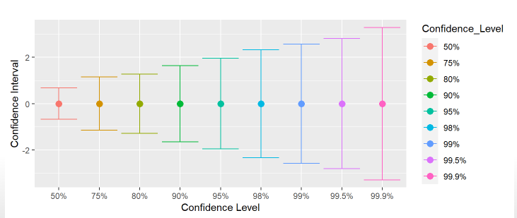

# Hasta ahora ...

##

## Pilares de la inferencia

:::: {.columns}
::: {.column width="48%"}

**Curva normal**

{width="90%" fig-align="center"}

:::

::: {.column width="48%"}

**Error estándar**

$$\sigma_{\bar{X}}=\frac{s}{\sqrt{N}}$$

:::
::::

## Diferencias

:::: {.columns}
::: {.column width="50%"}

**Desviación estándar**

$$s=\sqrt{\frac{\Sigma(x_i-\bar{X})^2}{N-1}}$$

Magnitud que expresa la dispersión en torno al promedio en la escala de la variable

:::

::: {.column .fragment width="50%"}

**Error estándar**

$$\sigma_{\bar{X}}=SE=\frac{s}{\sqrt{N}}$$

 
Magnitud que equivale a la desviación estándar de los promedios de varias muestras

:::
::::

## ... y más de Error Estándar

- se calcula no solo para el promedio, sino para **distintos estadísticos** como correlación, regresión, desviación estándar (con distintas fórmulas para cada uno)

- como está expresado en unidades estándar de variación, permite construir **rangos de probabilidad** basados en la distribución normal

- estos rangos de probabilidad se conocen como **intervalos de confianza**

# [Intervalos de confianza]{style="font-size: 0.85em;"} {data-background-color="#0C3547" style="text-align: right;"}

## 

- El error estándar, por su asociación a las áreas de la curva normal, se relaciona con **niveles de probabilidad**

- Si sumo y resto error(es) estándar al promedio puedo construir un rango de valores probables en que se encuentra el parámetro poblacional -> **intervalo de confianza**

- Por ejemplo, si tengo un promedio=10 y SE=1, puedo decir que aproximadamente el 68% de los casos se encuentran en el **intervalo** entre 9 y 11 (basado en distribución normal)

## Intervalos y Z

- Recordemos que el puntaje Z es una medida de cuántas desviaciones estándar se encuentra un valor respecto al promedio

::: {.fragment}
$$Z=\frac{x_i-\bar{x}}{s}$$
:::
- Y para construir un intervalo de confianza:

::: {.fragment}
$$IC=\bar{x}\pm Z*SE$$ 
:::

# Pero en términos de **inferencia**: ¿Es suficiente un intervalo (rango) que cubra el 68%?

## Error y confianza

- Un 68% implica que la probabilidad de que el promedio esté fuera de ese rango (o **probabilidad de error**) es de un 32% (100%-68%)

::: {.fragment}
::: {.content-box-red style="text-align: center;"}
¿Es aceptable este nivel?
:::
:::

::: {.fragment}
Esto es equivalente a preguntarse cuánto error estoy dispuesto a tolerar como resultado de una inferencia estadística
:::

::: {.fragment}
Y se asocia al concepto de [**nivel de confianza**]{style="color: #c0392b;"}
:::

## ¿Certeza o precisión?

- No hay certezas, solo probabilidades

- Las probabilidades se asocian a un rango (intervalo) que garantice un cierto nivel de confianza

::: {.content-box-green .fragment style="text-align: center;"}
Ideal: un **rango estrecho** (preciso) y un **nivel de confianza alto** (certero)
:::

## ¿Qué es preferible?

- el promedio de ingresos se encuentra entre 500.000 y 5.000.000, con un 99% de confianza, ó

- el promedio de ingresos se encuentra entre 700.000 y 710.000, con un 65% de confianza

::: {.fragment}
::: {.content-box-red style="text-align: center;"}
_"con un 100% de probabilidad te aseguro que tu nota se encuentra entre 1 y 7"_
:::
:::

## Intervalos vs confianza

{width="100%" fig-align="center"}

## Margen de error

- El margen de error es el valor en que puede oscilar el promedio en el intervalo.

- Es decir, equivale a lo que se suma/resta al promedio para generar el intervalo, pero en general se expresa en términos de porcentaje

## Ejemplo margen de error {style="font-size: 0.8em;"}

- Para nuestro intervalo al 95%, el margen de error equivale a qué porcentaje es 4.900 en relación al total. Aplicando regla de 3 para porcentajes:

::: {.fragment}
$$Margen_{error95}=\frac{SE*1.96*100}{\bar{x}}=\frac{4.900*100}{800.000}=0.612$$
:::
- Por lo tanto, el margen de error en este caso es de $\pm{0.6}\%$

## Recomendaciones

Ver [simulación de intervalo de confianza para promedio muestral](https://shiny.rit.albany.edu/stat/confidence/)

